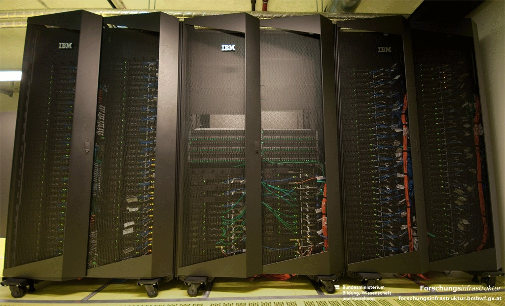
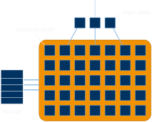

## Clusters and supercomputers

:::: {.columns}
::: {.column width="46%"}
- Looks like:

{width="100%"}
:::
::: {.column width="54%"}
- Feels like:

{fig-align="center" width="100%"}
:::
::::

## Get user credentials, log in and change your password!

- `ssh cbxxxxxx@login.lcc3.uibk.ac.at`
- change password with `passwd`
- don't use these credentials for anything other than this course
  - coin mining isn't worth it anyways…

## Submission systems

:::: {.columns}
::: {.column width="70%"}
- responsible for resource management and job orchestration
  - used to submit or cancel "jobs", query their status, get information about the cluster, …
- very popular: SLURM
  - modern, complex but very capable
  - de-facto standard on most systems these days
:::
::: {.column width="30%"}
{fig-align="center" height="300"}
:::
::::

## Jobs: submission, deletion, status

:::: {.columns}
::: {.column width="34%"}
- `sbatch name_of_script`
  - allocates resources
  - sets up environment
  - executes application
  - frees allocation
- `scancel job_id_list`
  - terminates application
  - frees up resources
- `squ` (`squeue -u $USER`)
  - queries for job status
  - `squeue` for all users
:::
::: {.column width="66%"}
::: {style="font-size: 0.8em; margin-top: 3.2em;"}
```default
[cb761011@login.lcc3 ~]$ sbatch job.sh
Submitted batch job 184
[cb761011@login.lcc3 ~]$ scancel 184
[cb761011@login.lcc3 ~]$ sbatch job.sh
Submitted batch job 185
[cb761011@login.lcc3 ~]$ squ
JOBID PRIORITY PARTITION NAME USER     STATE   NODES CPUS TIME_LIMIT NODELIST(REASON)
185   504      lva       test cb761011 RUNNING 1     8    30:00      n002
```
:::
:::
::::

## SLURM job scripts

```{.bash filename="code/job.sh"}

```

## Additional useful SLURM tools

- `sinfo`
  - list information on partitions, nodes, etc.
- `scontrol`
  - alter properties of pending jobs
- `sacct`
  - show accounting information

## Action!

- submit the job, wait for it to finish, check the output
  - what happened and what did you expect?

## Modules system

- used to modify the user environment (environment variables, most notably `PATH` & `LD_LIBRARY_PATH`)
  - `module avail`
  - `module load`
  - `module list`
  - `module unload`

## Fix job script

- add a line to load the required MPI module (e.g. just before program execution)
  - `module load openmpi/3.1.6-gcc-12.2.0-d2gmn55`
- fix the program execution line in the job script
  - `mpiexec -n $SLURM_NTASKS /bin/hostname`
- re-submit and check the output
- happy now?

## Compiling and running MPI programs

- MPI is an inter-process communication library
  - provides a header + library files (`*.so`/`*.a`)
  - more information in the lecture
- compiler wrappers for C/C++ (set all required flags and directories)
  - `mpicc`
  - `mpic++`
- execution wrapper for MPI programs
  - `mpiexec -n [num_processes] /path/to/application`

## Storage and compilers on LCC3

- LCC3 has two main storage mount points
  - `/home/cb76/<username>` limited to 1 GB
  - `/scratch/<username>` limited to 16 TB (?)
  - both are network-mounted on all login and compute nodes
  - when using VS Code + Remote SSH, be sure to set

    ```json
    "remote.SSH.serverInstallPath": { "lcc3": "/scratch/c703429" }
    ```
- LCC3's system gcc is old (8.5.0)
  - use modules to find and load newer versions (e.g. 12.2.0)
  - e.g. `gcc/12.2.0-gcc-8.5.0-p4pe45v`

## Further information on SLURM, job scripts and LCC3

- refer to ZID's help pages
  - LCC3 status: <https://login.lcc3.uibk.ac.at/cgi-bin/slurm.pl>
  - LCC3: <https://www.uibk.ac.at/zid/systeme/hpc-systeme/leo3/>
  - SLURM: <https://www.uibk.ac.at/zid/systeme/hpc-systeme/common/tutorials/slurm-tutorial.html>
- consult manpages or "The Internet"
- ask me

## Image sources {.smaller}

::: {.small}
- **Cluster photo:** <https://forschungsinfrastruktur.bmbwf.gv.at/de/fi/hpc-compute-cluster-leo3-leo3e_513>
- **SLURM:** <https://justjimsthoughts.blogspot.com/2017/07/trivia_24.html>
:::
