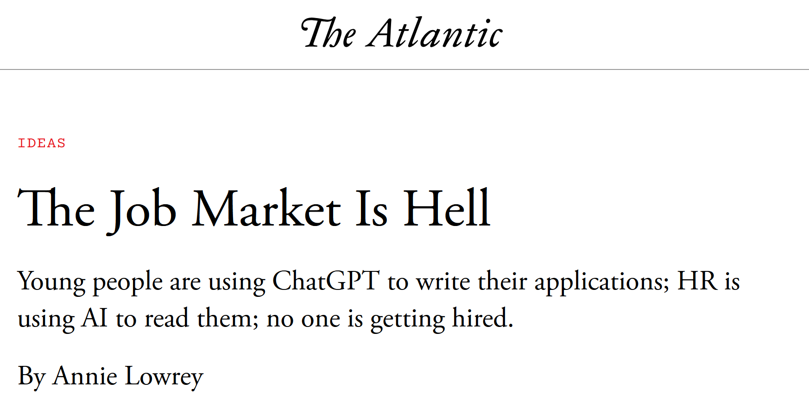
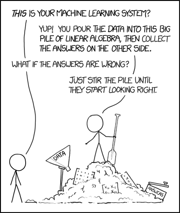

## High-Performance Computing - Where are the slides? {.center-figs}

:::: {.columns}
::: {.column width="45%"}
<https://github.com/philippgs/uibk_hpc_26>

or

<https://tinyurl.com/UIBKHPC26>
:::
::: {.column width="55%"}
{.fig-card fig-align="center" height="420"}
:::
::::

## Organizational stuff

:::: {.columns}
::: {.column width="50%"}
- VO+PS instructor information
  - <philipp.gschwandtner@uibk.ac.at>
  - {style="height: 0.9em; margin: 0; vertical-align: -0.12em;"} philgs or room 2W05, ICT building
  - no fixed office hours (send an e-mail, I'm quite responsive…usually)
  - adhere to my communication rules!

:::
::: {.column width="50%"}
- dates and location
  - see lfu:online ([VO](https://lfuonline.uibk.ac.at/public/lfuonline_lv.details?sem_id_in=26W&lvnr_id_in=703308), [PS](https://lfuonline.uibk.ac.at/public/lfuonline_lv.details?sem_id_in=26W&lvnr_id_in=703309)) for exact dates
  - generally:
    - proseminar every Wednesday 08:45–10:30 in RR 15
	- lecture every Wednesday 10:45–12:30 in RR 15
:::
::::

## Communication rules

:::: {.columns}
::: {.column width="48%"}
- Philipp (Gschwandtner (PhD))
- use of LLMs (ChatGPT & Co)
  - "I hope this e-mail finds you well"
  - overly polite
  - very generic & lengthy
  - eloquent, over-the-top phrases
  - **wastes my time [and]{.underline} yours**
:::
::: {.column width="52%"}
{.fig-card fig-align="center" width="100%"}

::: {.small style="text-align: center;"}
<https://www.theatlantic.com/ideas/archive/2025/09/job-market-hell/684133/>
:::
:::
::::

## Communication rules cont'd

:::: {.columns}
::: {.column width="45%"}
- Philipp (Gschwandtner (PhD))
- use of LLMs (ChatGPT & Co)
  - "I hope this e-mail finds you well"
  - overly polite
  - very generic & lengthy
  - eloquent, over-the-top phrases
  - **wastes my time [and]{.underline} yours**
:::
::: {.column width="50%"}
{.fig-card fig-align="center" height="520"}

::: {.small style="text-align: center;"}
<https://xkcd.com/1838/>
:::
:::
::::

## More organizational stuff

:::: {.columns}
::: {.column width="48%"}
- prerequisites
  - interest in parallel hardware, parallel programming and high-performance computing
  - lecture: very little beyond that
  - proseminar: + programming in C/C++
- language
  - English
:::
::: {.column width="52%"}
- content
  - general concepts of parallel programming and its intricacies
    - concepts apply to almost all parallel programming models
    - as an example, we will mainly discuss MPI
    - there are countless others (OpenMP, Kokkos, CUDA, SYCL, TBB, Cilk, Pthreads, C++ STL, Charm++, X10, …)
    - also bits and pieces of hardware every now and then
  - guided tour
  - feel free to request topics!
:::
::::

## Grading: lecture

- no mandatory attendance
  - note: not everything I say will be on the slides…
- single, written exam (27.01.2027, 17.02.2027, 22.03.2027)
  - multiple exercises with multiple points
  - standard grading scheme, ≥ 50% for positive grade, 12.5% intervals between grades
  - don't memorize the slides, understand the content!

## Grading: proseminar

- weekly assignments, published on GitHub
  - <https://github.com/philippgs/uibk_hpc_26>
- teamwork is permitted and encouraged
  - 3 people max. per team
  - every team member must be able to present and discuss solution
- [solutions must be handed in via OLAT until Tuesday 17:00!]{.strikethrough}
  - solutions must work on the LCC3 cluster
  - copying/generating solutions (e.g. off the Internet/LLMs) is acceptable if properly cited and understood
  - grade is 50% check marks, 50% presentations/discussion – both must be ≥ 50%!
	- you might be asked to present multiple times, presentation grade will be the arithmetic mean!

## AI policy for coursework

*"Riding a taxi is not a good way to learn how to drive."*

:::: {.columns}
::: {.column width="48%"}
**Principles**

- you are responsible for [all]{.underline} content you deliver (spoken, in writing, or code)
- this course uses a similar policy compared to most other courses at UIBK
- failure to comply with the policy may result in failing the course
:::
::: {.column width="52%"}
**Definition of the traffic light**

::: {.fig-legend}


AI use is prohibited.


AI is permitted, but must be declared and comply with other restrictions


AI use is allowed.


AI use is recommended.
:::
:::
::::

::: {.aside}
Department of Computer Science, Winter Term 2026/27
:::

## AI policy for this course

The traffic light applies to different types of AI use in the following way:

::::: {.fig-cols}
:::: {}
{.line-art height="60"}
{height="120"}

**Creative tasks**

- planning of parallelization strategies, algorithm selection, etc.
- text generation
- creation of presentation slides
::::
:::: {}
{.line-art height="60"}
{height="120"}

**Professional core tasks**

- programming code and benchmarking infrastructure
- data analysis

::::
:::: {}
{.line-art height="60"}
{height="120"}

**Supporting tasks**

- literature search
- text summarisation and translation (without directly adopting the output)
- generation of solution hints

::::
:::: {}
{.line-art height="60"}
{height="120"}

**Presentation quality assurance**

- spell checking
- text editing (without changing the meaning)
- improvement/harmonisation of graphical elements
::::
:::::

::: {.aside}
Department of Computer Science, Winter Term 2026/27
:::

## Interaction & feedback

- platform for interaction outside of the PS/VO
  - Discord? Matrix?
- anonymous feedback possible via Google Form linked in OLAT

## Literature

- Your AI of choice
- www.internet.com
  - MPI: A Message-Passing Interface Standard 5.0 (PDF available via <https://www.mpi-forum.org/>, hardcover of v3.1 available)
  - <https://theartofhpc.com/>
  - Stackoverflow
  - Google
  - …
- https://theartofhpc.com/
- old school: printed books
  - let me know and I will look up some references…

## Who is this speaker, what does he do besides teaching?

:::: {.columns}
::: {.column width="64%"}
- Head of Research Center HPC, UIBK
  - studied computer science @ UIBK, focus on parallel programming, benchmarking and tuning
- research interests in and around HPC
  - measurement/optimization/modeling of performance, energy, efficiency, …
  - APIs, programming models, runtime systems, compilers, …
- aid researchers in developing/optimizing parallel applications
  - (co-)writing HPC-focused project proposals
  - making stuff go faster
  - giving training courses on how to make stuff go faster (OpenMP, MPI, etc.)
- **supervising very exciting master theses!**
:::
::: {.column width="36%"}
{fig-align="center" height="400"}

::: {.small style="text-align: center;"}
Extremely professional-looking photo of Philipp Gschwandtner (© Andreas Friedle)
:::
:::
::::

## What are we all doing here?

:::: {.columns}
::: {.column width="48%"}
- discuss key concepts of parallel computing
  - hardware **and** software aspects
  - multiple non-functional aspects – there's more than just speed
  - portability, usability, maintainability, sustainability
- we still need to actually do some concrete work
  - (mostly) MPI for implementing and evaluating distributed-memory parallelism concepts
  - we'll use LCC3 for running experiments
:::
::: {.column width="52%"}
{width="100%"}
:::
::::

## What are we going to discuss?

- crash course on hardware and programming models
- introduction to MPI (and a bit of other APIs/models such as OpenMP?)
- tons of generic concepts at the example of MPI (and others) programs
  - metrics: performance, efficiency, scalability
  - problem partitioning, scheduling and load balancing
  - parallel program classification and characteristics
  - programmer productivity, debugging, profiling
  - …

## Hints (not only) for this course

:::: {.columns}
::: {.column width="55%"}
- choose a suitable source code editor / IDE and choose it wisely!
- get acquainted with your toolchain
  - debuggers, version control (git), etc.
- use common sense and sanity checks!
:::
::: {.column width="45%"}
{fig-align="center" height="400"}
:::
::::

# Questions?

# A Crash Course in Clusters and Job Submission

## Clusters and supercomputers

:::: {.columns}
::: {.column width="46%"}
- Looks like:

{width="100%"}
:::
::: {.column width="54%"}
- Feels like:

{fig-align="center" width="100%"}
:::
::::

## Get user credentials, log in and change your password!

- `ssh cbxxxxxx@login.lcc3.uibk.ac.at`
- change password with `passwd`
- don't use these credentials for anything other than this course
  - coin mining isn't worth it anyways…

## Submission systems

:::: {.columns}
::: {.column width="70%"}
- responsible for resource management and job orchestration
  - used to submit or cancel "jobs", query their status, get information about the cluster, …
- very popular: SLURM
  - modern, complex but very capable
  - de-facto standard on most systems these days
:::
::: {.column width="30%"}
{fig-align="center" height="300"}
:::
::::

## Jobs: submission, deletion, status

:::: {.columns}
::: {.column width="34%"}
- `sbatch name_of_script`
  - allocates resources
  - sets up environment
  - executes application
  - frees allocation
- `scancel job_id_list`
  - terminates application
  - frees up resources
- `squ` (`squeue -u $USER`)
  - queries for job status
  - `squeue` for all users
:::
::: {.column width="66%"}
::: {style="font-size: 0.8em; margin-top: 3.2em;"}
```default
[cb761011@login.lcc3 ~]$ sbatch job.sh
Submitted batch job 184
[cb761011@login.lcc3 ~]$ scancel 184
[cb761011@login.lcc3 ~]$ sbatch job.sh
Submitted batch job 185
[cb761011@login.lcc3 ~]$ squ
JOBID PRIORITY PARTITION NAME USER     STATE   NODES CPUS TIME_LIMIT NODELIST(REASON)
185   504      lva       test cb761011 RUNNING 1     8    30:00      n002
```
:::
:::
::::

## SLURM job scripts

```{.bash filename="code/job.sh"}

```

::: {.aside}
Source: [`code/job.sh`](code/job.sh)
:::

## Additional useful SLURM tools

- `sinfo`
  - list information on partitions, nodes, etc.
- `scontrol`
  - alter properties of pending jobs
- `sacct`
  - show accounting information

## Action!

- submit the job, wait for it to finish, check the output
  - what happened and what did you expect?

## Modules system

- used to modify the user environment (environment variables, most notably `PATH` & `LD_LIBRARY_PATH`)
  - `module avail`
  - `module load`
  - `module list`
  - `module unload`

## Fix job script

- add a line to load the required MPI module (e.g. just before program execution)
  - `module load openmpi/3.1.6-gcc-12.2.0-d2gmn55`
- fix the program execution line in the job script
  - `mpiexec -n $SLURM_NTASKS /bin/hostname`
- re-submit and check the output
- happy now?

## Compiling and running MPI programs

- MPI is an inter-process communication library
  - provides a header + library files (`*.so`/`*.a`)
  - more information in the lecture
- compiler wrappers for C/C++ (set all required flags and directories)
  - `mpicc`
  - `mpic++`
- execution wrapper for MPI programs
  - `mpiexec -n [num_processes] /path/to/application`

## Storage and compilers on LCC3

- LCC3 has two main storage mount points
  - `/home/cb76/<username>` limited to 1 GB
  - `/scratch/<username>` limited to 16 TB (?)
  - both are network-mounted on all login and compute nodes
  - when using VS Code + Remote SSH, be sure to set

    ```json
    "remote.SSH.serverInstallPath": { "lcc3": "/scratch/c703429" }
    ```
- LCC3's system gcc is old (8.5.0)
  - use modules to find and load newer versions (e.g. 12.2.0)
  - e.g. `gcc/12.2.0-gcc-8.5.0-p4pe45v`

## Further information on SLURM, job scripts and LCC3

- refer to ZID's help pages
  - LCC3 status: <https://login.lcc3.uibk.ac.at/cgi-bin/slurm.pl>
  - LCC3: <https://www.uibk.ac.at/en/zid/systeme/hpc-systeme/lcc3/>
  - SLURM: <https://www.uibk.ac.at/zid/systeme/hpc-systeme/common/tutorials/slurm-tutorial.html>
- consult your AI, "The Internet", or manpages
- ask me

## Image sources {.smaller}

::: {.small}
- **LEO3 / LCC3 photo:** <https://forschungsinfrastruktur.bmbwf.gv.at/de/fi/hpc-compute-cluster-leo3-leo3e_513>, <https://www.uibk.ac.at/zid/systeme/hpc-systeme/leo3/>
- **The Atlantic:** <https://www.theatlantic.com/ideas/archive/2025/09/job-market-hell/684133/>
- **xkcd:** <https://xkcd.com/1838/>
- **Photo of Philipp Gschwandtner:** © Andreas Friedle
- **AI policy and its icons:** Department of Computer Science, Winter Term 2026/27
- **Sandbox:** <http://www.googblogs.com/open-sourcing-sandboxed-api/>
- **SLURM:** <https://justjimsthoughts.blogspot.com/2017/07/trivia_24.html>
:::
