## Overview

- what is parallelism, why do we need it?
  - applications and problems
  - "three walls"
- parallelism in hardware
  - multi-/many-core, clusters, NUMA, latencies, …
- parallelism in software
  - task & data parallelism, Flynn taxonomy, shared & distributed memory

## What is parallel computing?

- using multiple, simultaneous computations in order to speed up solving the overall problem
  - note the difference to concurrent computing ("simultaneous" vs. e.g. Pthreads on a single core)
  - generally (but not exclusively) the goal is faster computation of the result
  - no exact definition for HPC, just "high performance"
- requires multiple processing elements that can be used simultaneously ("parallel hardware")
  - lots of shapes and forms, more details in a bit

## Why do we need parallelism?

:::: {.columns}
::: {.column width="52%"}
- Deepwater Horizon oil spill in Gulf of Mexico in 2010
  - research project to simulate the propagation, carried out by IBM (and UIBK)
- faster-than-realtime simulation required
  - oil takes 20 hours from source to ocean surface
  - simulating 1 second requires 3 hours of computation time
  - 30 years of computing time to simulate entire spill
:::
::: {.column width="48%"}
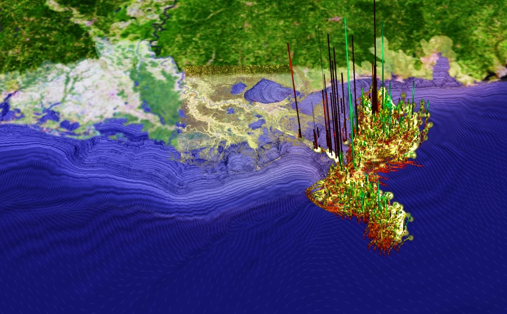{width="60%" fig-align="center"}

{width="60%" fig-align="center"}
:::
::::

## Additional applications {.center-figs}

::: {.fig-row}
{width="32%" }
{width="32%" }
{width="32%" }
:::

## Applications at UIBK

- Cronos: Astrophysics simulation of a binary star system (LS 5039)
- computes gamma-ray emissions caused by stellar and pulsar wind turbulence
- computing time: 27 million core hours (3082 years)

<video controls loop width="70%" style="display:block;margin:0.4em auto 0">
  <source src="img/media1.mp4" type="video/mp4">
</video>

## SETI@home

::::: {.columns}
:::: {.column width="52%"}
- "Arecibo" radio telescope collected 350 GB of data per day in the 1990s
- too much data to analyze for a single data center at the time
- divided into 350 KB chunks, sent to participating end-users for analysis
- SETI@home BOINC project
::::
:::: {.column width="48%"}
::: {.fig-row}
{height="150"}
{height="150"}
:::
::: {.fig-row}
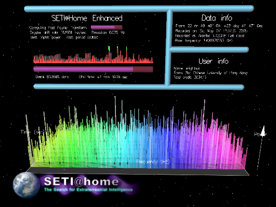{height="130"}
{height="130"}
:::
::::
:::::

# Parallelism in hardware

## Why do we need parallelism? The hardware side

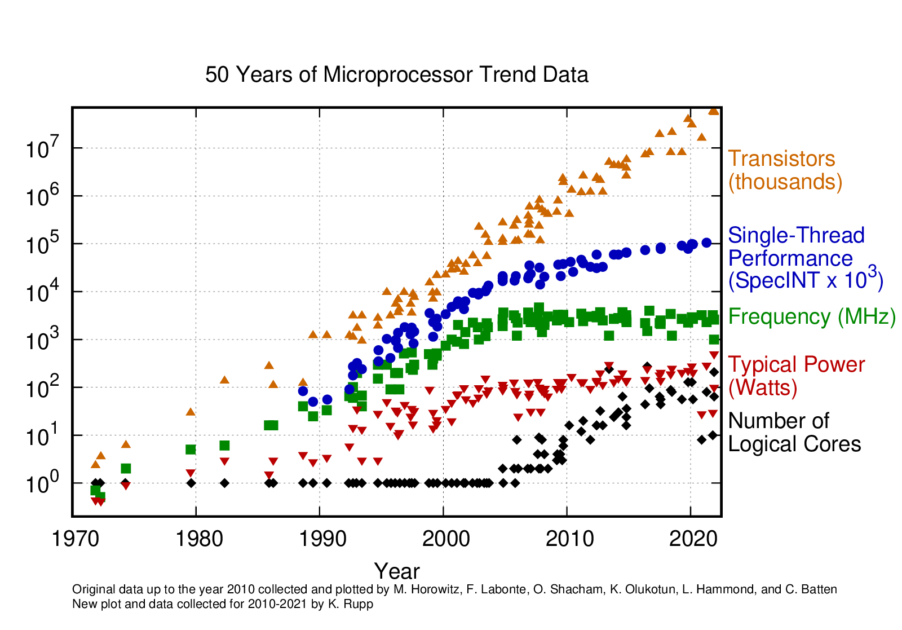{.fig-card fig-align="center" width="60%"}

::: {.aside}
<https://github.com/karlrupp/microprocessor-trend-data>
:::

## Just adding more resources stops working

:::: {.columns}
::: {.column width="45%"}
- soviet MD-160 (a "Lun" class ekranoplan)
- just throwing more resources at the problem doesn't get you very far, and it gets increasingly expensive
- general "law of diminishing returns"
- "add engines until airborne" no longer viable
:::
::: {.column width="55%"}
{width="100%"}
:::
::::

## Moore's Law

- "the number of transistors in iso-cost silicon doubles approx. every 2 years" — 1965
  - also rephrased as "performance doubles every 18 months"
  - has been derived from historical data, used as predictive measure for decades
- ceased to be true in the 2020s
- compare Intel's architecture updates
  - previously: "Tick-Tock" (2 steps)
  - now: "Process-architecture-optimization" (3 steps)
- directly affects you!
  - e.g. *"Unfortunately, the Lenovo ThinkPad P1 2019, which we are reviewing right now, is slower than the older model."* — notebookcheck.com review in 2019
  - additional example: GPU performance gains (or lack thereof) over the past 2-3 years

## Parallel computing is ubiquitous

- increasing amount of parallel hardware
  - supercomputers since ~1960s
  - desktop PCs, laptops since 2005
  - mobile and embedded devices
    - cellphones since 2011, smart watches since 2016
- sequential computing hardware practically became extinct!
- increasing amount (>120) of parallel or concurrent programming languages and libraries
- serve as the basis to many more, highly domain-specific languages and libraries (DSLs)
 
::: {.tiny}
Ada, Akka.NET, Alef, Alice, Apache Beam, Apache Flink, Apache Hadoop, Apache Spark, Ateji PX, Axum, Bloom, BMDFM, C#, C\*, C++, C++ AMP, C=, CAL, Chapel, Charm++, Cilk, Cilk Plus, Clojure, CnC, Coarray Fortran, Concurrent Clean, Concurrent Haskell, Concurrent ML, Concurrent Pascal, Constraint Handling Rules, Cpp, Crystal, CUDA, Curry, Cω, D, Dart, E, Ease, ECMAScript, Eiffel, Eiffel SCOOP, Elixir, Elm, Emerald, Erlang, Esterel, FAUST, Fork, FortranM, Fortress, Futhark, Glenda, Go, Golang, Haskell, Hermes, HPF, Hume, Id, Io, Janus, Java, JavaScript, JCSP, JoCaml, Join Java, Joule, Joyce, Julia, Kokkos, LabVIEW, Limbo, Linda, Lustre, Mercury, Millipede, Modula, MPD, MPI, MultiLisp, Newsqueak, Occam, Occam-π, OpenCL, OpenHMPP, OpenMP, Orc, Oz, ParaSail, Parlog, Perl, Pict, Pony, Preesm, Prolog, PyCSP, Python, Red, Reia, Ruby, Rust, SALSA, Scala, SequenceL, Sequoia, Signal, SISAL, Smalltalk, SR, StratifiedJS, SuperPascal, SYCL, SystemC, SystemVerilog, Termite Scheme, Titanium, TNSDL, Unicon, UPC, Verilog, VHDL, X10, XC, ZPL, μC++ 

(Source: <https://en.wikipedia.org/wiki/List_of_concurrent_and_parallel_programming_languages>)
:::

## The three walls

- **power wall**
  - increase in clock frequency means increase in dynamic power consumption
- **memory wall**
  - growing speed disparity between computational units and memory
- **instruction-level parallelism (ILP) wall**
  - diminishing returns in overlapping in-core instruction execution

## The power wall

- frequency increase was not an option anymore
$$
P_{dyn} = C \times F \times V^2 \times \alpha \approx F^3
$$
  - (C…capacitance, F…frequency, V…voltage, α…switching factor)
- number of transistors can be increased
  - feature-size (e.g. Intel's 14nm++++…) reduction allows same area
  - but power consumption and heat dissipation increase
  - not everything runs at the same time ("dark silicon")
  - Dennard Scaling Law ("same area – same power consumption") no longer holds
    - started breaking down around 2005

## The power wall cont'd

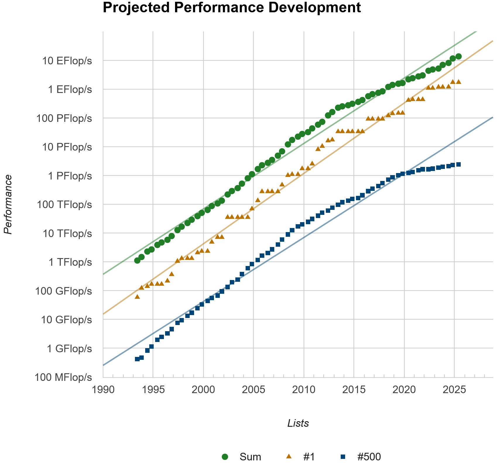{.fig-card fig-align="center" height="420"}

::: {.aside}
TOP500 list (<https://www.top500.org>) — fastest supercomputers world-wide, released twice every year; clearly shows the Dennard Scaling impact (delayed effect around ~2015)
:::

## The power wall cont'd

:::: {.columns}
::: {.column width="42%"}
- VSC-3 compute node cooling
- oil-immersion cooling instead of air

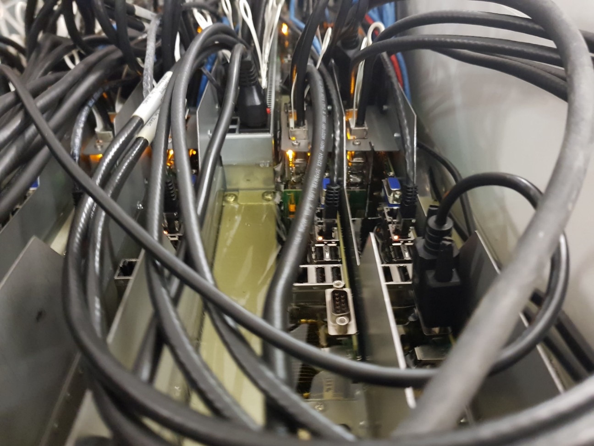{width="100%"}
:::
::: {.column width="58%"}
::: {.video-4x3}

:::
:::
::::

## The memory wall

- computational speed grows faster than memory speed (latency & bandwidth)
  - executing a single integer ADD: 1 clock cycle (approx. 0.3 ns @ 3 GHz)
  - latency fetching data from RAM: 300 clock cycles (100 ns @ 3 GHz)
  - similar disparity for memory bandwidth and computing speed over the past decades
- lead to the introduction of memory hierarchies (L1, L2, L3, L4 caches), High Bandwidth Memory (HBM), stacked memory, etc.
  - they mitigate the problem but do not solve it
- changes the way (parallel) programs are written and optimized
  - focus on latency of load/store instead of computation instructions
  - aim for high data locality

## Side note: latency numbers every programmer should know

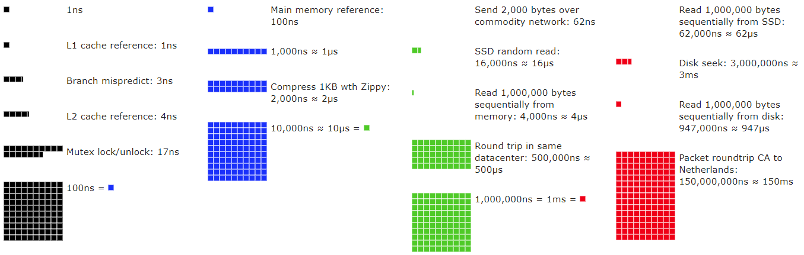{.fig-card fig-align="center" width="92%"}

::: {.aside}
<https://people.eecs.berkeley.edu/~rcs/research/interactive_latency.html>
:::

## The ILP wall

- instruction-level parallelism is omnipresent (responsibility of compiler and processor designers)
  - pipelining
  - superscalar execution
  - out-of-order execution
  - register renaming
  - branch prediction
  - prefetching
  - …
- however: diminishing returns for ILP optimizations
  - gets increasingly difficult to maintain high utilization of a single, modern processor core

## Three-walls-summary

:::: {.columns}
::: {.column width="55%"}
- power, memory, and ILP wall represent previous optimization spaces for which the limit has been (almost) reached
  - entirely new approach required to significantly increase performance
- solution: introduce high-level parallelism
  - put multiple cores on a CPU or multiple CPUs on a mainboard
  - makes software developers very sad
:::
::: {.column width="45%"}
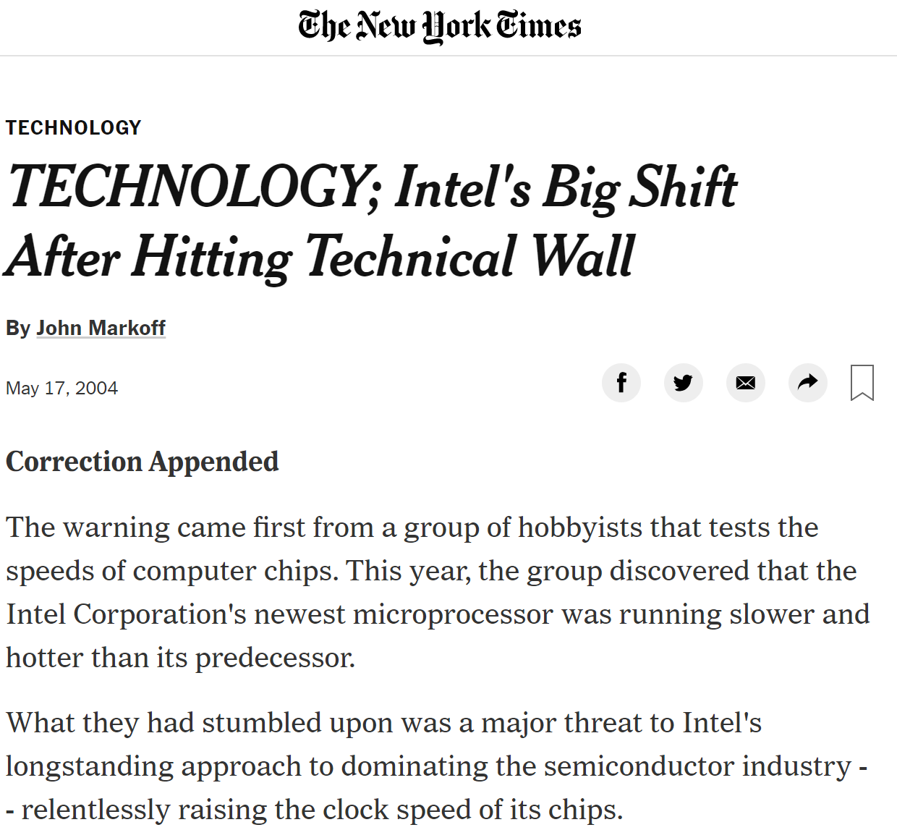{.fig-card width="100%"}
:::
::::

## Forms of parallel hardware (fictional architecture) {.center-figs}

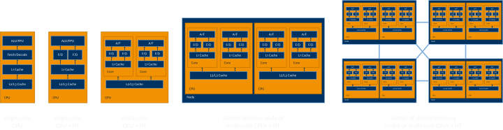{fig-align="center" width="100%"}

## Forms of parallel hardware cont'd {.center-figs}

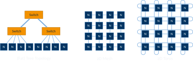{fig-align="center" height="400"}

## Forms of parallel hardware cont'd

- "multi-core" or "many-core" CPU?
  - no exact definition
  - personal opinion: do you need to seriously think about core interconnects? → "many-core"
  - ring bus vs. meshes vs. …
- vectorization
  - in-core parallelization support (e.g. MMX, SSE, AVX)
- NUMA!

## Non-uniform memory access (NUMA)

:::: {.columns}
::: {.column width="45%"}
- any RAM accessible from any CPU
  - not at the same cost though!
- usually ccNUMA (cache-coherent)
  - easy to program, but concealed performance bottleneck
- there are tools that can textually/graphically show the NUMA topology (e.g. hwloc's `lstopo`)
:::
::: {.column width="55%"}
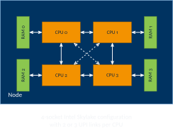{width="100%"}
:::
::::

## Accelerators are parallel too!

:::: {.columns}
::: {.column width="50%"}
- GPUs
  - Nvidia: B300, RTX5090, Tegra/Xavier
  - AMD: RX 9000, Radeon Instinct
- FPGAs
  - Virtex (Xilinx), Stratix (Altera/Intel)
- Misc
  - Intel Xeon Phi
- several caveats, because of different
  - ISA (and RISC vs. CISC)
  - address space
  - programming model (SYCL, CUDA, VHDL, etc.)
- we are probably not going to work on any of those!
:::
::: {.column width="50%"}
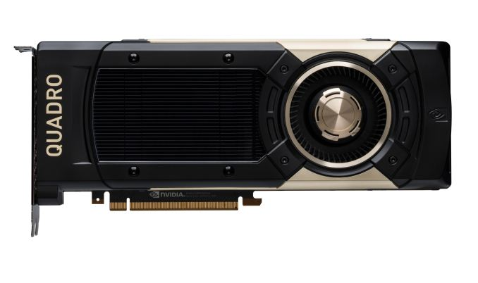{width="60%" fig-align="center"}

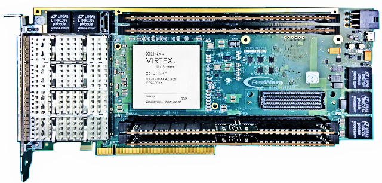{width="60%" fig-align="center"}
:::
::::

## HPC @ UIBK

:::: {.columns}
::: {.column width="50%"}
**LCC3** (2011, 96 cores)

- 8 nodes
  - 2x Intel Six-Core X5650 CPUs
  - 48 GB DDR3 RAM
- Infiniband QDR network
  - 32 Gbit/s bandwidth
  - 1.3 µs latency
- used for teaching and training only
  - mostly empty
:::
::: {.column width="50%"}
**LEO5** (2023, 4032 cores)

- 63 nodes
  - 2x Intel Xeon Platinum 8358
  - at least 256 GB DDR4 RAM
- Infiniband HDR network
  - 100 Gbit/s bandwidth
  - 0.5 µs latency (?)
- used for scientific research
:::
::::

## HPC beyond Innsbruck

:::: {.columns}
::: {.column width="50%"}
**MUSICA**, Austria (84,480 cores)

- 440 nodes
  - 2x AMD EPYC 9654 "Genoa"
  - 768 GB RAM
  - 168 nodes with 4x Nvidia H100 (94 GB)
- 2x Infiniband NDR400 per node
  - 800 Gbit/s bandwidth
  - <1 µs latency
- ranked 50th world-wide (Nov 2024)
:::
::: {.column width="50%"}
**Lineshine**, Shenzhen, China (13,789,440 CPU cores)

- 22,000+ nodes
  - 2x LX2 CPU (304 cores each)
  - 64 GB HBM + 512 GB DDR5
- LinQi Network
  - 1.6 Tbit/s bandwidth per node
  - 1 µs latency per hop
- ranks 1st world-wide (Jun 2026)
:::
::::

# Parallelism in software

## High-level types of parallelism

:::: {.columns}
::: {.column width="52%"}
- **data parallelism**
  - execute parts of the same task on different data simultaneously
- **task parallelism**
  - execute different tasks within the same problem simultaneously
- consider the work (=task) of having workers (=processing units) pick apples (=data) from a tree
:::
::: {.column width="48%"}
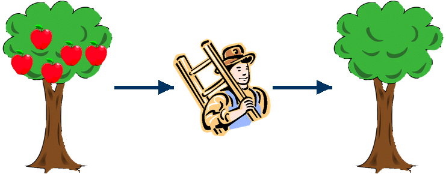{width="100%"}
:::
::::

## Data parallelism

:::: {.columns}
::: {.column width="50%"}
- have multiple workers pick multiple apples from the same tree at the same time
  - How many workers per tree? How many apples per worker?
  - What if not all trees have the same number of apples?
  - What if not all the workers pick apples at the same speed?
:::
::: {.column width="50%"}
{width="100%"}
:::
::::

## Data parallelism cont'd

:::: {.columns}
::: {.column width="50%"}
- have multiple workers pick apples from different trees at the same time
  - How many workers?
  - What if not all the trees have the same number of apples?
  - Nested parallelism?
:::
::: {.column width="50%"}
{width="100%"}
:::
::::

## Task parallelism

- apples also need to be transported to the farm!
  - How many apples to pick before they are transported to the farm?
  - How fast is each worker at their task?

{fig-align="center" height="250"}

## Hybrid parallelism

- have multiple workers pick apples from multiple trees, to be transported to the farm by multiple workers
  - consider all the complexities yourself

{fig-align="center" height="250"}

## Flynn's taxonomy

- classification of computer architectures, proposed by Michael Flynn in 1966
- still valid and in use today
- also applies to software

::: {.table-grid}
|                         | **Single Data**                          | **Multiple Data**                          |
|-------------------------|------------------------------------------|--------------------------------------------|
| **Single Instruction**  | Single Instruction Single Data (SISD)    | Single Instruction Multiple Data (SIMD)    |
| **Multiple Instruction**| Multiple Instruction Single Data (MISD)  | Multiple Instruction Multiple Data (MIMD)  |
:::

## Flynn's taxonomy cont'd

- **SISD**
  - single instruction per time unit
  - single data unit per time unit
  - e.g. basic single-core CPUs
- **SIMD**
  - single instruction per time unit
  - multiple data units per time unit
    - but all with the same operation at the same time, i.e. in full lockstep
  - aka vectorization
  - e.g. vector units in CPUs (Intel MMX, SSE, AVX; IBM AltiVec; ARM NEON, SVE, …), RISC-V RVV, GPUs

## Flynn's taxonomy cont'd

- **MISD**
  - multiple instructions per time unit
  - single data unit per time unit
  - comparatively rare, often used for fault tolerance or redundancy
    - e.g. flight computers for airplanes, rockets, spacecraft
- **MIMD**
  - multiple instructions per time unit
  - multiple data units per time unit
  - very large class, includes every multi-core CPU or multi-thread/multi-process software
  - sometimes subdivided into
    - SPMD – single program (like SIMD, but no lockstep)
    - MPMD – multiple programs

## MPI generally used for data parallelism / SPMD

- decompose data into multiple chunks, have multiple processing elements do the same work on their own chunks
- interested in task parallelism?
  - Check out e.g. OpenMP, SYCL, Cilk, Pthreads, Intel TBB, …
- interested in hybrid parallelism?
  - Can be done with e.g. OpenMP or SYCL
  - Also: Consider combining the above with MPI (often called MPI+X)

## Shared memory and distributed memory parallelism

:::: {.columns}
::: {.column width="50%"}
- **shared memory** (e.g. OpenMP)
  - single memory address space
  - usually based on threads
  - all data can be accessed directly
  - synchronization (e.g. barriers) required to ensure correctness

```c
lock();
x[0] += 42;
unlock();
```
:::
::: {.column width="50%"}
- **distributed memory** (e.g. MPI)
  - multiple memory address spaces
  - usually based on processes
  - data cannot be accessed directly
  - message exchange required to get data and ensure synchronization

```c
x = recv_data(…);
x[0] += 42;
send_data(x, …);
```
:::
::::

## Shared/distributed memory implications

:::: {.columns}
::: {.column width="50%"}
- **shared memory**
  - direct data access hides access cost (interconnect and memory latency)
  - very little explicit communication
    - frequently leads to race conditions
  - can often be done incrementally from sequential code
  - available memory scales with RAM of a single node (limiting factor – except for exotic hardware types such as SGI UV)
:::
::: {.column width="50%"}
- **distributed memory**
  - data access cost (interconnect and memory) evident in the code
  - a lot of explicit communication
    - frequently leads to deadlocks
  - difficult to do incrementally, often all-or-nothing approach
  - available memory scales with machine size (number of nodes)
:::
::::

## Exotic HPC hardware: MACH-2 @ JKU in Linz

:::: {.columns}
::: {.column width="45%"}
- 1728 cores, 20 TB of RAM
- same components as most distributed memory systems
- uses SGI NUMAlink to provide global cache coherence
- useful for mandatorily shared-memory apps that require a lot of RAM
  - e.g. legacy codes nobody wants to rewrite
- 2024: no longer necessary today, as RAM has become very cheap
  - 2026: 😏
:::
::: {.column width="55%"}
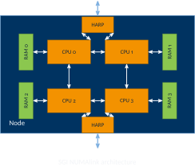{width="100%"}
:::
::::

## Three steps to creating a parallel program

:::: {.steps}
::: {}
- **1:** identify work that can be performed in parallel and/or data that can be worked on in parallel
:::


::: {}
- **2:** partition work and/or data
:::


::: {}
- **3:** manage data accesses, communication, and synchronization
:::

::::

- most importantly: do all of that **BEFORE** touching the keyboard!

# Summary

## Summary

- Moore's law & the three walls
  - parallelism was the only feasible way out
- parallelism in hardware
  - multi-/many-core, clusters, NUMA, latencies, …
- parallelism in software
  - data & task parallelism
  - Flynn taxonomy
  - shared vs. distributed memory

## Image sources {.smaller}

::: {.small}
- **Parallel applications:** <https://www.chemistryworld.com/features/oil-spill-cleanup/3008990.article>, Marcel Ritter (UIBK), <https://twitter.com/maven2mars/status/984440044659159040>, <https://www.nasa.gov/ames/image-feature/nasa-highlights-simulations-at-supercomputing-conference-like-aircraft-landing-gear>, ZAMG Wettervorhersage 01.10.2025 13:00, Ralf Kissmann (UIBK)
- **Soviet MD-160:** <https://gizmodo.com/this-caspian-sea-monster-was-a-giant-soviet-spruce-go-1456423681>
- **TOP500 trend:** <https://www.top500.org/statistics/perfdevel/>
- **THG video:** <https://www.youtube.com/watch?v=NxNUK3U73SI>
- **Latency numbers:** <https://people.eecs.berkeley.edu/~rcs/research/interactive_latency.html>
- **Accelerators:** <https://www.anandtech.com/show/12579/big-volta-comes-to-quadro-nvidia-announces-quadro-gv100>, <https://forums.xilinx.com/t5/Xcell-Daily-Blog-Archived/Want-to-get-on-board-the-Xilinx-UltraScale-FPGA-express-now/ba-p/727882>, <http://www.itmi.co.kr/product/product_list.php?ca_id=1020>
- **Microprocessor trend data:** <https://github.com/karlrupp/microprocessor-trend-data>
:::
