# General concepts

## Overview

- general concepts about MPI
  - characteristics
  - programming model
  - startup
- point-to-point communication
- collective communication
- practical example
- Tales from the proseminar: `osu_latency on LCC3`

## Motivation for using MPI: data distribution {.center-figs}

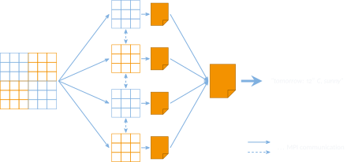{fig-align="center" height="460"}

## Message Passing Interface (MPI)

- message passing library for distributed memory parallelism
- de-facto standard for C (C++) and Fortran
- maintained by the MPI Forum
  - initial release in 1994 (version 1.0)
  - updates in 1997 (2.0), 2012 (3.0), 2015 (3.1), 2021 (4.0), 2023 (4.1), 2025 (5.0)
  - specification updates slow, aim at stability and high TRL

::: {.small}
> "On June 30 2020, the MPI forum voted for version 3.3 of these voting rules (effective June 30th, 2020)."
:::

## How does it compare to OpenMP?

:::: {.columns}
::: {.column width="50%"}
- **MPI** – Message Passing Interface
  - distributed memory programming model
  - library: steeper learning curve compared to OpenMP
  - much higher obtainable performance and maximum memory footprint
- **OpenMP** – Open MultiProcessing
  - shared memory programming model
  - compiler-based: much easier to get working parallel programs, allows incremental parallelization
  - lower obtainable performance and maximum memory footprint
:::
::: {.column width="50%"}
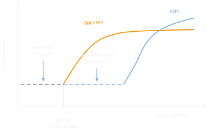{width="100%"}
:::
::::

## MPI implementations

- **OpenMPI**
  - open source
  - merge of multiple previous MPI implementations
  - default on many systems
- **MPICH**
  - also open source
  - basis for many vendor implementations maintained by Intel, IBM, Cray, Microsoft, …
    - default on many systems

::: {.callout-warning appearance="minimal"}
Do not confuse implementation versions with specification versions!
Do not confuse implementation adherence with specification adherence!
:::

<https://www.mpi-forum.org/implementation-status/>

## Main characteristics

:::: {.columns}
::: {.column width="50%"}
- offers specific tools for
  - sending and receiving messages
  - waiting and synchronization
  - identification of individual processes
  - …
:::
::: {.column width="50%"}
- additional convenience tools for
  - partitioning and distributing data
  - organizing processes in structures
  - large-scale I/O operations
  - …
:::
::::

## Main characteristics cont'd

:::: {.columns}
::: {.column width="50%"}
- a lot of user responsibility
  - explicit parallelism and communication
  - program correctness
  - performance optimization
    - (non-)blocking
    - (a)synchronous
:::
::: {.column width="50%"}
- a lot of advantages
  - available everywhere
  - several implementations
  - portable to many architectures
  - very high performance
:::
::::

## Recap: MIMD: MPMD

```{dot}
//| label: mpmd
digraph mpmd {
  rankdir=LR; bgcolor="transparent"; nodesep=0.30; ranksep=0.45;
  node [style=filled, fillcolor="#003361", color="#F2F4F7", fontcolor="#F2F4F7",
        fontname="Calibri", fontsize=12, penwidth=1.0];
  edge [color="#7FB0E0", penwidth=1.2, arrowsize=0.7];

  srcA  [shape=note,    label="Source\n(e.g. C++)"];
  compA [shape=ellipse, label="Compiler"];
  binA  [shape=note,    label="Binary"];
  exeA  [shape=ellipse, label="Execution"];
  cpu0  [shape=box,     label="CPU 0"];

  srcB  [shape=note,    label="Source\n(e.g. C++)"];
  compB [shape=ellipse, label="Compiler"];
  binB  [shape=note,    label="Binary"];
  exeB  [shape=ellipse, label="Execution"];
  cpu1  [shape=box,     label="CPU 1"];

  srcA -> compA -> binA -> exeA -> cpu0;
  srcB -> compB -> binB -> exeB -> cpu1;

  // the two programs differ; only the messages connect them
  cpu0 -> cpu1 [dir=both, style=dashed, constraint=false, color="#F39200",
                label="MSG", fontcolor="#F39200", fontsize=10];
}
```

## Recap: MIMD: SPMD

```{dot}
//| label: spmd
digraph spmd {
  rankdir=LR; bgcolor="transparent"; nodesep=0.30; ranksep=0.45;
  node [style=filled, fillcolor="#003361", color="#F2F4F7", fontcolor="#F2F4F7",
        fontname="Calibri", fontsize=12, penwidth=1.0];
  edge [color="#7FB0E0", penwidth=1.2, arrowsize=0.7];

  src  [shape=note,    label="Source\n(e.g. C++)"];
  comp [shape=ellipse, label="Compiler"];
  bin  [shape=note,    label="Binary"];
  exe  [shape=ellipse, label="Execution"];
  cpu0 [shape=box,     label="CPU 0"];
  cpu1 [shape=box,     label="CPU 1"];

  // one binary, executed by every rank
  src -> comp -> bin -> exe;
  exe -> cpu0;
  exe -> cpu1;

  cpu0 -> cpu1 [dir=both, style=dashed, constraint=false, color="#F39200",
                label="MSG", fontcolor="#F39200", fontsize=10];
}
```

## MPMD through SPMD

:::: {.columns}
::: {.column width="45%"}
- many MPI implementations support only SPMD
- SPMD can emulate MPMD
:::
::: {.column width="55%"}
```c
int main() {
    // get id information
    int cpuID = ...;
    if(cpuID==0) {
        ... // program A
    } else {
        ... // program B
    }
}
```
:::
::::

## Parallelism requires two mechanisms

- a mechanism for spawning processes
  - multiple ways of achieving this
  - we won't look at this in too much detail
  - simply rely on `mpiexec` to do the work for you
- a mechanism for sending and receiving messages
  - many ways of exchanging messages
  - we will definitely look at this in a lot of detail
  - tons of functionality to choose from, as we'll see in a bit

## Compiler and execution wrappers

- `mpicc` / `mpic++` for compiling
  - OpenMPI: `--showme` prints compiler flags
  - passes all additional compiler flags to backend compiler (e.g. `mpicc -g`)
- `mpiexec` for running
  - formerly `mpirun`, but `mpiexec` is standardized
  - alternatively `srun`
  - preferably what the platform documentation recommends

## Startup procedure of an MPI application

```{dot}
//| label: startup
digraph startup {
  rankdir=LR; bgcolor="transparent"; nodesep=0.35; ranksep=0.55;
  node [shape=box, style="filled,rounded", fillcolor="#003361",
        color="#7FB0E0", fontcolor="#F2F4F7", fontname="Calibri",
        fontsize=12, penwidth=1.0, margin="0.18,0.12"];
  edge [color="#F39200", penwidth=1.4, arrowsize=0.8];

  slurm [label=<<B>SLURM job submission</B><BR ALIGN="CENTER"/>
                <FONT POINT-SIZE="11">allocates resources<BR ALIGN="LEFT"/>
                sets environment<BR ALIGN="LEFT"/>
                calls mpiexec / mpirun / srun<BR ALIGN="LEFT"/></FONT>>];
  launch [label=<<B>mpiexec</B><BR ALIGN="CENTER"/>
                <FONT POINT-SIZE="11">reads SLURM environment<BR ALIGN="LEFT"/>
                spawns processes<BR ALIGN="LEFT"/>
                connects to nodes<BR ALIGN="LEFT"/></FONT>>];
  calls  [label=<<B>MPI function calls</B><BR ALIGN="CENTER"/>
                <FONT POINT-SIZE="11">exchange messages<BR ALIGN="LEFT"/>
                synchronize<BR ALIGN="LEFT"/>
                identify processes<BR ALIGN="LEFT"/></FONT>>];

  slurm -> launch -> calls;
}
```

## Hello world in MPI

```{.c filename="code/hello_world.c" code-line-numbers="|5|7-8|10-11|13|15"}

```

::: {.aside}
Source: [`code/hello_world.c`](code/hello_world.c)
:::

## Setup and teardown

- `int MPI_Init( int* argc, char*** argv )`
  - must be called by every process before calling any other MPI function
  - initializes the MPI library
- `int MPI_Finalize( void )`
  - must be the last MPI function called by every process
  - user must ensure completion of all locally (!) pending communication
  - performs library cleanup

## Who am I talking to?

:::: {.columns}
::: {.column width="50%"}
- in MPI-speak, processes are known as "ranks"
  - numbered from 0 to N-1
  - own rank can be queried with\
    `int MPI_Comm_rank(MPI_Comm comm, int* rank)`
  - number of ranks can be queried with\
    `int MPI_Comm_size(MPI_Comm comm, int* size)`
:::
::: {.column width="50%"}
- almost all MPI semantics are relative to a "communicator" or "group"
  - identifies a set of ranks
  - always available: `MPI_COMM_WORLD` (=everyone)
  - new communicators and groups that hold subsets of ranks can be created
  - when developing a library, always create your own communicator!
    - frequent MPI programming pattern
:::
::::

# Point-to-Point Communication

## Point-to-point communication

:::: {.columns}
::: {.column width="50%"}
- `MPI_Send(…)`/`MPI_Recv(…)`
  - single sender, single receiver ("point-to-point")
- simplest form of communication available
  - not necessarily the best
- multiple different types
  - (a)synchronous
  - (non-)blocking
:::
::: {.column width="50%"}
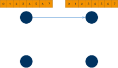{width="100%"}
:::
::::

## MPI_Send

```c
int MPI_Send(const void* buf, int count, MPI_Datatype datatype,
             int dest, int tag, MPI_Comm comm)
```

- `buf`: source buffer to send data from
- `count`: number of data elements to send
- `datatype`: type of data to send
- `dest`: destination rank
- `tag`: user-defined message type or category
- `comm`: communicator

```c
MPI_Send(&number, 1, MPI_INT, 1, 42, MPI_COMM_WORLD);
```

## MPI_Recv

```c
int MPI_Recv(void* buf, int count, MPI_Datatype datatype,
             int source, int tag, MPI_Comm comm, MPI_Status* status)
```

- `buf`: destination buffer to save data to
- `count`: number of data elements to receive
- `datatype`: type of data to receive
- `source`: source rank
- `tag`: user-defined message type or category
- `comm`: communicator
- `status`: holds additional information (e.g. rank of sender or tag of message)

```c
MPI_Recv(&number, 1, MPI_INT, 0, 42, MPI_COMM_WORLD, MPI_STATUS_IGNORE);
```

## Basic send/receive example

```{.c code-line-numbers="|2-4|5-7"}
int number;
if (rank == 0) {
    number = -1;
    MPI_Send(&number, 1, MPI_INT, 1, 42, MPI_COMM_WORLD);
} else if (rank == 1) {
    MPI_Recv(&number, 1, MPI_INT, 0, 42, MPI_COMM_WORLD, MPI_STATUS_IGNORE);
    printf("Rank 1: Received %d from rank 0\n", number);
}
```

## Side note: MPI data type conversion

- "representation conversion"
  - changes the binary representation of data without changing semantics
  - allowed in MPI, required for supporting heterogeneous architectures
    - e.g. sender is ARM, receiver is x86, …
    - e.g. big-endian vs. little-endian, ASCII vs. EBCDIC, …
- "type conversion"
  - converts the actual data type, e.g. from float to integer
  - c.f. C++ numeric casts
  - not allowed in MPI, might change semantics

## Predefined MPI constants

- datatypes
  - `MPI_INT`, `MPI_FLOAT`, `MPI_DOUBLE`, `MPI_BYTE`, `MPI_CHAR`, …
- wildcards & misc
  - `MPI_ANY_SOURCE`
  - `MPI_ANY_TAG`
  - `MPI_COMM_WORLD`
  - `MPI_STATUS_IGNORE`
  - …

## (Non-)Blocking and (a)synchronous communication

:::: {.columns}
::: {.column width="55%"}
- distinguish two important properties
  - When does the MPI function call return?
    - Can I overwrite the send buffer?
    - When is all the data in the receive buffer?
  - When does the corresponding message transfer happen?
    - Do I need to wait for the receiver to get the entire message?
    - Do I need to wait for the receiver to begin receiving?
:::
::: {.column width="45%"}
```c
if (rank == 0) {
    MPI_Send(&number, ...);
} else if (rank == 1) {
    MPI_Recv(&number, ...);
}
```
:::
::::

## (Non-)Blocking and (a)synchronous communication cont'd {.center-figs}

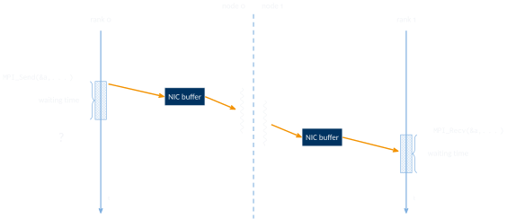{fig-align="center" height="450"}

## Blocking vs. non-blocking communication

:::: {.columns}
::: {.column width="50%"}
- blocking point-to-point: `MPI_Send()` and `MPI_Recv()`
  - allows to re-use send buffer after send call returns
  - allows to read receive buffer after receive call returns
:::
::: {.column width="50%"}
```c
if (rank == 0) {
    MPI_Send(&number, ...);
    // re-use number here
} else if (rank == 1) {
    MPI_Recv(&number, ...);
    // use number here
}
```
:::
::::

## Blocking vs. non-blocking communication cont'd

:::: {.columns}
::: {.column width="45%"}
- non-blocking point-to-point: `MPI_Isend()` and `MPI_Irecv()`
  - send and receive return (almost) immediately
  - `MPI_Wait()` call blocks until buffer can be read/re-used
:::
::: {.column width="55%"}
```{.c code-line-numbers="|1|3-4|7-8"}
MPI_Request request;
if (rank == 0) {
    MPI_Isend(&number, ..., &request);
    MPI_Wait(&request, MPI_STATUS_IGNORE);
    // re-use number here
} else if (rank == 1) {
    MPI_Irecv(&number, ..., &request);
    MPI_Wait(&request, MPI_STATUS_IGNORE);
    // re-use number here
}
```
:::
::::

## (A)Synchronous send modes

:::: {.columns}
::: {.column width="55%"}
- `MPI_Ssend()` – synchronous mode
  - will wait for matching receive
- `MPI_Bsend()` – buffered mode
  - will buffer, won't wait for a matching receive
- `MPI_Rsend()` – ready mode
  - requires an already posted, matching receive (dangerous, developer responsibility!)
- `MPI_Send()` – standard mode
  - may buffer (depends on message size)
  - may or may not wait for matching receive
- and there are also non-blocking variants for **ALL** of them…
:::
::: {.column width="45%"}
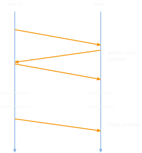{fig-align="center" height="440"}
:::
::::

## Message order preservation

:::: {.columns}
::: {.column width="50%"}
- messages do NOT overtake each other if
  - same communicator
  - same source rank
  - same destination rank
- regardless of blocking or synchronization mode
- mandated by MPI specification
:::
::: {.column width="50%"}
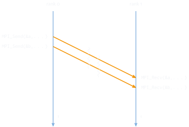{width="100%"}
:::
::::

# Collective Communication

## Collective communication

- convenience functions for frequently-used programming patterns (e.g. distributing data)
  - can involve several ranks at the same time, not just 2
  - must be called by ALL ranks in the communicator
  - must be called in-order by all ranks (no interleaving of multiple collective communication calls!)
  - is locally finished when local operation has finished
  - is globally finished when all participating ranks are finished
  - available as blocking and non-blocking variants (but cannot be mixed!)

## MPI_Scatter/MPI_Scatterv

:::: {.columns}
::: {.column width="50%"}
- sends chunks of data to multiple ranks, including root itself
- simple way of partitioning and distributing data
- `MPI_Scatterv()` allows varying counts of elements to be distributed to each rank
:::
::: {.column width="50%"}
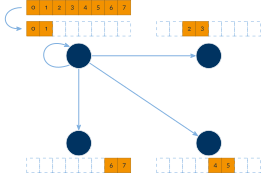{width="100%"}
:::
::::

## MPI_Scatter

```c
int MPI_Scatter(const void* sendbuf, int sendcount, MPI_Datatype sendtype,
                void* recvbuf, int recvcount, MPI_Datatype recvtype,
                int root, MPI_Comm comm)
```

- `sendbuf`: source buffer to send data from
- `sendcount`: number of data elements to send to each rank
- `sendtype`: type of data to send
- `recvbuf`: destination buffer to save data to
- `recvcount`: number of data elements to receive at each rank
- `recvtype`: type of data to receive
- `root`: rank of the sender
- `comm`: communicator

## Scatter example

```c
int globaldata[4];
if(rank==0) {
    for(int i = 0; i < 4; i++) {
        globaldata[i] = ...
    }
}
int localdata;
MPI_Scatter(globaldata, 1, MPI_INT, &localdata, 1, MPI_INT, 0,
            MPI_COMM_WORLD);
```

## MPI_Gather/MPI_Gatherv

:::: {.columns}
::: {.column width="50%"}
- sends chunks of data from multiple ranks, including root itself, to root
- simple way of collecting data
- `MPI_Gatherv()` allows varying counts of elements to be collected from each rank
:::
::: {.column width="50%"}
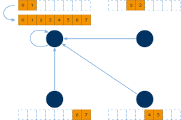{width="100%"}
:::
::::

## MPI_Bcast

:::: {.columns}
::: {.column width="50%"}
- broadcast operation
- sends copies of data to multiple ranks
:::
::: {.column width="50%"}
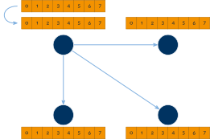{width="100%"}
:::
::::

## Q: emulating broadcast with point-to-point?

```{.c code-line-numbers="|1|3-11"}
MPI_Bcast(&buf, 1, MPI_INT, 0, MPI_COMM_WORLD);
// ################ or instead: ################
if (rank == 0) {
    for (int i = 0; i < size; i++) {
        if (i != rank) {
            MPI_Send(&buf, 1, MPI_INT, i, 0, MPI_COMM_WORLD);
        }
    }
} else {
    MPI_Recv(&buf, 1, MPI_INT, 0, 0, MPI_COMM_WORLD, MPI_STATUS_IGNORE);
}
```

## Collective communication patterns

- might be chosen automatically at runtime by MPI implementation
- may depend on multiple parameters, including
  - type of operation (e.g. broadcast)
  - number and location of ranks
  - size and structure of data
  - hardware capabilities

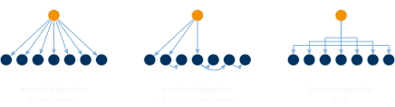{fig-align="center" height="230"}

## Barrier

```c
int MPI_Barrier(MPI_Comm comm)
```

- `comm`: communicator
- causes all ranks to wait until everyone reached the barrier
  - normally not needed: explicit data communication usually also inherently synchronizes
  - often used for functional debugging and performance debugging
    - Don't forget to remove in production/release!

## MPI_Reduce

:::: {.columns}
::: {.column width="55%"}
- aggregate data from multiple ranks, including root itself, to root
  - e.g. `MPI_SUM`
  - may use optimized collective communication patterns
- assumes associative reduction operation $\circ$ such that e.g.
  $$(x_0 \circ x_1) \circ (x_2 \circ x_3) = ((x_0 \circ x_1) \circ x_2) \circ x_3$$
- be careful with floating point types!
:::
::: {.column width="45%"}
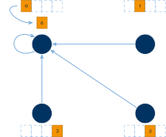{width="100%"}
:::
::::

## MPI_Reduce cont'd

```c
int MPI_Reduce(const void* sendbuf, void* recvbuf, int count,
               MPI_Datatype datatype, MPI_Op op, int root, MPI_Comm comm)
```

- `sendbuf`: source buffer to reduce data from
- `recvbuf`: destination buffer to reduce data into
- `count`: number of data elements in source and destination buffers
- `datatype`: type of data to reduce
- `op`: reduction operation
- `root`: rank of the destination of aggregated result
- `comm`: communicator

## Available reduction operations

:::: {.columns}
::: {.column width="50%"}
- several pre-defined
  - `MPI_MAX`, `MPI_MIN`
  - `MPI_SUM`, `MPI_PROD`
  - `MPI_LAND`, `MPI_LOR`, `MPI_LXOR`
  - `MPI_BAND`, `MPI_BOR`, `MPI_BXOR`
  - `MPI_MAXLOC`, `MPI_MINLOC`
- all pre-defined operations are associative and commutative
:::
::: {.column width="50%"}
- also user-defined ops are possible
  - must be associative
  - may be commutative
  - requires a specific function signature
  - needs to be registered as an MPI handle
:::
::::

## Additional MPI functions

- `MPI_Wtime`
  - returns time in seconds since an arbitrary time in the past (wall clock time)
- `MPI_Sendrecv`
  - convenience wrapper for blocking send and receive
- `MPI_Allreduce`/`MPI_Allgather`/…
  - same as non-all versions, but result is available everywhere (performance impact!)
- `MPI_Scan`/`MPI_Exscan`
  - inclusive and exclusive prefix reductions
- `MPI_Wait`/`MPI_Test`
  - blocking/non-blocking check whether pending operation completed
- `MPI_Probe`/`MPI_Iprobe`
  - blocking/non-blocking check for new message without actually receiving it

# Practical example

## Example code: naïve matrix multiplication

:::: {.columns}
::: {.column width="50%"}
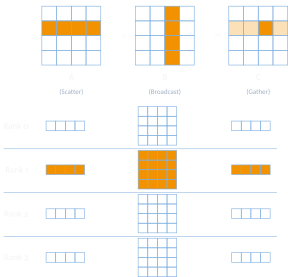{width="100%"}
:::
::: {.column width="50%"}
```{.c filename="code/matmul_mpi.c"}
#include <mpi.h>
#include <stdio.h>
#include <stdlib.h>

#define SIZE 4

int A[SIZE][SIZE];
int B[SIZE][SIZE];
int C[SIZE][SIZE];

void fill_matrix(int m[SIZE][SIZE]);
void print_matrix(int m[SIZE][SIZE]);
```
:::
::::

## Example code: naïve matrix multiplication cont'd {.smaller}

```{.c filename="code/matmul_mpi.c" code-line-numbers="|3-4|7-10|13-16|19-20|23-24|27"}
int myRank, numProcs;
MPI_Init(&argc, &argv);
MPI_Comm_rank(MPI_COMM_WORLD, &myRank);
MPI_Comm_size(MPI_COMM_WORLD, &numProcs);

// if matrix size not divisible
if(SIZE % numProcs != 0) {
    MPI_Finalize();
    return EXIT_FAILURE;
}

// root generates input data
if(myRank == 0) {
    fill_matrix(A);
    fill_matrix(B);
}

// compute boundaries of local computation
int start = myRank*SIZE/numProcs;
int end = (myRank+1)*SIZE/numProcs;

// distribute rows of A to everyone
MPI_Scatter(A, SIZE*SIZE/numProcs, MPI_INT, A[start], SIZE*SIZE/numProcs, MPI_INT, 0,
            MPI_COMM_WORLD);

// send entire matrix B to everyone
MPI_Bcast(B, SIZE*SIZE, MPI_INT, 0, MPI_COMM_WORLD);
```

## Example code: naïve matrix multiplication cont'd

```{.c filename="code/matmul_mpi.c" code-line-numbers="|2-10|13-14|16"}
// local computation of every rank
for(int i = start; i < end; i++) {
    for(int j = 0; j < SIZE; j++) {
        C[i][j] = 0;
        for(int k = 0; k < SIZE; k++) {
            C[i][j] += A[i][k] * B[k][j];
        }
    }
}

// gather result rows back to root
MPI_Gather(C[start], SIZE*SIZE/numProcs, MPI_INT, C, SIZE*SIZE/numProcs, MPI_INT, 0,
           MPI_COMM_WORLD);

if(myRank == 0) { print_matrix(C); }
MPI_Finalize();
return EXIT_SUCCESS;
```

::: {.aside}
Complete program: [`code/matmul_mpi.c`](code/matmul_mpi.c) — compile with `mpicc -o matmul code/matmul_mpi.c`, run with `mpiexec -n 4 ./matmul`
:::

## Submitting to a cluster (SLURM & SGE)

:::: {.columns}
::: {.column width="50%"}
```{.bash filename="code/job.slurm"}

```
:::
::: {.column width="50%"}
```{.bash filename="code/job.sge"}

```
:::
::::

## `Tales from the proseminar: osu_latency on LCC3` {.center-figs}

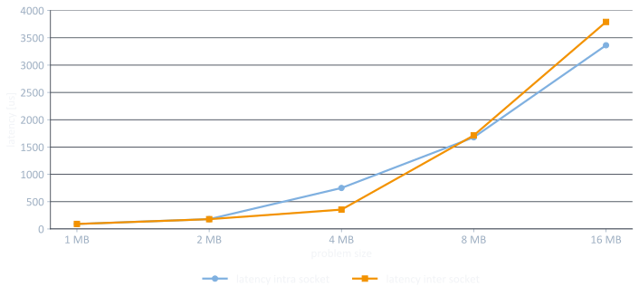{fig-align="center" height="460"}

## `Tales from the proseminar: osu_latency on LCC3` {.center-figs visibility="uncounted"}

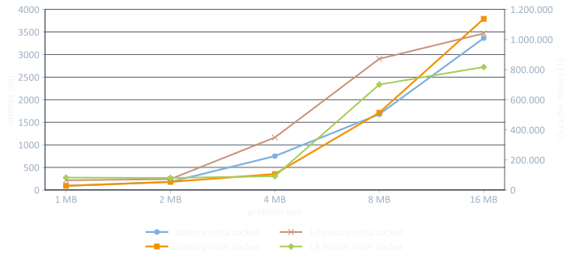{fig-align="center" height="460"}

## `Tales from the proseminar: osu_latency on LCC3 (WIP!)`



# Summary

## Summary

- general concepts about MPI
  - characteristics
  - programming model
  - startup
- point-to-point communication
- collective communication
- practical example
- `Tales from the proseminar: osu_latency on LCC3`
