## Overview

- functional debugging
  - generic guidelines
  - serial debugging
  - parallelism-specific debugging
- performance debugging
  - generic guidelines
  - serial debugging
  - parallelism-specific debugging

## Motivation: first Ariane-5 flight, 1996

:::: {.columns}
::: {.column width="58%"}
- Debugging Ariane-5's maiden flight
  - booster nozzles adjusted for a 20% angle of attack, causing vehicle separation, triggering self-destruction
  - because a diagnostic bit pattern was sent to on-board computer as flight data
  - because a data conversion from 64 bit float to 16 bit signed int overflowed
  - because they used Ariane 4 inertial code for Ariane 5, which has larger possible value ranges (velocities)
    - and only protected 4 out of 7 critical variables against overflow and not this one because in Ariane 4 velocities were lower
    - also, this software component serves no purpose after lift-off (only used for inertial platform alignment before launch)
:::
::: {.column width="42%"}
{width="100%"}

::: {.aside}
<https://www.youtube.com/watch?v=gp_D8r-2hwk>
:::
:::
::::

## Motivation: first Ariane-5 flight, 1996 {.smaller}

:::: {.columns}
::: {.column width="58%"}
- Debugging Ariane-5's maiden flight
  - booster nozzles adjusted for a 20% angle of attack, causing vehicle separation, triggering self-destruction
  - because a diagnostic bit pattern was sent to on-board computer as flight data
  - because a data conversion from 64 bit float to 16 bit signed int overflowed
  - because they used Ariane 4 inertial code for Ariane 5, which has larger possible value ranges (velocities)
    - and only protected 4 out of 7 critical variables against overflow and not this one because in Ariane 4 velocities were lower
    - also, this software component serves no purpose after lift-off (only used for inertial platform alignment before launch)
:::
::: {.column width="42%"}
&nbsp;

<!-- one lesson per cause, in the same order as the bullets on the left -->

➜ &nbsp;bad choice of sentinel values

➜ &nbsp;compiler warnings!

➜ &nbsp;lack of proper requirement analysis

➜ &nbsp;lack of proper requirement analysis

➜ &nbsp;debugging code active in release
:::
::::

## Motivation

- Why do we need debugging?
  - Because we make mistakes!
- Why do we need a lecture about this?
  - OpenMPI FAQ *"Debugging applications in parallel"*, first question:

::: {.small}
> **Q:** "How do I debug OpenMPI processes in parallel?"
>
> **A:** "This is a difficult question. […] This FAQ section does not provide any definite solutions to debugging in parallel. […]"
:::

# Functional Debugging

## Functional debugging

- dealing with everything that results in not getting the correct program output
  - program crashes (e.g. segmentation faults, undefined behavior, race conditions)
  - program not finishing (deadlocks, infinite loops)
  - incorrect output (e.g. undefined behavior, race conditions, arithmetic errors)
- errors can be deterministic or non-deterministic
- all that applies to debugging serial programs is crucial for parallel ones
  - If you can't trust the serial implementation, why would you in a parallel context?
  - parallel programming models are just different means to cause the same issues

## Debugging effort pyramid {.center-figs}

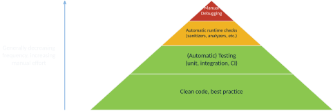{fig-align="center" height="440"}

## Coding guidelines

:::: {.columns}
::: {.column width="72%"}
- write clean code that prevents bugs or facilitates their detection, e.g.
  - use meaningful identifiers
  - minimize vertical distance of variables
  - don't use OpenMP's `private`
  - follow the Don't Repeat Yourself (DRY) principle (single component per feature)
  - …
- The toolchain you must use!
  - read & heed compiler warnings
  - write and regularly run unit and/or integration tests, especially aimed at (varying degrees of) parallelism
  - use code coverage tests
  - use continuous integration
  - use source version control
:::
::: {.column width="28%"}
{.fig-card width="100%"}
:::
::::

## "Best of" real commit messages encountered in the past

::: {.small}
- `stufF`
- `manager stuff`
- `more manager stuff`
- `Make things work`
- `::w:qMerge branch 'master'`
- `dl;adlwa`
- `Added performance fix for DataItemManager::get() by caching fragment result in reference`
- `Removed debug print statement`
- `Fixed a linking issue of the unwrap_tuple function`
- `Redirected runtime system output to error stream`
- `fixing typos`
:::

## Recommended reading/reference material example

:::: {.columns}
::: {.column width="62%"}
- *"Clean Code"* by Robert Martin, Prentice Hall 2008
  - ISBN 9780132350884
  - also available in German
- naming, functions, commenting, formatting, data structures, error handling, unit tests, classes, concurrency, refinement & refactoring, …
:::
::: {.column width="38%"}
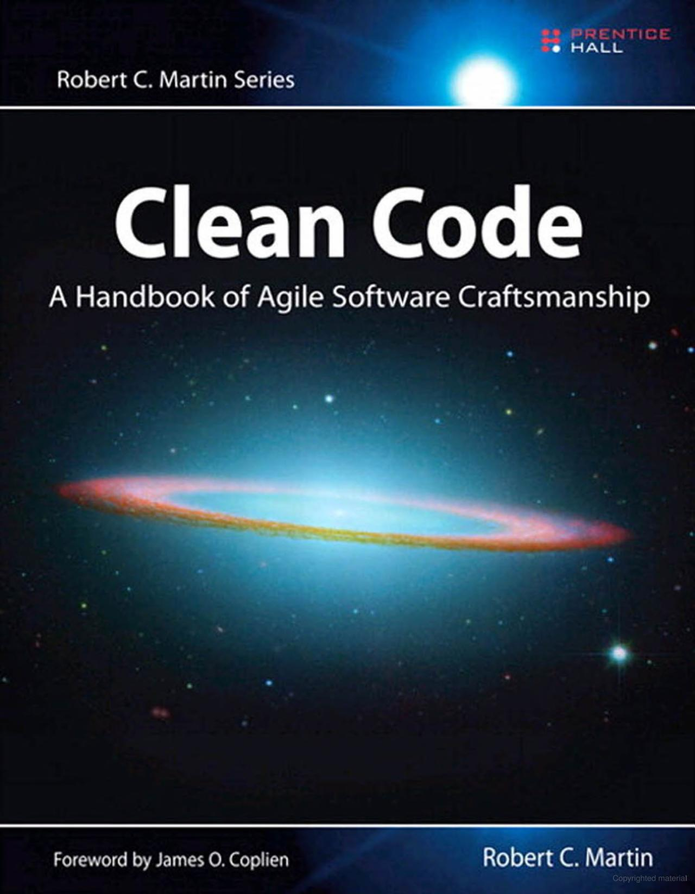{width="80%" fig-align="center"}
:::
::::

## Generic debugging guidelines

- create a Minimal Working Example (MWE)
  - minimize problem size
  - minimize software components/features involved
  - ensure/increase reproducibility (e.g. fix random seeds, thread/process mapping/binding, …)
  - if parallel
    - minimize machine size (number of threads and/or ranks)
    - minimize complexity of parallel interaction (e.g. communication patterns, …)
- minimizes debugging feedback cycle times, amount of memory to inspect, amount of code to consider, overall degree of complexity of component & parallel interaction
  - sounds simple, but don't underestimate its significance
  - every change along the way to an MWE gives you more information about the problem

## Serial debuggers

- `gdb`
  - useful for inspecting memory contents and getting call stacks
  - can work with multi-threaded programs and also MPI
    - `mpiexec -n X gdb --ex 'run' --ex 'bt' --ex 'quit' ./a.out`
  - can be used to debug e.g. a single MPI process among many
    - `mpiexec -n 1 gdb ./a.out : -n 7 ./a.out`
  - can be attached to already-running processes
    - `gdb --pid 12345`
- `valgrind`
  - mostly used for finding memory leaks (can also simulate cache or generate call graph)
  - can work with multi-threaded programs (but only concurrent execution!)
  - can yield some false positives e.g. for OpenMP related to thread-local storage
  - there is a dedicated `valgrind4hpc` (mainly handles output redirection from multiple ranks)

## Sanitizers (still mostly serial)

- tools that instrument code at compile time to perform checks at runtime
  - often lower overhead compared to external tools such as valgrind
  - if in doubt, check same issue with multiple tools (e.g. address sanitizers of multiple compilers and valgrind)
- depending on compiler, several sanitizers available, e.g.
  - **address**: buffer overflows, use-after-free, stack corruption, etc.
  - **undefined behavior**: signed integer overflow, float division by zero, negative shift operands, etc.
  - **thread**: detects data races
  - **leak**: detects memory leaks

## Example 1: wrong order of arguments in MPI call {.smaller}

```c
MPI_Send(&A_local[0], MPI_DOUBLE, N, rank - 1, 0, MPI_COMM_WORLD);
```

Compile with `-Wall -Wextra -pedantic`:

::: {.small}
```default
heat_2D.c: In function 'main':
/usr/lib/.../openmpi/include/mpi.h:402:47: warning: passing argument 2 of 'MPI_Send'
    makes integer from pointer without a cast [-Wint-conversion]
  402 | #define OMPI_PREDEFINED_GLOBAL(type, global) ((type) ((void *) &(global)))
      |                                                      ~^~~~~~~~~~~~~~~~~~
      |                                                       struct ompi_datatype_t *
heat_2D.c:110:25: note: in expansion of macro 'MPI_DOUBLE'
/usr/lib/.../openmpi/include/mpi.h:1784:50: note: expected 'int' but argument is of
    type 'struct ompi_datatype_t *'
heat_2D.c:110:37: warning: passing argument 3 of 'MPI_Send'
    makes pointer from integer without a cast [-Wint-conversion]
  110 | MPI_Send(&A_local[0], MPI_DOUBLE, N, rank - 1, 0, MPI_COMM_WORLD);
      |                                   ^
      |                                   int
```
:::

## Example 2: incorrect array indexing {.smaller}

*"program hangs" or "receiving garbage in ghost cells"*

::: {.small}
```default
$ mpicc heat_2D_mpi.c -o heat_2D_mpi -O3 -fsanitize=undefined,address -g
$ mpiexec -n 2 ./heat_2D_mpi

==1510386==ERROR: AddressSanitizer: heap-buffer-overflow on address 0x61f000002880
READ of size 6144 at 0x61f000002880 thread T0
    #0  0x14f80355538a in __interceptor_memcpy sanitizer_common_interceptors.inc:827
    #1  0x14f80104b8a2 in ucp_dt_pack                  (/lib64/libucp.so.0+0x248a2)
    #2  0x14f801055403 in ucp_tag_pack_eager_only_dt   (/lib64/libucp.so.0+0x2e403)
    #3  0x14f800e0f8e8 in uct_mm_ep_am_bcopy           (/lib64/libuct.so.0+0x148e8)
    #4  0x14f8010557ca in ucp_tag_eager_bcopy_single   (/lib64/libucp.so.0+0x2e7ca)
    #5  0x14f801061a0d in ucp_tag_send_nbr             (/lib64/libucp.so.0+0x3aa0d)
    #6  0x14f8032318b0 in mca_pml_ucx_send             (libmpi.so.40+0x1a68b0)
    #7  0x14f80313d64a in PMPI_Send                    (libmpi.so.40+0xb264a)
    #8  0x402ab6      in main       heat_2D_mpi.c:116
    #9  0x14f8022add84 in __libc_start_main            (/lib64/libc.so.6+0x3ad84)
```
:::

## Example 2: incorrect array indexing cont'd

```{.c code-line-numbers="|9"}
if (rank > 0) {
    MPI_Send(&A_local[0], N, MPI_DOUBLE, rank - 1, 0, MPI_COMM_WORLD);
    MPI_Recv(ghost_vec_upper, N, MPI_DOUBLE, rank - 1, 1, MPI_COMM_WORLD,
             MPI_STATUS_IGNORE);
}
if (rank < size - 1) {
    // printf("A_N\n");
    // printVec((A_local[rows_local-1]),N);
    MPI_Send(&A_local[rows_local-1], N, MPI_DOUBLE, rank + 1, 1, MPI_COMM_WORLD);
    MPI_Recv(ghost_vec_lower, N, MPI_DOUBLE, rank + 1, 0, MPI_COMM_WORLD,
             MPI_STATUS_IGNORE);
}
```

## Example 3: MPI Send/Recv deadlock {.smaller}

::: {.small}
```default
$ mustrun -np 2 ./heat_stencil_2D_mpi --must:output stdout

[MUST] MUST configuration ... centralized checks with fall-back application crash
       handling (very slow)
[MUST] Search for linked P^nMPI ... not found ... using LD_PRELOAD ... success
[MUST] Executing application:
[MUST-RUNTIME] ============MUST===============
[MUST-RUNTIME] ERROR: MUST detected a deadlock, detailed information is available
               in the MUST output file.
[MUST-RUNTIME] ===============================
[MUST-REPORT] Error global: The application issued a set of MPI calls that can
              cause a deadlock! A graphical representation of this situation is
              available in a detailed deadlock view.
[MUST-REPORT] Reference 1: call MPI_Send@rank 0, threadid 0;
[MUST-REPORT] Stacktrace:
[MUST-REPORT] #0  main@heat_stencil_2D_mpi.c:83
```
:::

Live demo with MUST (<https://itc.rwth-aachen.de/must/>)!

## Example 3: MPI Send/Recv deadlock cont'd {.center-figs}

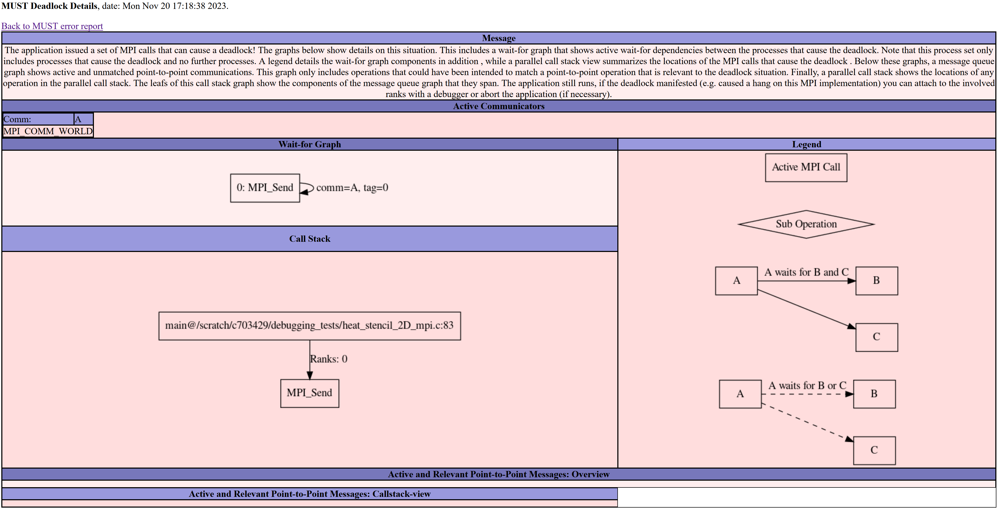{.fig-card fig-align="center" height="430"}

## Parallel debuggers

- very little free software
- two commercial top dogs: DDT (Linaro) and TotalView (Perforce Software)
  - support OpenMP, MPI, CUDA, etc.
  - several features centered around parallelism
    - examine variables per rank/thread, examine send/receive queues of MPI libraries, etc.
    - still, limited usefulness
- several other software packages
  - **MUST**: MPI runtime error checking tool
  - **SimGrid**: cluster simulator, also for MPI
  - **Visual Studio**: supports debugging MPI programs on Windows
  - **Intel Inspector**: data race detector for multi-threaded programs
  - **ARCHER**: data race detector for OpenMP
  - **STAT**: trace analysis tool to group ranks with similar behavior for easier analysis
  - **AutomaDeD**: uses heuristics to find dissimilarities in rank behaviors

## DDT screenshot (overview) {.center-figs}

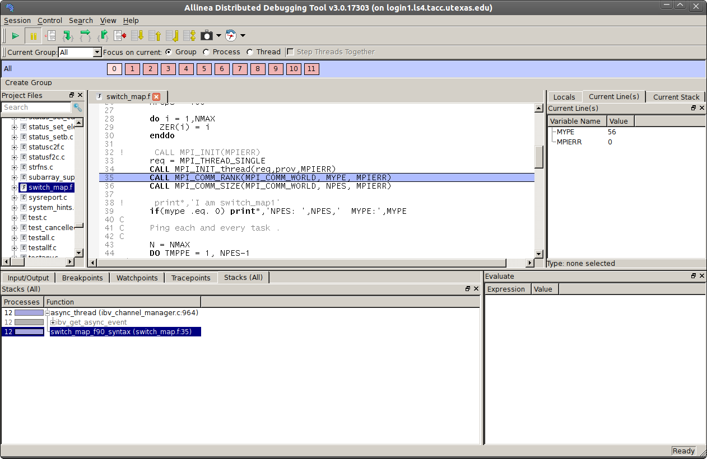{.fig-card fig-align="center" height="440"}

## DDT screenshots (communication patterns, data across ranks) {.center-figs}

::: {.fig-row}
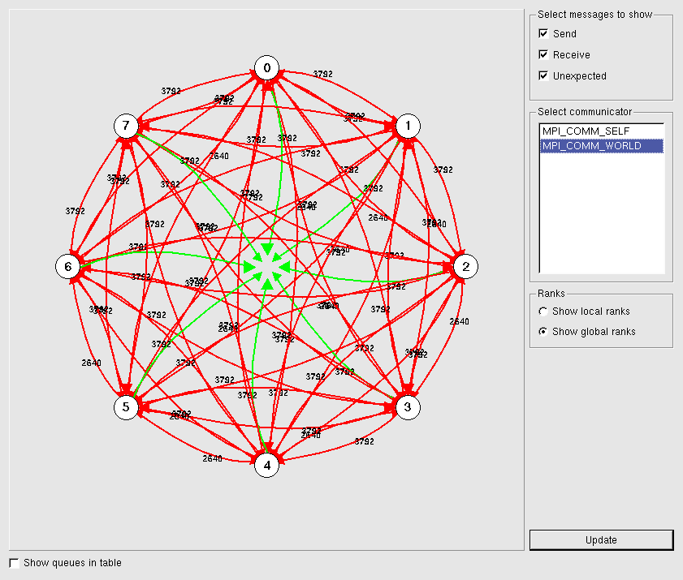{.fig-card height="400"}
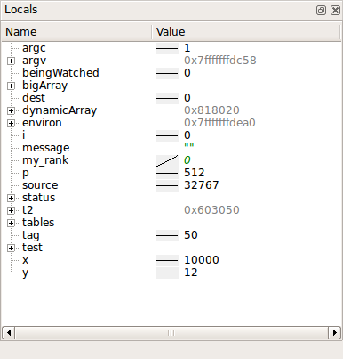{.fig-card height="400"}
:::

## Automatic race condition debugging

- difficult to do automatically and exactly
  - statically detecting race conditions is NP-hard
  - dynamically detecting race conditions incurs large runtime overhead (every memory access and synchronization action must be logged and checked, usually there are multiple control flow paths to be checked, etc.)
- most solutions resort to simulation and/or heuristics
  - several experimental tools available in research
  - many issues: limited scope, only apply to a subset of programming languages, etc.
  - few "mature" tools, e.g. Intel Inspector

## Domain-specific debugging

- visualize the output using appropriate tools
  - gnuplot
  - matplotlib
  - ParaView
  - …
- note that this usually prohibits automatic checking
  - whenever feasible, unit and integration tests are preferred

::: {.fig-row}
{height="215"}
{height="215"}
{.fig-card height="215"}
:::

## Best approach to debugging parallel programs

- know your algorithm and implementation
  - e.g. *"a structured grid problem with 2 ghost cells in every direction"*
- know your programming models and languages, and their semantics
  - *"reading the send buffer during an `MPI_Isend(…)` is illegal"*
  - *"this C++ object's destructor will be called at the end of the full-expression"*
- Don't trust (seemingly) "automagic" analysis tools too much (LLMs!!!), read and understand the source code when available!

## Supercomputer-specific information {.smaller}

:::: {.columns}
::: {.column width="42%"}
- check available SLURM QOS and partitions
  - e.g. VSC5 shown on the right
- use interactive jobs
  - e.g. LCC3: `srun --nodes=1 --ntasks-per-node=12 --pty bash -i`
- general good practices
  - SLURM's resource limits, even in production (wall time, RAM)
  - e-mail notifications for (some) job state changes
  - Don't run anything parallel on the login node that has even a remote chance of running >1 second!
:::
::: {.column width="58%"}
::: {.small}
| QOS name | Partition | Run time limit | Description |
| --- | --- | --- | --- |
| `zen3_0512` | `zen3_0512` | 72h (3 days) | Default |
| `zen3_1024` | `zen3_1024` | 72h (3 days) | High Memory |
| `zen3_2048` | `zen3_2048` | 72h (3 days) | Higher Memory |
| `cascadelake_0384` | `cascadelake_0384` | 72h (3 days) | |
| `zen2_0256_a40x2` | `zen2_0256_a40x2` | 72h (3 days) | GPU Nodes |
| `zen3_0512_a100x2` | `zen3_0512_a100x2` | 72h (3 days) | GPU Nodes |
| `zen3_0512_devel` | 5 nodes on `zen3_0512` | 10 min | Fast Feedback |
:::

::: {.aside}
<https://wiki.vsc.ac.at/doku.php?id=doku:vsc5_queue>
:::
:::
::::

# Performance Debugging

## Performance debugging (aka "optimization")

- also sometimes known as "non-functional" debugging (not related to functional output)
  - short execution time not necessarily but most often the only goal
  - much more tricky than functional debugging
    - How do you know the performance "bug" was fixed? Because it's "fast" now?
- most aspects of functional debugging of sequential programs still apply
  - coding guidelines & best practice
  - \+ reproducibility (e.g. fix random seeds, scheduling affinities, …)
  - \+ if required, performance unit tests, performance regression checks
  - \+ performance tools (the ones for sequential programs can also be useful)
  - \+ a lot more knowledge about hardware required

## (h)top

- Don't underestimate the power of `top` or `htop`!
- get a high-level overview of the workload on the system (and its components) and compare to what you expected!
  - What's the ratio between user time and system time?
    - high system time could be caused by inefficient I/O, high amount of context switching, etc.
    - also useful: `/usr/bin/time -v`
  - Which CPU cores am I really using?
    - the only way to verify affinity policies
  - What is the actual memory footprint vs. what it should be?
    - detect e.g. memory leaks or inefficient memory management without any additional analysis tools

## htop & affinity

- 2x Intel E5-2699 v3 (18 cores per CPU) in a single node
- htop shows cores 1–18 and 37–54 busy, hence 36 cores total – right?

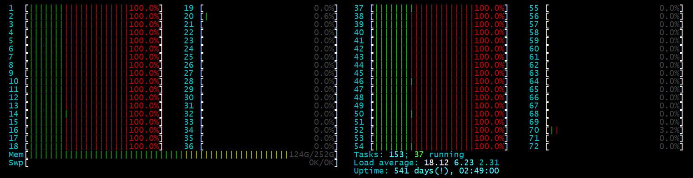{fig-align="center" width="100%"}

## Performance counters via `perf`

```default
$ perf stat ./heat_stencil_1D_seq
...
    28,826,239,136      cycles:u                  #   2.471 GHz
    35,220,856,783      instructions:u            #   1.22  insn per cycle
     6,711,849,029      branches:u                # 575.356 M/sec
         1,295,209      branch-misses:u           #   0.02% of all branches
             1,044      LLC-load-misses:u
                26      LLC-store-misses:u
        15,312,122      L1-dcache-load-misses:u
       476,440,489      L1-dcache-store-misses:u
```

## Terminology

:::: {.columns}
::: {.column width="45%"}
- **instrumentation**
  - add source/machine code that will measure something when executed
  - can happen manually, automatically, during compilation, linking, runtime, …
  - do not confuse with "measurement"
- **inclusive/exclusive measurements**
  - do measurements include data for nested code regions (e.g. functions)?
:::
::: {.column width="55%"}
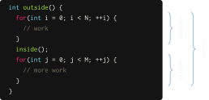{width="100%"}
:::
::::

## More terminology: sample- vs. trace-based profiling

- **sampling**
  - gives aggregated information of how much time is spent where in the code
  - based on statistics: does not provide information on the order of events, their time interval or exact numbers
  - easy to accomplish, comparatively low overhead, often no code changes required
    - e.g. stop program periodically and read program counter register of the CPU core
    - build histogram at the end
- **tracing**
  - produces a detailed log of which event happened at what point in time
  - allows to establish order of events, even across processes/nodes if clocks are in sync
  - often requires code changes/instrumentation
    - e.g. wrap every function call with `get_timestamp(); func_call(); get_timestamp();`

## gprof

- sample-based profiler
  - also limited code instrumenter for call graph generation and call counts
  - very simplistic, not always accurate
- available with every GCC installation
- very simple in its use
  - compile with debug symbols (`-g`) and gprof support (`-pg`)
  - run binary as usual
  - run `gprof binary gmon.out` to view results
  - use `--line` to get more detailed, line-based results

## gprof example: global sum vs. thread-local sum {.smaller}

:::: {.columns}
::: {.column width="50%"}
```c
int foo() {
    long long counter = 0;
    #pragma omp parallel for
    for(int i = 0; i < N; ++i) {
        #pragma omp critical
        counter++;
    }
    return counter;
}
```
:::
::: {.column width="50%"}
```c
int bar() {
    long long partSum[MAX_NUM_THREADS][8];
    long long counter = 0;
    #pragma omp parallel
    {
        int tid = omp_get_thread_num();
        partSum[tid][0] = 0;
        #pragma omp for
        for(int i = 0; i < N; ++i) partSum[tid][0]++;
        #pragma omp critical
        counter += partSum[tid][0];
    }
    return counter;
}
```
:::
::::

## gprof example cont'd

```default
Flat profile:

Each sample counts as 0.01 seconds.
  %   cumulative   self              self     total
 time   seconds   seconds    calls  Ts/call  Ts/call  name
100.71      0.02     0.02                            foo._omp_fn.0 (test.c:13 @ 400a3d)
  0.00      0.02     0.00        1     0.00     0.00  bar (test.c:19 @ 40092c)
  0.00      0.02     0.00        1     0.00     0.00  foo (test.c:8 @ 4008e6)
```

## `perf record` / `perf report`

:::: {.columns}
::: {.column width="45%"}
- `perf` also supports profiling
  - `perf record ./application`
  - `perf report -s sym,srcline`
- supports time as well as performance counters
- also records a lot of platform information
  - `perf report --header-only`
    - CPU type, OS version, date & time of record, etc.
  - `perf report --header-only -I`
    - includes NUMA topology, cache info, etc.
:::
::: {.column width="55%"}
::: {.small}
```default
Samples: 262K of event 'cache-misses:u'
Event count (approx.): 1072111977

Overhead  Symbol      Source:Line
  98.87%  [.] main    02_matrix_mul.c:68
   1.10%  [.] main    02_matrix_mul.c:69
   0.01%  [.] vfprintf vfprintf+15272
   0.01%  [.] vfprintf vfprintf+15262
   0.00%  [.] vfprintf vfprintf+15292
   0.00%  [.] vfprintf vfprintf+15255
```
:::
:::
::::

## gperftools

- sample-based profiler
  - formerly Google Performance Tools
- actually a collection of performance analysis tools and high-performance multi-threaded memory allocators
- very simple in its use
  - install gperftools library
  - link with `-lprofiler`
  - run with environment variable `CPUPROFILE=prof.out`
  - run `pprof binary prof.out` to view results (`--gv` for graphical visualization)

## gperftools example {.center-figs}

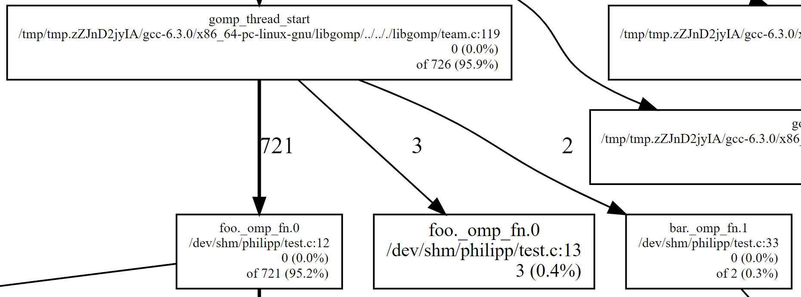{.fig-card fig-align="center" height="430"}

## Performance analysis tools for parallel programs {.smaller}

- profiling and analysis software
  - **Intel Pin**: dynamic binary instrumentation
  - **Intel VTune**: performance analysis for multi-threaded programs
  - **Intel Advisor**: dependency, vectorization and cache analysis tool
  - **AMD CodeXL / NVIDIA Nsight**: profiler and debugger for GPUs
  - **TAU**: profiling and tracing suite
  - **HPCToolkit**: profiling and tracing suite, includes GUI tools and tools for mapping binary code to source code
  - **PAPI**: library for access to hardware performance counters
  - **OProfile**: sampling-based profiler with hardware performance counter support
  - also, some software built into your IDE, e.g. MS Visual Studio
- analysis and visualization/reporting tools
  - Scalasca, Vampir, Paraver, JumpShot, paraprof, CUBE, etc.
- These lists are by far not complete!

## TAU & ParaProf {.center-figs}

::: {.fig-row}
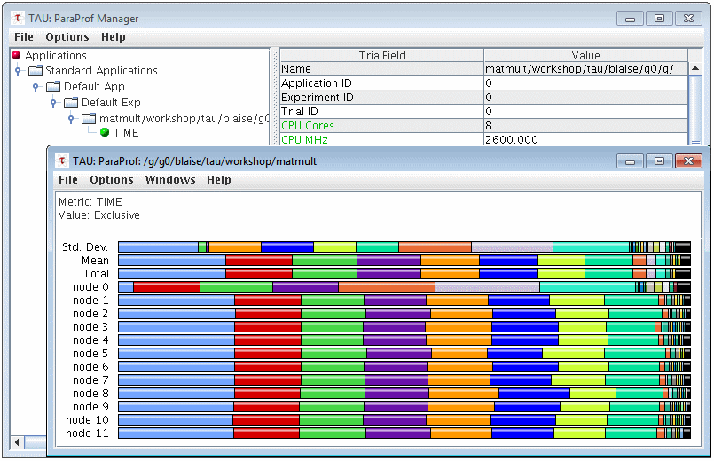{.fig-card height="400"}
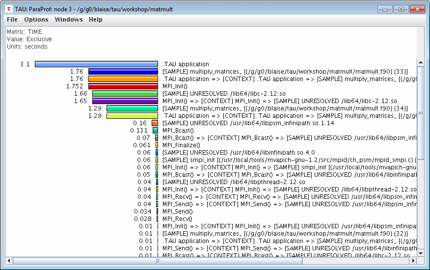{.fig-card height="400"}
:::

## Vampir {.center-figs}

::: {.fig-row}
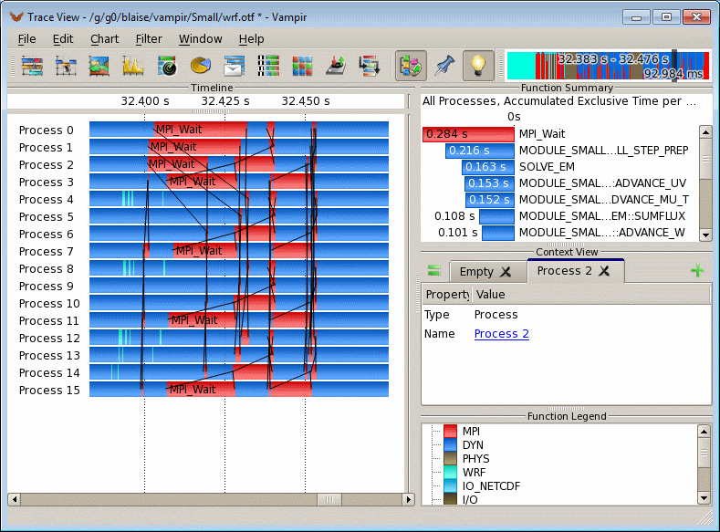{.fig-card height="400"}
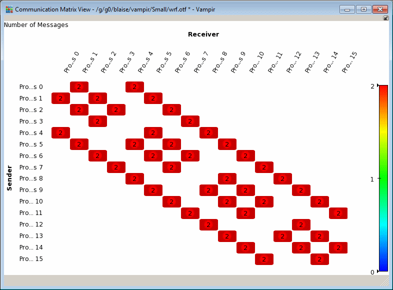{.fig-card height="400"}
:::

## HPCToolkit {.center-figs}

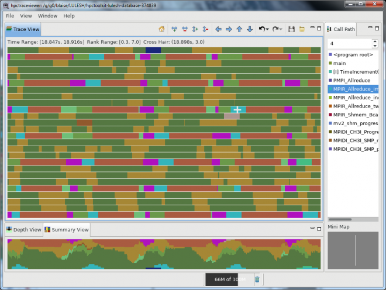{.fig-card fig-align="center" height="440"}

## Cube (from Scalasca suite)

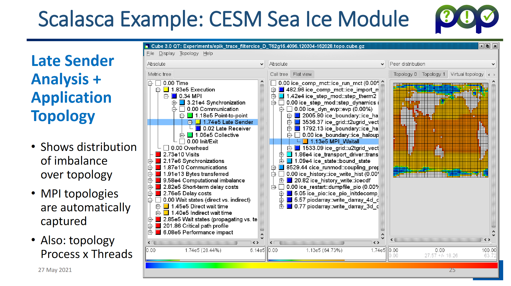{.fig-card fig-align="center" height="410"}

::: {.aside}
Source: Bernd Mohr, <https://pop-coe.eu/sites/default/files/pop_files/pop-webinar-scalasca.pdf>
:::

## General hints when working with debuggers

- `-g` when compiling if source code locations are required
  - Has nothing to do with optimization levels/flags! You can often use `-O3 -g`!
  - usually negligible performance impact
- careful with optimization levels/flags, especially `-O#`
  - function inlining, loop fusion/fission, …
  - likely to obfuscate source code locations
  - if required and feasible, work in `-O0` or temporarily disable conflicting flags
  - careful: `-O0` performance is very different from `-O1/2/3/…` performance
- check whether child processes and/or threads are included in analysis/reports
- if tracing or otherwise large-overhead instrumentation required, restrict to code regions of interest

## Angles of attack in order of benefit

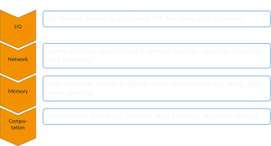{fig-align="center" height="450"}

# Summary

## Summary

- functional debugging
  - adhere to coding guidelines and best practice of software engineering
  - especially relevant for parallelism: know your programming models and semantics, don't trust automatic tools blindly
- performance debugging
  - don't underestimate the power of simple tools
  - many more advanced tools out there, but not straight-forward to use
  - know your hardware and your program hotspots

## Image sources {.smaller}

::: {.small}
- **Yoda:** <https://www.deviantart.com/biggiepoppa/art/Master-Yoda-Star-Wars-395511111>
- **DDT:** <https://portal.tacc.utexas.edu/software/ddt>, <https://www.sharcnet.ca/help/index.php/Parallel_Debugging_with_DDT>, <https://developer.arm.com/docs/101136/latest/ddt/viewing-variables-and-data>
- **Domain-specific debugging:** <https://twitter.com/maven2mars/status/984440044659159040>, <https://www.nasa.gov/ames/image-feature/nasa-highlights-simulations-at-supercomputing-conference-like-aircraft-landing-gear>, ZAMG Wettervorhersage 06.10.2020 12:00
- **TAU & ParaProf:** <https://hpc.llnl.gov/software/development-environment-software/tau-tuning-and-analysis-utilities>
- **Vampir:** <https://hpc.llnl.gov/software/development-environment-software/vampir-vampir-server>
- **HPCToolkit:** <https://hpc.llnl.gov/software/development-environment-software/hpc-toolkit>
:::

# Appendix: Intel Inspector

## Intel Inspector

- features
  - free
  - Linux & Windows version
  - automatically finds bugs in multi-threaded programs
    - deadlocks
    - memory corruption
    - race conditions
    - vulnerabilities
  - supports OpenMP, TBB, Pthreads, Windows threads
- limitations & issues
  - slowdown by 1–2 orders of magnitude!
  - explicit support only for Intel OpenMP runtime
  - error detection only at runtime, only in executed control flow branches
  - false positives and negatives possible

## OpenMP data race example 1

```c
int counter = 0;
#pragma omp parallel for
for(int i = 0; i < 10; ++i) {
    counter++;
}
```

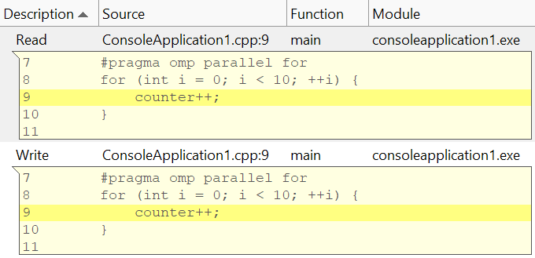{.fig-card fig-align="center" height="300"}

## OpenMP data race example 2

```c
int sum = 0;
#pragma omp parallel for
for(int i = 0; i < 10; i++) {
    int tmp = sum;
    tmp = tmp + 1;
    sum = tmp;
}
```

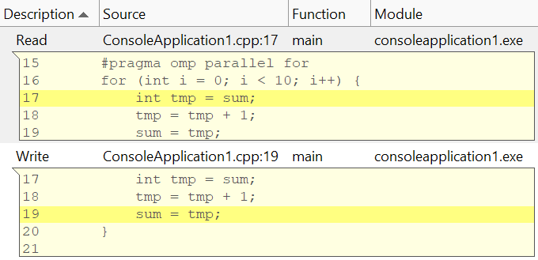{.fig-card fig-align="center" height="290"}

## OpenMP data race example 2: wrong fix

```c
int sum = 0;
#pragma omp parallel for
for(int i = 0; i < 10; i++) {
    int tmp;
    #pragma omp critical
    tmp = sum;
    tmp = tmp + 1;
    #pragma omp critical
    sum = tmp;
}
```

*(not detected by Intel Inspector 2020)*
