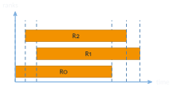
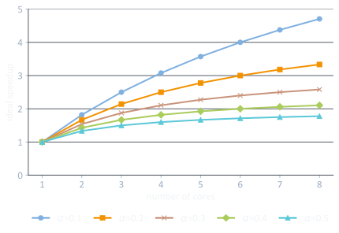
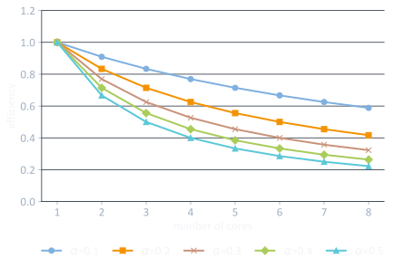
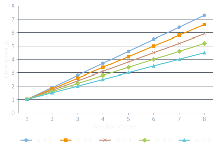
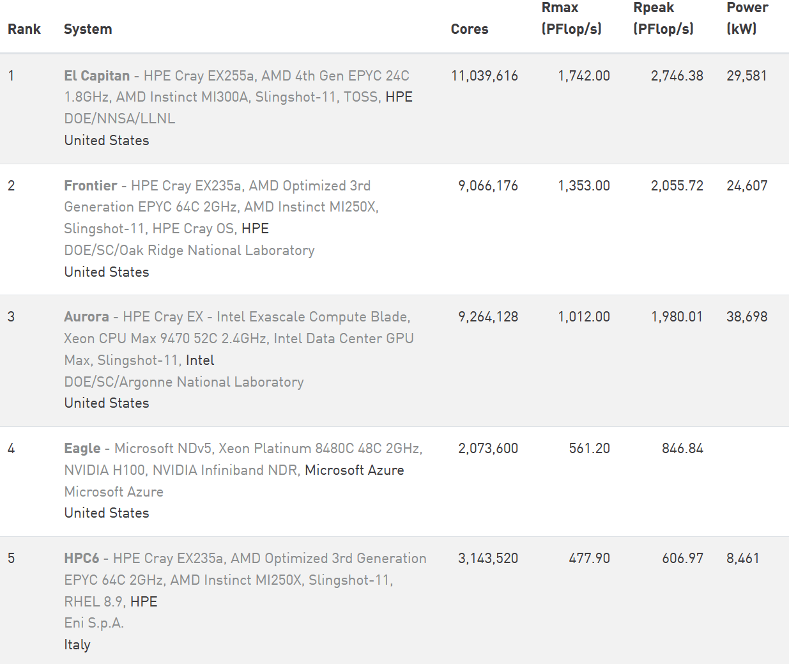
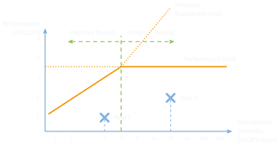
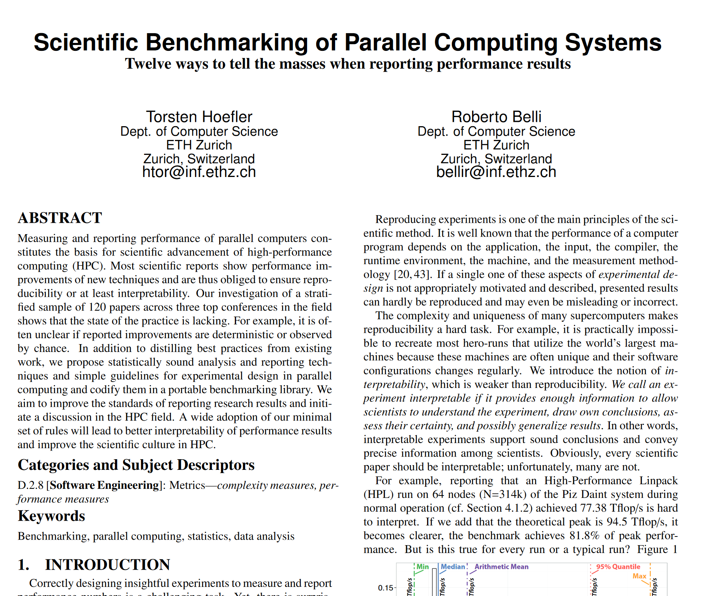
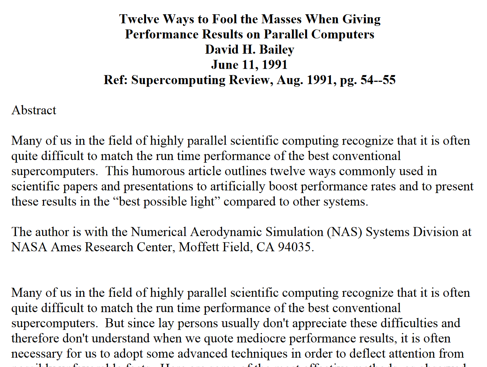

## Overview

- what and how to measure
  - time
  - time-dependent (speedup, efficiency, …)
  - FLOPS
- use measurements to drive optimizations
  - Amdahl's & Gustafson's law
- how to report measurements

## Motivation: optimization

- difficult to optimize without measuring
  - measurements are crucial for everything in computer science
  - How do you know whether program performance improved or not?
  - risk of premature optimization
- difficult to measure without knowing what is measured and how
  - know your metrics!
    - performance, time, efficiency, memory footprint, energy, FLOPs, cache misses, cyclomatic complexity, …
- tons of research on this topic…

# Time-Related Metrics

## Time

:::: {.columns}
::: {.column width="50%"}
- *wall time*
  - time measured by looking at the wall clock
  - disregards degree of parallelism
  - the default when talking "time"

$$t_\text{wall} = \max_{0 \le i < N}\left(t_{\text{end},i}\right) - \min_{0 \le i < N}\left(t_{\text{start},i}\right)$$
:::
::: {.column width="50%"}
- *cpu time*
  - wall time for each rank
  - cumulative over all ranks, varies with degree of parallelism
  - the default when talking "costs"

$$t_\text{cpu} = \sum_{i=0}^{N-1} t_i$$
:::
::::

{fig-align="center" height="200"}

## Time is parallel too

- synchronizing clocks over a large-scale system is very difficult
  - e.g. x86's TSC: in-core TimeStamp Counter, 1 clock cycle tick rate (< 1 ns)
  - can be read with a single instruction (`rdtsc` / `rdtscp`)
  - compare to network latency: 100–1000 ns, best case
  - note: CPU clock frequency scaling (DVFS) today no longer an issue
- hard to compare time measurements between processes (on different nodes!)
  - no issue if moderate accuracy and resolution requirements
  - otherwise check synchronization first (e.g. `MPI_WTIME_IS_GLOBAL` using `MPI_Comm_get_attr()`)
- also: mind the timer resolution in general
  - e.g. don't measure time intervals of 1–2 milliseconds with a 1 millisecond resolution
  - good practice: at least 10x higher resolution than shortest interval to be measured

## Speedup

- speed increase of a parallel program over the sequential version

$$\text{speedup}_p = \frac{t_s}{t_p}$$

- ideal: $t_p = \dfrac{t_s}{p}$ and hence $\text{speedup}_p = \dfrac{t_s}{\;t_s/p\;} = p$ (linear)

- super-linear speedup also possible
  - e.g. problem partitioning reduces memory footprint per processor/core
  - enables more efficient use of memory hierarchy (caches)

## Absolute and relative speedup

- two kinds of speedup
  - **absolute**: reference $t_s$ is the fastest sequential version
  - **relative**: reference $t_s$ is the fastest parallel version run sequentially
  - bad third option: reference is $t_{p'}$ with $p' < p$ (e.g. $p' = 16$ and $p = 128$)
  - always specify your reference!
- non-trivial problem: parallelism might entail algorithmic changes and/or overheads (e.g. communication)

## Efficiency

- measure of parallelization overhead
  - value range given between 0 and 1 or as a percentage

$$\text{efficiency}_p = \frac{\text{speedup}_p}{p}$$

- ideal: $\text{efficiency}_p = 1$ (= linear speedup)

- worst case: $\lim\limits_{p \to \infty} \text{efficiency}_p = 0$

## Amdahl's Law

- one of the oldest (1967) and still most important laws in parallel programming
- defines (upper limit on) speedup when dividing a parallel program into a sequential part ($r_s$) and a parallel part ($r_p$), with $r_s + r_p = 1$
- idea: $r_s$ cannot be improved through parallelism
  - hence it must somehow pose a limiting factor for any potential speedup
  - all parallelism improvement must originate solely from improving $r_p$
- note: idealized perspective, does not include e.g. hardware characteristics

## Amdahl's Law cont'd

:::: {.columns}
::: {.column width="46%"}
- law:

$$\text{speedup}_n = \frac{1}{r_s + \frac{r_p}{n}} = \frac{1}{\alpha + \frac{1-\alpha}{n}}$$

- severely limits potential speedup, even for infinite parallelism
- example: $\alpha = 0.2$ (= 20% sequential)
  - theoretical speedup on 8 cores is 3.33
  - theoretical speedup on $\infty$ cores is 5
:::
::: {.column width="54%"}
{width="100%"}
:::
::::

## Amdahl's Law: efficiency

:::: {.columns}
::: {.column width="46%"}
- the same principle applies to parallel efficiency
- example: $\alpha = 0.2$ (= 20% sequential)
  - theoretical efficiency on 8 cores is 0.42
  - theoretical efficiency on $\infty$ cores?
:::
::: {.column width="54%"}
{width="100%"}
:::
::::

## Amdahl's Law: implications

- first order of business: minimize $\alpha$!
  - change algorithm to reduce amount of sequential part
    - careful, changes reference for relative speedup
  - optimize sequential part as much as possible
- don't spend excessive effort on optimizing parallel part
  - 80/20 rule: diminishing benefits
  - also: risk of premature optimization
- consider a sensible maximum degree of parallelism
  - don't allocate 1024 processors when using 128 is acceptably fast
  - also consider other users, power consumption, cpu time budgets, …!

## Amdahl's Law: shortcomings

- Noticed that it assumes the amount of work to be fixed?
  - not realistic for many use cases, problem size often scales with machine size
  - some problems are solved in real-time (e.g. rendering) but at the highest problem size (e.g. image quality) possible
  - more resources (= processors/cores) can indeed help here
- John Gustafson reevaluated this issue in 1988
  - → Gustafson's Law

## Gustafson's Law cont'd

:::: {.columns}
::: {.column width="46%"}
- assume a sequential part $\alpha$ and a parallel part $(1-\alpha)$
- assume that $\alpha$ is fixed or scales very slowly with the number of cores

$$\text{speedup}_p = \alpha + (1-\alpha) \times P$$
:::
::: {.column width="54%"}
{width="100%"}
:::
::::

## Strong vs. weak scalability

- scalability is (sort-of) a description for speedup and efficiency
  - "program scales (linearly)" = program achieves linear speedup
  - "program does not scale" = program doesn't get any faster (maybe even slower)
- **strong scalability**
  - how the program scales with a fixed problem size
- **weak scalability**
  - how the program scales when keeping the problem size proportional
  - important: how to scale the problem in proportion?
    - Consider a 2D problem: scale first dimension? Second? Both? What about in 3D/4D/5D?

# Additional Metrics

## FLOPS

- floating point operations (FLOP/s: per second)
  - only operations with floating point semantics (= math)
  - does not count load/store/bitwise/…
- main measure for useful performance of software and hardware (work processed per time)
  - time not necessarily useful: can be wasted in waiting states…
- not applicable to every problem
  - consider integer-heavy problems (e.g. combinational logic, dynamic programming, …)
  - also: memory-heavy, I/O-heavy, etc…

## FLOPS cont'd

:::: {.columns}
::: {.column width="50%"}
- What's the number of floating point instructions in x86 on the right?
  - 2 operations: `mul`, `add`
  - 1 instruction: fused multiply-add (FMA)
- Don't confuse operations and instructions
  - number of instructions is hardware- and compiler-dependent
  - know your hardware, compiler, and environment (e.g. compiler flags)
  - do not blindly trust hardware peak FLOPS
:::
::: {.column width="50%"}
```c
double foo(double A, double B,
           double C, double D) {
    D = A * B + C;
    return D;
}
```

```asm
x86:  vfmadd132sd xmm0, xmm2, xmm1
```
:::
::::

## Common way of counting FLOPS: multiply + add

```c
D = A * B + C;          // 2 Ops, 1 Ins
D = A     + C;          // 1 Op,  1 Ins
D = A * B    ;          // 1 Op,  1 Ins
D = A * A * B + C;      // 3 Ops, 2 Ins
D = A * B + C * A + B;  // 4 Ops, 2 Ins
```

## Getting FLOPS data

:::: {.columns}
::: {.column width="50%"}
- instrumentation and measurement
  - `perf`, PAPI, etc.
  - use performance counters (also "hardware counters")
  - requires detailed knowledge of the source code, hardware, and compiler
- modeling
  - know your algorithm and implementation
  - there are also tools to automatically build models, of varying quality…
:::
::: {.column width="50%"}
::: {.small}
```default
FP_ARITH_INST_RETIRED.SCALAR_DOUBLE
FP_ARITH_INST_RETIRED.SCALAR_SINGLE
FP_ARITH_INST_RETIRED.128B_PACKED_DOUBLE
FP_ARITH_INST_RETIRED.128B_PACKED_SINGLE
FP_ARITH_INST_RETIRED.256B_PACKED_DOUBLE
FP_ARITH_INST_RETIRED.256B_PACKED_SINGLE
FP_ARITH_INST_RETIRED.512B_PACKED_DOUBLE
FP_ARITH_INST_RETIRED.512B_PACKED_SINGLE
UOPS_EXECUTED.X87
```
:::

::: {.aside}
(a few floating point counters available on Intel Tiger Lake CPUs)
:::
:::
::::

## Performance counters

- originally added to CPUs for post-silicon functional debugging
  - nowadays re-purposed for performance debugging
- can be read with tools
  - command line: `perf`
  - library: PAPI
  - tons of additional performance tools out there…
- can be extremely useful if you know your hardware well
  - Intel: <https://perfmon-events.intel.com/>
  - AMD: Processor Programming Reference (PPR) documentation

## Performance counters example

```default
$ perf stat ./heat_stencil_1D_seq
...
    28,826,239,136      cycles:u                  #   2.471 GHz
    35,220,856,783      instructions:u            #   1.22  insn per cycle
     6,711,849,029      branches:u                # 575.356 M/sec
         1,295,209      branch-misses:u           #   0.02% of all branches
             1,044      LLC-load-misses:u
                26      LLC-store-misses:u
        15,312,122      L1-dcache-load-misses:u
       476,440,489      L1-dcache-store-misses:u
```

## FLOPS: Rmax vs. Rpeak

:::: {.columns}
::: {.column width="46%"}
- **Rmax**: achieved by software
  - high performance linpack (HPL) benchmark
  - linear algebra stress-testing
- **Rpeak**: achievable by hardware
  - product of: number of FP units per CPU, their FP instructions per cycle, clock frequency, and number of CPUs
:::
::: {.column width="54%"}
{.fig-card width="100%"}

::: {.aside}
Taken from the November 2024 list of the Top500
:::
:::
::::

## Application throughput

- FLOPS are not everything
  - MB/s achieved RAM bandwidth?
  - MB/s achieved I/O bandwidth?
- consider what the application does
  - Eulerian simulation (compute properties at grid points): cells/s
  - Lagrangian simulation (no grid but moving particles): particles/s
  - chemistry applications: molecules/s
  - business applications: stock prices/s
  - unknown application: elements/s, updates/s, queries/s, …
- domain-specific metrics are often much more useful to users than highly technical metrics

## Compute bound vs. memory bound (vs. communication bound)

- what is the bottleneck of your code X on hardware Y
  - memory accesses
  - computational throughput
  - data transfer
  - …
- **compute bound**
  - no benefit in speeding up memory accesses, execution units are 100% busy
- **memory bound**
  - no benefit in speeding up computation, memory link is 100% busy

## "Roofline" model

- visual performance model for intra-node optimization
  - illustrates performance potential of a given hardware architecture
  - illustrates how much of this potential is used by an application
- indicates whether one is compute bound or memory bound
  - indicates which optimizations to apply

## "Roofline" model cont'd {.center-figs}

{fig-align="center" height="450"}

## Driving optimizations

- If roofline model says "memory bound", check e.g.
  - cache optimality of algorithm
  - NUMA mapping/bindings
  - software prefetching, compression, etc.
- If roofline model says "compute bound", check e.g.
  - vectorization (SIMD)
  - compiler optimizations
  - software caching ("memoization")

# Properly Reporting Data

## How to report metrics? (very brief, non-exhaustive)

- Number of repetitions?
  - Just a single run?
  - Three runs for averaging?
- Multiple hardware platforms?
  - Same or different architecture?
- Reproducibility of measurements?
  - What information is required to enable reproducibility?
- Show all collected data?
  - Select data, and if so, how?
  - Aggregate data, and if so, how?
  - Report absolute or relative values?
- …

## Experiment repetitions

- Report whether your problem is deterministic!
- if deterministic
  - single run sufficient (should be – ideally – exactly reproducible)
  - Are performance measurements deterministic?
- if non-deterministic
  - multiple runs are required
  - report statistical measures
    - arithmetic/geometric/harmonic means
    - confidence intervals
    - …

## How many repetitions are required?

- One approach: use confidence interval (CI)
  - interval around sample mean, e.g. $\bar{x} = 80\;[75; 85]$
  - e.g. a 95 % CI means there's a 95 % probability it contains the true mean
- for normally distributed data
  - directly compute the number of measurements required to satisfy error $e$

  $$n = \left(\frac{s \times t\!\left(n-1, \frac{\alpha}{2}\right)}{e\,\bar{x}}\right)^{2}$$

  - check <https://en.wikipedia.org/wiki/Confidence_interval#Basic_steps> for details on computing CI
- for non-normally distributed data
  - re-compute CI every $k$ experiments (choose $k$ depending on experiment effort), stop when happy
  - requires at least a couple of runs to compute first meaningful CI

## Running on multiple systems

- depends on how high you aim
  - *"I have shown in a proof-of-concept that this might work in some selected cases"*
  - vs.
  - *"I have shown that this generally works in all cases"*
- more hardware (or software!) coverage is always better
  - but trade-off between porting effort and benefits

## Data collection and selection

- document your efforts and back up your data and documentation
  - ideally, back up raw data!
- if reporting only a subset of data, clearly specify the reason and motivation
  - e.g. only 8 to 16 nodes; only 4, 9, 16, 25, and 36 nodes
  - e.g. only using half the cores per node
  - e.g. applications 1, 2, and 3 on hardware A and B, but data for 3 on B is missing
  - e.g. only measuring parts of an application

## Data aggregation

- **costs**
  - usually atomic units, linear relationship
  - can directly aggregate using arithmetic mean
  - e.g. execution time (seconds), memory footprint (megabytes), energy consumption (joule)
- **rates**
  - if able, aggregate costs first and then compute rate; otherwise use harmonic mean
  - e.g. FLOP/s, MB/s, etc.
- **ratios**
  - if able, don't aggregate at all; if required, aggregate base data instead
  - e.g. "A is 50 % higher than B"

## Reproducibility

- publish all required information, but not more than that
  - source code
  - compiler, version, flags, libraries
  - hardware architecture (degree of detail depends on use case)
  - external factors (e.g. other users, load of the system, room temperature, …)
  - reference data to compare against
  - aggregation methods, if used
- note: doesn't mean you need to provide a VM or container…
  - But often you can!

## Reading recommendations {.center-figs}

::: {.fig-row}
{.fig-card height="400"}
{.fig-card height="400"}
:::

## Four steps to creating an optimized parallel program

1. devise and implement the simplest, most straight-forward parallel solution that you can think of
2. measure the performance (or whatever metric you are interested in) to obtain a point of reference
3. improve your program based on your measurements
4. `while(!) { step2(); step3(); }`

## Sequential equivalence

- **strong sequential equivalence**
  - bitwise identical results
  - may require preserving the order of computations compared to sequential version
  - potentially big impact on performance (associativity & collective communication patterns, …)
- **weak sequential equivalence**
  - mathematically equivalent but not bitwise identical (e.g. IEEE 754 float arithmetic is neither associative, nor commutative)
  - does not require preserving the order of computations
- Always check your requirements!
  - If your algorithm doesn't require exact math, why should its implementation?

## Portability

- **functional portability**
  - program runs on different hardware and produces correct results
  - hardware architecture, compiler, libraries, etc.
  - usually not hard to achieve (mostly x86/ARM + GPUs)
- **performance** (also "non-functional") **portability**
  - program runs efficiently on different hardware and is considered "fast"
  - no exact definition, topic of ongoing research

# Summary

## Summary

- lots of metrics to choose from
  - classics are speedup and efficiency
- always consider Amdahl's law for everything you do
- measure before you optimize
  - and when you optimize, do it data-driven and not based on hunches

## Image sources {.smaller}

::: {.small}
- **Rmax/Rpeak:** <https://www.top500.org/lists/top500/2024/11/>
- **Reading recommendations:** <https://www.davidhbailey.com/dhbpapers/twelve-ways.pdf>, <https://htor.inf.ethz.ch/publications/img/hoefler-scientific-benchmarking.pdf>
:::
