## Overview

- derived datatypes
  - allows to send user-specific datatypes
- virtual topologies
  - adds semantic position information to ranks
- tales from the proseminar

## Motivation

- we discussed using MPI for parallelization, but on a very basic level
  - we can only transfer contiguous ranges of arrays of the same element type
  - we need to manually compute rank numbers for talking to semantically significant and often-used ranks (e.g. left/right neighbor)
- what about
  - transferring (nested) structs/classes, arrays of tuples, columns of a 2D matrix, etc.
  - ease of coding & semantics: *"send temperature to my left neighbor"* instead of *"send double to `(myRank - 1 + numRanks) % numRanks`"*

# Derived Datatypes

## Recap: MPI datatypes

:::: {.columns}
::: {.column width="55%"}
- several predefined basic types
  - `MPI_INT`, `MPI_FLOAT`, `MPI_DOUBLE`, `MPI_BYTE`, …
- what about something like on the right?
  - struct with 4 members
  - 3x 8 bytes + 4 bytes
:::
::: {.column width="45%"}
```c
struct Particle {
    double x;
    double y;
    double z;
    int species;
};
```
:::
::::

## Issues with more complex data structures

- MPI doesn't know how large a single element is
  - no predefined `MPI_(DATA_TYPE_THAT_DOESNT_EXIST_YET)`
  - what about nesting types? with differently-sized members?
  - sending individual elements blows up the code and causes performance overhead due to multiple messages
- issue of sending a single member of struct instances
  - bad solution: explicitly assemble send/receive buffers with single data type per message transfer
  - causes coding, memory footprint, and message overhead (at least one message per type)

## Why not just use `MPI_BYTE` everywhere?

- derived datatypes add type information, allow automatic type handling
  - size of e.g. `int` is unknown (C standard only defines minimum requirements!)
  - `int` on machine A and `int` on machine B might have different size
  - machine A might be little-endian, machine B might be big-endian
  - saves a lot of explicit user-written `sizeof()` constructs
  - enables type-specific hardware optimizations for MPI
- using `MPI_BYTE`/… everywhere deprives you of all of the above
  - also does not carry any semantic information on the content
  - does not work for C++ objects that are not PODs (Plain Old Data)
    - undefined behavior due to pointers & vtables (+ more reasons depending on setup)

## MPI derived datatypes

- composed of existing types
  - both basic and derived
  - can be nested
- used to transfer high-level data structures
  - encodes more information in transfer, allows MPI to perform optimizations
  - more performance-efficient than individual transfer of data structure contents
  - less code, easier to read and maintain

## MPI derived datatypes cont'd

- allow definition of new handles
  - e.g. `MPI_FOOBAR`
- require several steps
  - **construction**: declare and define new datatype
  - **allocation / commit**: needs to be done once by all ranks before using new datatype
  - **usage**
  - **deallocation**: frees internal MPI storage, to be done once by all ranks

## Selection of MPI derived datatype facilities

- `MPI_Type_create_struct(…)`
  - specifies the data layout of user-defined structs (or classes)
- `MPI_Type_vector(…)`
  - specifies strided data, i.e. same-type data with missing elements
- `MPI_Type_create_subarray(…)`
  - specifies sub-ranges of multi-dimensional arrays
- `MPI_Type_contiguous(…)`
  - specifies a user-defined contiguous type comparable to C arrays

## Structs

```c
int MPI_Type_create_struct(int count, const int blocklengths[],
                           const MPI_Aint displacements[],
                           const MPI_Datatype types[], MPI_Datatype* newtype)
```

- `count`: number of blocks
- `blocklengths`: number of elements per block (array)
- `displacements`: starting address of first element of each block (array)
- `types`: type of each block (array)
- `newtype`: resulting derived datatype

## Structs: block lengths, displacements and types

:::: {.columns}
::: {.column width="50%"}
```c
struct Particle {
    int posX;
    int posY;
    int posZ;
    double magneticForceX;
    double magneticForceY;
    double magneticForceZ;
};
```
:::
::: {.column width="50%"}
- block no. 0, starts at byte 0, 3 elements of type integer
- block no. 1, starts at byte 12, 3 elements of type double
:::
::::

## Careful with displacements

:::: {.columns}
::: {.column width="52%"}
- careful with manually specifying displacements
  - binary layout of structs in memory is compiler-dependent (e.g. struct members might be padded)
  - use `offsetof()` instead!
  - careful with C vs. C++ differences, e.g. size of empty structs/classes
- do not confuse `MPI_Aint` (programming language data type) and `MPI_AINT` (MPI data type)
- additional option: use `MPI_BOTTOM` as the buffer argument, enables use of absolute addresses as displacements instead of offsets
  - rationale: `MPI_Aint` is a signed integer (overflow behavior is not defined), absolute addresses are unsigned (overflow behavior is defined)
:::
::: {.column width="48%"}
```c
MPI_Aint displacements[2] =
  { 0,
    12 };

// ===== vs =====

MPI_Aint displacements[2] =
  { offsetof(Foo, posX),
    offsetof(Foo, magneticForceX) };
```
:::
::::

## Careful with pointers

:::: {.columns}
::: {.column width="55%"}
- don't transfer shallow copies of data
  - `double* data` might not be available or likely at a different memory address on node B
- try to avoid
  - otherwise, make a deep copy and adjust pointers at receiver side
:::
::: {.column width="45%"}
```c
struct Particle {
    int size;
    double* data;
};
```
:::
::::

## Struct example {.smaller}

:::: {.columns}
::: {.column width="50%"}
```c
typedef struct {
    int barInt;
    double barDoubleA;
    double barDoubleB;
} Foo;

MPI_Datatype myType;
int blocklengths[2] = { 1, 2 };
MPI_Aint displacements[2] =
  { offsetof(Foo, barInt),
    offsetof(Foo, barDoubleA) };
MPI_Datatype datatypes[2] =
  { MPI_INT, MPI_DOUBLE };

MPI_Type_create_struct(2, blocklengths,
    displacements, datatypes, &myType);
MPI_Type_commit(&myType);
```
:::
::: {.column width="50%"}
```c
if (myRank == 0) {
    Foo data[2] = ...
    MPI_Send(data, 2, myType, 1, 42,
             MPI_COMM_WORLD);
} else {
    Foo data[2] = ...
    MPI_Recv(data, 2, myType, 0, 42,
             MPI_COMM_WORLD,
             MPI_STATUS_IGNORE);
}

MPI_Type_free(&myType);
```
:::
::::

## Non-contiguous data

:::: {.columns}
::: {.column width="48%"}
- send all max values of an array of `(min, max)`-tuples to another rank
- send the column of a matrix
- do all of that without having to copy data to a contiguous buffer first!
:::
::: {.column width="52%"}
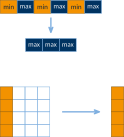{width="100%"}
:::
::::

## Vectors

:::: {.columns}
::: {.column width="45%"}
- support strides (gaps in arrays)
  - e.g. take 2 elements, omit 1 element, repeat 3 times in total
  - useful for linear algebra
:::
::: {.column width="55%"}
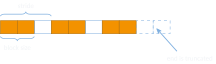{width="100%"}
:::
::::

## Vector example {.smaller}

:::: {.columns}
::: {.column width="50%"}
```c
#define SIZE   20
#define COUNT   3
#define LENGTH  2
#define STRIDE  3

MPI_Datatype myType;
MPI_Type_vector(COUNT, LENGTH, STRIDE,
                MPI_CHAR, &myType);
MPI_Type_commit(&myType);
```
:::
::: {.column width="50%"}
```c
if (myRank == 0) {
    char data[SIZE] = ...;
    MPI_Send(data, 1, myType, 1, 42,
             MPI_COMM_WORLD);
} else {
    char data[SIZE];
    MPI_Recv(data, 1, myType, 0, 42,
             MPI_COMM_WORLD,
             MPI_STATUS_IGNORE);
}
MPI_Type_free(&myType);
```
:::
::::

## Vector variants: use case compaction {.smaller}

:::: {.columns}
::: {.column width="50%"}
```c
char data[SIZE];
MPI_Recv(data, 1, myType,
         0, 42, MPI_COMM_WORLD,
         MPI_STATUS_IGNORE);
```
:::
::: {.column width="50%"}
```c
char data[COUNT*LENGTH];
MPI_Recv(data, COUNT*LENGTH, MPI_CHAR,
         0, 42, MPI_COMM_WORLD,
         MPI_STATUS_IGNORE);
```
:::
::::

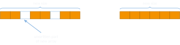{fig-align="center" width="92%"}

## Vector variants: use case transposition {.smaller}

:::: {.columns}
::: {.column width="50%"}
```c
int data[SIZE][SIZE];
MPI_Type_vector(SIZE, 1, SIZE, MPI_INT,
                &myType);
MPI_Type_commit(&myType);
MPI_Send(data, 1, myType,
         1, 42, MPI_COMM_WORLD);
```
:::
::: {.column width="50%"}
```c
int data[SIZE];
MPI_Recv(data, SIZE, MPI_INT,
         0, 42,
         MPI_COMM_WORLD, MPI_STATUS_IGNORE);
```
:::
::::

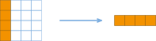{fig-align="center" height="200"}

## Subarrays

:::: {.columns}
::: {.column width="42%"}
- allows to address a contiguous multi-dimensional sub-range of array elements
:::
::: {.column width="58%"}
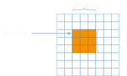{width="100%"}
:::
::::

## Subarray example in 2D {.smaller}

:::: {.columns}
::: {.column width="50%"}
```c
#define SIZE    8
#define SUBSIZE 3

MPI_Datatype myType;
int size[2]    = { SIZE, SIZE };
int subSize[2] = { SUBSIZE, SUBSIZE };
int start[2]   = { 2, 2 };

MPI_Type_create_subarray(2, size, subSize,
    start, MPI_ORDER_C, MPI_INT, &myType);
MPI_Type_commit(&myType);
```
:::
::: {.column width="50%"}
```c
if (myRank == 0) {
    int data[SIZE][SIZE] = ...;
    MPI_Send(data, 1, myType, 1, 42,
             MPI_COMM_WORLD);
} else {
    int subData[SUBSIZE][SUBSIZE];
    MPI_Recv(subData, SUBSIZE*SUBSIZE,
             MPI_INT, 0, 42, MPI_COMM_WORLD,
             MPI_STATUS_IGNORE);
}
MPI_Type_free(&myType);
```
:::
::::

## Subarray receive variants {.smaller}

:::: {.columns}
::: {.column width="50%"}
```c
int data[SIZE][SIZE];
MPI_Recv(data, 1, myType, 0, 42,
         MPI_COMM_WORLD, MPI_STATUS_IGNORE);
```
:::
::: {.column width="50%"}
```c
int subData[SUBSIZE][SUBSIZE];
MPI_Recv(subData, SUBSIZE*SUBSIZE,
         MPI_INT, 0, 42, MPI_COMM_WORLD,
         MPI_STATUS_IGNORE);
```
:::
::::

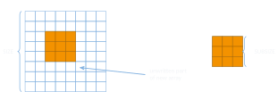{fig-align="center" height="230"}

## Multiple ways of distributing columns

- allocate as a 1D array, use linearized indices
  - use 1D MPI vector with stride
  - (use nD MPI subarray with 1 dimension)
  - (use nD MPI darray with 1 dimension)
- allocate as an nD array
  - use nested 1D MPI vectors
  - use nD MPI subarray
  - use nD MPI darray
- same functional result for all of the above, but performance might differ
  - remember, MPI doesn't guarantee performance portability

## Contiguous derived datatypes {.smaller}

:::: {.columns}
::: {.column width="48%"}
- allows to aggregate same-type arrays into a single-count datatype
- has certain advantages
  - sending more than `INT_MAX` elements (count parameter type in `MPI_Send`/`Recv`/… is only `int`!)
  - allows semantic grouping and naming of data
:::
::: {.column width="52%"}
```c
MPI_Datatype myType;
MPI_Type_contiguous(SIZE, MPI_CHAR, &myType);
MPI_Type_commit(&myType);

char data[SIZE] = { 0 };
if (myRank == 0) {
    MPI_Send(data, 1, myType, 1, 42,
             MPI_COMM_WORLD);
} else {
    MPI_Recv(data, 1, myType, 0, 42,
             MPI_COMM_WORLD, MPI_STATUS_IGNORE);
}
MPI_Type_free(&myType);
```
:::
::::

## Packing/unpacking

- MPI also offers `MPI_Pack(…)` and `MPI_Unpack(…)` functions
  - *"Packs a datatype into contiguous memory"* (MPICH documentation)
  - prefer this over derived datatypes? (hint: no)
- requires explicit copy of data from non-contiguous, user-defined form into a contiguous buffer to be sent with MPI
  - mostly superseded by MPI functions presented thus far, which may directly access user-defined structures (no user copy required)
  - pack/unpack still mostly offered for compatibility reasons
  - only very few modern edge cases

## Free the datatypes!

- call `MPI_Type_free(…)` once you no longer need the type
  - frees MPI-internal data storage for your custom type
  - reduces memory footprint for large numbers of datatypes
  - facilitates debugging
  - note: any pending communication using this type will continue and complete normally
  - omitted in some source code examples on my slides for obvious space reasons

# Virtual Topologies

## Virtual topologies

:::: {.columns}
::: {.column width="50%"}
- allows to "name" MPI ranks and provide addresses with semantics
  - high-level view of MPI ranks
  - simplifies implementation of complex algorithms
  - called "virtual" because it's independent of the hardware topology
- naming scheme should fit communication pattern
  - and reflect the real-world topological relationship of parts of your problem
  - enables MPI to perform optimizations
:::
::: {.column width="50%"}
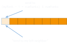{width="100%"}
:::
::::

## There are two types of topologies (according to MPI)

:::: {.columns}
::: {.column width="50%"}
- **Cartesian topologies**
  - regular grids of squares/cubes/…
  - each rank is a node on the grid and connected to its neighbors
  - boundaries can be periodic
  - ranks can be identified via Cartesian coordinates instead of rank ID
:::
::: {.column width="50%"}
- **graph topologies**
  - general graphs
  - each rank is a vertex in the graph
  - edges represent neighbor relationship
  - edge weights specify communication intensity (facilitates optimization)
  - not covered here
:::
::::

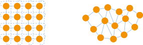{fig-align="center" height="230"}

## Properties of Cartesian topologies {.center-figs}

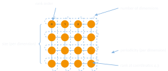{fig-align="center" height="420"}

## Working with Cartesian topologies

- create topology, resulting in new communicator
  - need to decide on dimensions, sizes, periodicity, etc…
  - per-dimension sizes can be computed using convenience function `MPI_Dims_create()`
  - new communicator implies rank IDs might have changed!
    - (remember MPI basics lecture: *"[…] MPI semantics are relative to a communicator or group"*)
- (re)compute rank numbers or coordinates as required
- communicate as you please
  - remember to specify correct communicator from this point on

## Creating a Cartesian topology

```c
int MPI_Cart_create(MPI_Comm comm_old, int ndims, const int dims[],
                    const int periods[], int reorder, MPI_Comm* comm_cart)
```

- `comm_old`: current communicator
- `ndims`: number of dimensions
- `dims`: size, per dimension
- `periods`: periodicity (0 = open, 1 = periodic), per dimension
- `reorder`: reorder rank numbers (0 = false, 1 = true)
- `comm_cart`: new communicator with Cartesian topology

## Shifting (`MPI_Cart_shift()`)

:::: {.columns}
::: {.column width="52%"}
- computes rank numbers of neighbors
  - requires direction and displacement (= distance)
- example on the right
  - partially periodic 2D topology of 4x4
  - up/down shift with displacement 1
  - or left/right shift with displacement 2
- can return `MPI_PROC_NULL` if neighbor does not exist
  - can be used in communication, will result in a no-op
:::
::: {.column width="48%"}
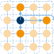{width="100%"}
:::
::::

## Slicing (`MPI_Cart_sub()`)

:::: {.columns}
::: {.column width="52%"}
- cuts a grid into slices
  - a new communicator is generated for each slice
  - enables slice-restricted collective communication
- example on the right
  - slicing a 2D topology horizontally
  - 4 new communicators A, B, C, and D with 4 ranks each
  - `MPI_Bcast(…, A)` only affects ranks of A
:::
::: {.column width="48%"}
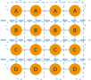{width="100%"}
:::
::::

## Convenience functions

- `MPI_Cart_coords(…)`
  - compute coordinates from a given rank (17 → [4, 1])
- `MPI_Cart_rank(…)`
  - compute rank from given coordinates ([4, 1] → 17)
- `MPI_Cart_sub(…)`
  - partition grid into lower-dimensional sub-grids (e.g. 2D square from 3D cube)
- `MPI_Cartdim_get(…)` / `MPI_Cart_get(…)`
  - get topology information for a given communicator
- `MPI_Neighbor_allgather(…)` / `MPI_Neighbor_alltoall(…)`
  - sparse collective communication, exchanges data between neighbors if they are neighbors in the topology

## Usefulness of Cartesian topologies

:::: {.columns}
::: {.column width="52%"}
- **use case**: 3D heat stencil with periodic boundary conditions
- **implementation**: 3D Cartesian topology with periodicity in all three dimensions
- mapped to hardware that uses (at least a 3D) torus interconnect
:::
::: {.column width="48%"}
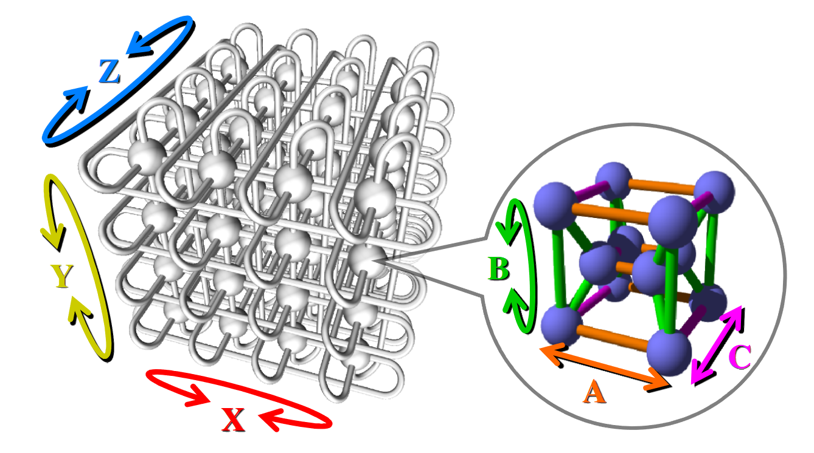{.fig-card width="100%"}

::: {.aside}
Image: Fugaku, Tofu D topology
:::
:::
::::

# Tales from the Proseminar

## Daniel's weird `int` problem

:::: {.columns}
::: {.column width="52%"}
- sequential 2D heat stencil
  - 100x100 problem size
  - `-O0` (but also with `-O2`) on LCC2
  - gcc 4.8.5 (but also 9.2 and MSVC 2019)
  - switching from `long long` loop iterators to `int` halves execution time
- What the heck is going on?
:::
::: {.column width="48%"}
```default
$ /usr/bin/time -f %E ./stencil_long 100 100
0:04.60

$ /usr/bin/time -f %E ./stencil_int 100 100
0:02.31
```
:::
::::

## Daniel's weird `int` problem cont'd {.smaller}

profiled with `gprof` to find "hot spots", left is `int`, right is `long long`

:::: {.columns}
::: {.column width="50%"}
```default
%   cumulative   self
time  seconds  seconds   name
32.92    0.76     0.76   int.c:93
20.06    1.22     0.46   int.c:78
14.83    1.56     0.34   int.c:79
10.47    1.80     0.24   int.c:87
 9.59    2.02     0.22   int.c:86
```
:::
::: {.column width="50%"}
```default
%   cumulative   self
time  seconds  seconds   name
36.84    1.69     1.69   long.c:79
31.61    3.15     1.45   long.c:78
16.35    3.90     0.75   long.c:93
 5.34    4.15     0.25   long.c:86
 3.27    4.30     0.15   long.c:87
```
:::
::::

## Daniel's weird `int` problem cont'd

```{.c code-line-numbers="|5-6"}
74   // get temperature at current position
75   value_t tc = A[i];
76
77   // get temperatures of adjacent cells
78   value_t txl = (i % Nx != 0)      ? A[i - 1] : tc;
79   value_t txr = (i % Nx != Nx - 1) ? A[i + 1] : tc;
     // ...... snip ......
90   if (Ny > 1)
91     B[i] = tc + 0.165 * (txl + txr + tyl + tyr + tzl + tzr + (-6 * tc));
92   else
93     B[i] = tc + 0.2 * (txl + txr + tzl + tzr + (-4 * tc));
```

## Daniel's weird `int` problem cont'd {.smaller}

far-fetched idea, but maybe branch (mis-)predictions? compared with `perf stat`:

:::: {.columns}
::: {.column width="50%"}
```default
  2328.650634 task-clock:u (msec) #  0.996 CPUs
            0 context-switches:u  #  0.000 K/sec
            0 cpu-migrations:u    #  0.000 K/sec
          186 page-faults:u       #  0.080 K/sec
5,739,935,525 cycles:u            #  2.465 GHz
10,671,532,880 instructions:u     #  1.86  IPC
1,196,623,336 branches:u          # 513.870 M/sec
    1,030,678 branch-misses:u     #  0.09%

  2.338387625 seconds time elapsed
```
:::
::: {.column width="50%"}
```default
  4639.728721 task-clock:u (msec) #  0.998 CPUs
            0 context-switches:u  #  0.000 K/sec
            0 cpu-migrations:u    #  0.000 K/sec
          186 page-faults:u       #  0.040 K/sec
11,444,184,736 cycles:u           #  2.467 GHz
10,972,976,005 instructions:u     #  0.96  IPC
1,196,977,569 branches:u          # 257.984 M/sec
    1,030,347 branch-misses:u     #  0.09%

  4.650327844 seconds time elapsed
```
:::
::::

## Daniel's weird `int` problem cont'd {.smaller}

`value_t txl = ( i % Nx != 0 ) ? A[i-1] : tc;`

:::: {.columns}
::: {.column width="50%"}
```asm
mov    eax, DWORD PTR [rbp-20]
cdq
idiv   DWORD PTR [rbp-24]
mov    eax, edx
test   eax, eax
je     .L2
```
:::
::: {.column width="50%"}
```asm
mov    eax, DWORD PTR [rbp-20]
cdqe
sal    rax, 3
lea    rdx, [rax-8]
mov    rax, QWORD PTR [rbp-32]
add    rax, rdx
movsd  xmm0, QWORD PTR [rax]
jmp    .L3
```
:::
::::

## Daniel's weird `int` problem cont'd

- found instruction information on Agner Fog's blog for the Intel Skylake architecture
  - <https://www.agner.org/optimize/instruction_tables.pdf>
- if you want to study compiler output: <https://godbolt.org/>

| inst. | operands | µops | latency |
| --- | --- | --- | --- |
| `idiv` | `r32` | 10 | 26 |
| `idiv` | `r64` | 57 | 42–95 |

## Daniel's weird `int` problem cont'd

- root cause of the issues: single loop for multi-dimensional problem space
  - requires `%` operator to get boundaries (which are strided in linearized space)
  - replace with loop nest and comparison operators (`>`, `<`, `==`, `!=`)
- potentially premature optimization and violates step 1 of *"Four Steps to Creating an Optimized Parallel Program"*

## Efficient ghost cell exchange

{fig-align="center" width="100%"}

:::: {.columns}
::: {.column width="34%"}
```c
if (myRank > 0) {
    // recv(left)
}
if (myRank < N-1) {
    // send(right)
}
```
:::
::: {.column width="66%"}
::: {.small}
| time | rank 0 | rank 1 | rank 2 | rank 3 |
| --- | --- | --- | --- | --- |
| 0 | **send(right)** | recv(left) | recv(left) | recv(left) |
| 1 | | **send(right)** | recv(left) | recv(left) |
| 2 | | | **send(right)** | recv(left) |
| 3 | | | | **send(right)** |
:::

unnecessary serialization!
:::
::::

## Efficient ghost cell exchange cont'd

{fig-align="center" width="100%"}

:::: {.columns}
::: {.column width="34%"}
```c
if (myRank % 2) {
    // recv, send
} else {
    // send, recv
}
// or
MPI_Sendrecv(...)
```
:::
::: {.column width="66%"}
::: {.small}
| time | rank 0 | rank 1 | rank 2 | rank 3 |
| --- | --- | --- | --- | --- |
| 0 | **send(right)** | recv(left) | **send(right)** | recv(left) |
| 1 | | **send(right)** | recv(left) | **send(right)** |
:::

done!
:::
::::

# Summary

## Summary

- derived data types can be very handy
  - no need to copy data to basic, contiguous buffers
  - allows to easily transpose data
  - arbitrary nesting possible
- virtual topologies add semantic position information to ranks
  - makes rank positions easily identifiable
  - allows direct neighbor communication
  - enables limited-scope collectives
- Tales from the proseminar
  - Daniel's weird `int` problem
  - efficient ghost cell exchange

## Image sources

::: {.small}
- **Tofu D interconnect:** <https://link.springer.com/content/pdf/10.1007/978-3-319-07518-1_35.pdf>
:::

# Appendix

## Verification and validation

- absolutely not the same thing, though often used synonymously
- **verification** means checking your implementation
  - ensure that implementation meets the specification
  - check that software output is correct
- **validation** means checking your specification
  - ensure that the specification meets requirements
  - check that specification is correct

## Tales from the proseminar: ChatGPT

:::: {.columns}
::: {.column width="45%"}
- ChatGPT and other LLMs are absolutely useful
  - if you know their limitations
- Consider them an *"unreliable research assistant"*
  - good for getting possibly new input/perspective/etc.
  - but always require their work to be checked
:::
::: {.column width="55%"}
{width="100%"}
:::
::::

## Shifting cont'd

:::: {.columns}
::: {.column width="52%"}
```c
MPI_Cart_shift(comm, 0, 1,
               &source, &dest);
// rank at 1,1:
// source is 1,0
// dest   is 1,2
```
:::
::: {.column width="48%"}
{width="100%"}
:::
::::

## Shifting cont'd

```c
int MPI_Cart_shift(MPI_Comm comm, int direction, int disp,
                   int* rank_source, int* rank_dest)
```

- `comm`: communicator (must have Cartesian topology!)
- `direction`: dimension along which to select neighbors
- `disp`: displacement/distance to neighbors
- `rank_source`: neighbor for which the calling rank is the destination
- `rank_dest`: requested neighbor for the calling rank

## Slicing cont'd

```c
int MPI_Cart_sub(MPI_Comm comm, const int remain_dims[], MPI_Comm* newcomm)
```

- `comm`: current communicator (must have Cartesian topology!)
- `remain_dims`: which dimensions to keep in sub-grid (0 = drop, 1 = include)
- `newcomm`: new communicator holding only ranks of this slice
