## Overview

- The 13 Dwarfs of HPC
  - abstract application categories

## Motivation

- MPI API or concepts such as data vs. task parallelism are still pretty low-level characteristics of parallel programs
- we need to be able to recognize higher-level classes of HPC applications and discuss them
- this lecture presents the most prominent classes of HPC applications
  - many new applications you encounter will fit into these categories or are a combination of them

## How and why are dwarfs defined?

:::: {.columns}
::: {.column width="68%"}
- group applications by similarity in computation and data structures
  - first published by Asanovic et al. in *The Landscape of Parallel Computing Research: A View from Berkeley*
  - <https://www2.eecs.berkeley.edu/Pubs/TechRpts/2006/EECS-2006-183.pdf>
- purely algorithmic, implementation-independent
  - enables cross-platform reasoning and cross-application knowledge/resource sharing (e.g. libraries)
- serve as small, abstract, high-level benchmarks for studying new
  - programming models
  - communication patterns
  - hardware architectures, topologies
  - …
- used to kick off innovation in all of these aspects
:::
::: {.column width="32%"}
::: {.fig-row}
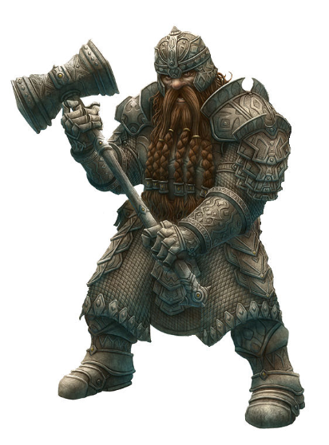{height="210"}
{height="210"}
:::
:::
::::

## 7 original dwarfs of HPC

:::: {.columns}
::: {.column width="50%"}
What are we going to discuss?

1. Dense Linear Algebra
2. Sparse Linear Algebra
3. Spectral Methods
4. N-body Methods
5. Structured Grids
6. Unstructured Grids
7. Monte Carlo Methods
:::
::: {.column width="50%"}
What have you already heard?

- matrix mul (first MPI lecture)
- N-body
- heat stencil
- Monte Carlo $\pi$
:::
::::

## Dense linear algebra

:::: {.columns}
::: {.column width="52%"}
- data is stored in densely-populated matrices (or vectors)
  - data is stored uncompressed ("as is")
  - data access via strides, often unit stride
- e.g. matrix multiplication, LU decomposition, Gauss-Seidel, …
- rarely done manually, there are a TON of libraries out there
:::
::: {.column width="48%"}
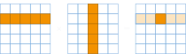{width="100%"}
:::
::::

## Dense linear algebra: characteristics {.smaller}

:::: {.columns}
::: {.column width="52%"}
- naïve implementations usually memory bound
  - remember: memory wall!
  - caches and prefetching help
- simple but significant data structure
  - stride often enables/prevents vectorization (SIMD)
  - fastest-changing index affects cache efficiency (hence matrices are often transposed)
- still the default measure for performance in HPC
  - e.g. TOP500 uses HPL, a high performance LINPACK benchmark
  - but nowadays not the only one (e.g. HPCG)
:::
::: {.column width="48%"}
```c
for (int i = 0; i < N; ++i) {
  for (int j = 0; j < N; ++j) {
    double tmp = 0.0;
    for (int k = 0; k < N; ++k) {
      tmp += A[i][k] * B[k][j];
    }
    result[i][j] = tmp;
  }
}
```

```asm
vgatherqpd ymm0{k2}, [rax+ymm5*1]
vmulpd     ymm0, ymm0, YMMWORD PTR [rdx+rdi]
...
```
:::
::::

## Side note: TOP500 list — Rmax vs. Rpeak

:::: {.columns}
::: {.column width="46%"}
- **Rmax**: achieved by software
  - high performance linpack (HPL) benchmark
  - linear algebra stress-testing
- **Rpeak**: achievable by hardware
  - product of: number of FP units per CPU, their FP instructions per cycle, clock frequency, and number of CPUs
:::
::: {.column width="54%"}
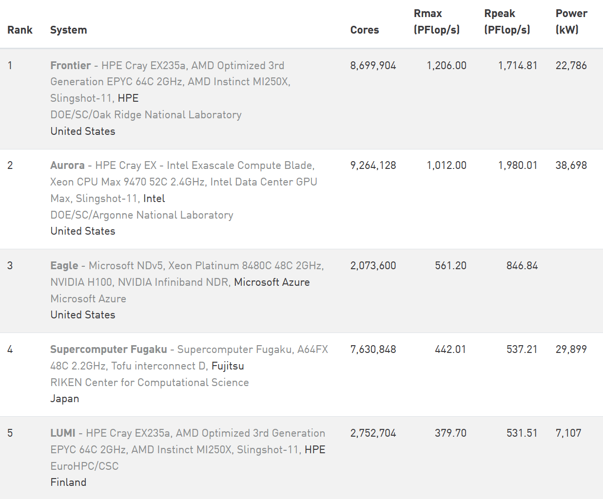{.fig-card width="100%"}

::: {.aside}
Taken from the June 2024 list of the Top500
:::
:::
::::

## Dense linear algebra: optimizations {.smaller}

:::: {.columns}
::: {.column width="52%"}
- loop blocking or tiling
  - do not work on single elements but smaller blocks (e.g. 2x2 or 32x32)
  - exploits locality and cache
  - also, lots of other HOTs (Higher Order Transformations)
- vectorization (SIMD, e.g. SSE/AVX)
  - might entail modifications, e.g. transposing matrix A or B in matrix mul
- hardware-specific instructions
  - e.g. fused multiply-add (FMA)
:::
::: {.column width="48%"}
```c
for (int ii = 0; ii < N; ii += ib) {
 for (int jj = 0; jj < N; jj += jb) {
  for (int k = 0; k < N; ++k) {
   for (int i = ii; i < ii+ib; ++i) {
    for (int j = jj; j < jj+jb; ++j) {
      // ... process single tile
    }
   }
  }
 }
}
```
:::
::::

## Sparse linear algebra

:::: {.columns}
::: {.column width="58%"}
- data is stored in sparsely-populated matrices (or vectors)
  - (vast) majority of data is zero
  - data is stored in compressed format
  - data often accessed indirectly via indices
- e.g. conjugate gradient, Google's PageRank, data mining
:::
::: {.column width="42%"}
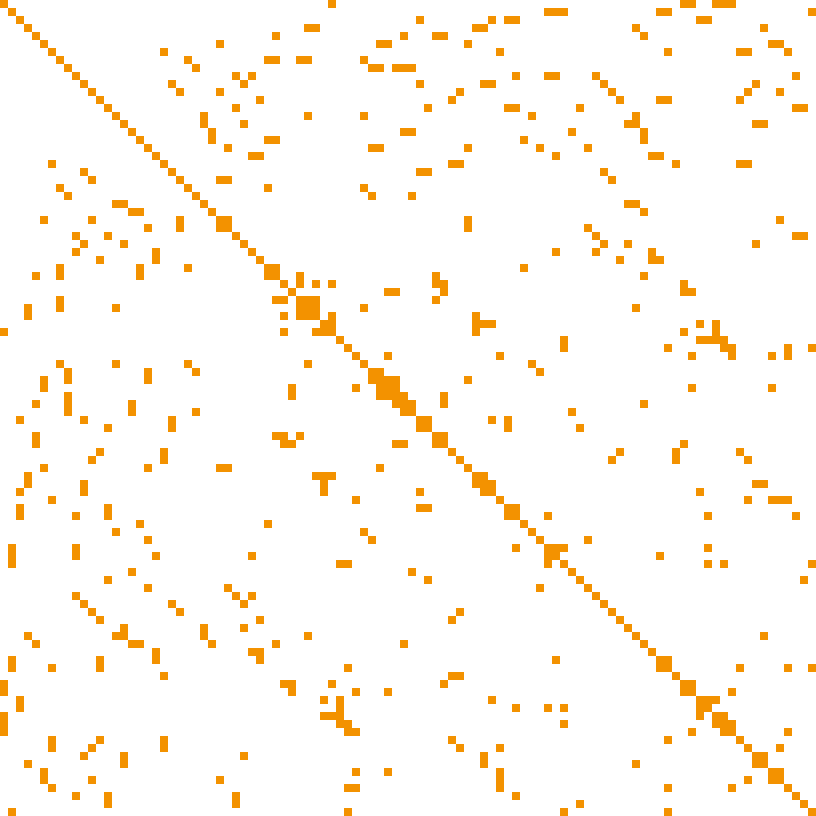{.fig-card width="100%"}
:::
::::

## Sparse linear algebra: characteristics {.smaller}

:::: {.columns}
::: {.column width="46%"}
- computationally or memory limited
  - depends on sparsity of data, data structure representation and algorithm
- different data structures available
  - e.g. coordinate scheme (COO) or "triplet format" or similar
  - array of structs (AoS) vs. struct of arrays (SoA)
  - not necessarily sorted!
:::
::: {.column width="54%"}
```c
typedef struct sparseElement {
    int i; int j; double value;
} sparseElement;

sparseElement sparseMatrix[SIZE];
sparseMatrix[0].i = 0;

// ############# vs. #############

typedef struct sparseMatrixT {
    int i[SIZE]; int j[SIZE];
    double values[SIZE];
} sparseMatrixT;

sparseMatrixT sparseMatrix;
sparseMatrix.i[0] = 0;
```
:::
::::

## Sparse linear algebra: optimizations {.smaller}

:::: {.columns}
::: {.column width="46%"}
- compressed row storage (CRS)
  - two arrays of size $N$
  - one holds $a_{ij}$, the other $j$
  - third array points to start of row $i$ in $j$
  - smaller memory footprint than COO
    - $2N + (m+1)$ vs. $3N$
- variants
  - column-major variant (CCS)
  - store small blocks (2x2 or 4x4) instead of single elements, improves SIMDness
  - compressed diagonal storage (CDS)
    - use domain-specific knowledge!
:::
::: {.column width="54%"}
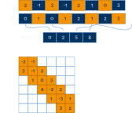{width="100%"}
:::
::::

## Spectral methods

:::: {.columns}
::: {.column width="50%"}
- data in frequency domain, not time or space
  - can include multiple stages of computations alternating between local and global communication
- e.g. fast Fourier transform (FFT), audio and video signal processing
  - e.g. "focus hunting" in contrast-based autofocus of photo/video cameras
:::
::: {.column width="50%"}
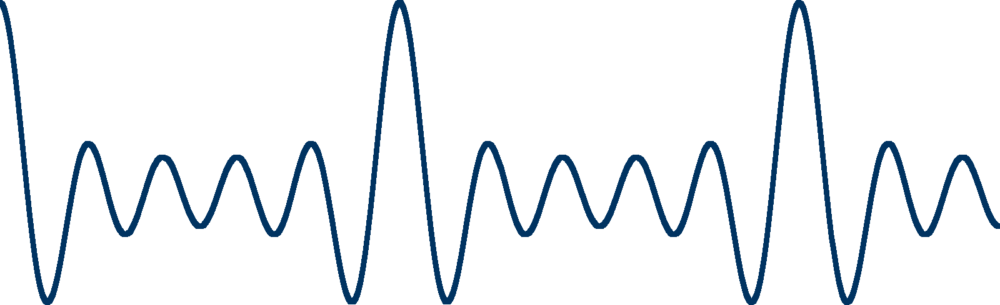{.fig-card width="100%"}

{.fig-card width="100%"}
:::
::::

## Spectral methods: characteristics

:::: {.columns}
::: {.column width="52%"}
- usually implemented using butterfly patterns
  - multiple stages of multiply-add
  - often latency limited due to global communication patterns (e.g. all-to-all)
- often resemble structured or unstructured grid methods after transformation to frequency domain
:::
::: {.column width="48%"}
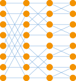{width="82%" fig-align="center"}
:::
::::

## Spectral methods: optimizations

- requires optimization of the transformation to frequency domain
  - relies on transposing data efficiently
- afterwards, consider similar optimizations as for (un)structured grids
- severely restricted scalability on larger HPC systems
  - ongoing research
  - lots of it in math

## N-body methods

:::: {.columns}
::: {.column width="52%"}
- model interactions between discrete, moving points
  - often requires dynamic data structures
  - varying spatial locality
  - movement affects load balance and data access costs
- e.g. galaxy collision simulations, molecular dynamics, protein folding
:::
::: {.column width="48%"}
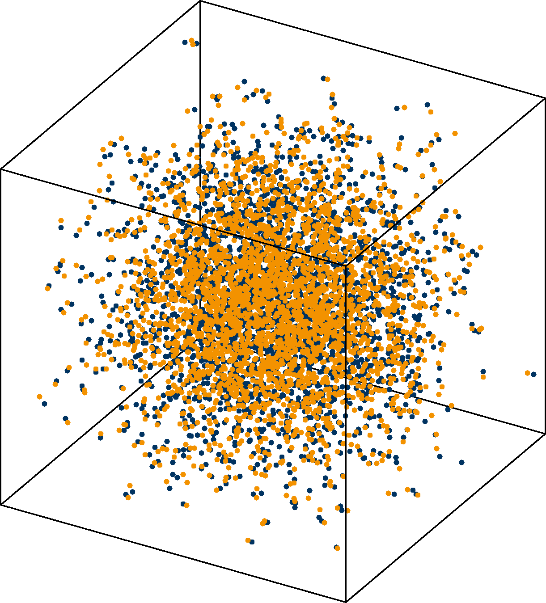{.fig-card width="100%"}
:::
::::

## N-body methods: characteristics

- computational effort is an issue
  - $\mathcal{O}(N^2)$ for $N$ particles
  - but also global communication
- lots of hierarchical optimization studies
  - domain decomposition!
  - e.g. Barnes-Hut or fast multipole optimization
- alternative approaches rely on domain-specific knowledge, e.g.
  - ignore long-distance particle interactions
  - store particles in Cartesian topology & only consider particles in neighboring grid cells

## N-body methods: optimizations

:::: {.columns}
::: {.column width="46%"}
- Barnes-Hut optimization:
  - decompose domain into quadtree (for 2D)
  - aggregate particle effect (e.g. gravitation from mass) for each cell into a single (hypothetical) particle at the center of gravity per cell
  - reduces complexity from $\mathcal{O}(N^2)$ to $\mathcal{O}(N \cdot \log N)$
:::
::: {.column width="54%"}
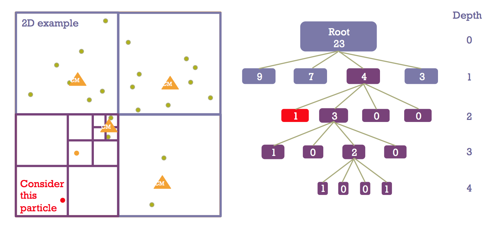{.fig-card width="100%"}
:::
::::

## Structured grids

:::: {.columns}
::: {.column width="55%"}
- model interactions between discrete, fixed points
  - grid structure described by pattern
  - topological information easily derived
  - usually high spatial locality
  - may be subdivided into finer grid ("adaptive")
- e.g. heat transfer (stencil), computational fluid dynamics (CFD), octrees
:::
::: {.column width="45%"}
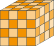{width="82%" fig-align="center"}
:::
::::

## Structured grids: characteristics

:::: {.columns}
::: {.column width="55%"}
- structured nature is a key aspect
  - similar characteristics compared to dense linear algebra (e.g. row-major vs. column-major)
  - memory access patterns & addresses often predictable, facilitates e.g. prefetching
  - adaptive grids and multi-grids possible
- typically memory bound
  - e.g. 7-point stencil in 3D: load 7 data points for computing a new one
  - local communication only (ghost cell exchange with direct neighbor)
:::
::: {.column width="45%"}
**structured grid does not imply rectangular!**

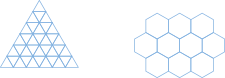{width="100%"}
:::
::::

## Structured grids: optimizations

:::: {.columns}
::: {.column width="48%"}
- decomposition, decomposition, decomposition
  - highly dependent on type of grid and specific use case
- structured nature of the problem makes analytic prediction possible
  - performance models and simulators for simple stencil kernels (e.g. Kerncraft)
:::
::: {.column width="52%"}
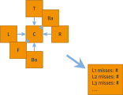{width="100%"}
:::
::::

## Unstructured grids

:::: {.columns}
::: {.column width="52%"}
- model interactions between discrete, fixed points
  - grid pattern described explicitly by individual connections
  - irregular geometry and topology
  - usually involves multiple levels of indirection when accessing data
- e.g. computational fluid dynamics (CFD)
:::
::: {.column width="48%"}
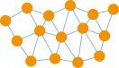{width="100%"}
:::
::::

## Unstructured grids: characteristics

:::: {.columns}
::: {.column width="55%"}
- usually heavily latency bound due to indirect access
  - `... = cells[neighbors[i]]`
  - `... = cell.getNeighbor(i)`
  - also known as "pointer chasing"
- similar problems compared to structured grids, e.g.
  - domain decomposition / adaptivity
  - topological information
  - ghost cell exchange
  - but hardly analytically predictable
:::
::: {.column width="45%"}
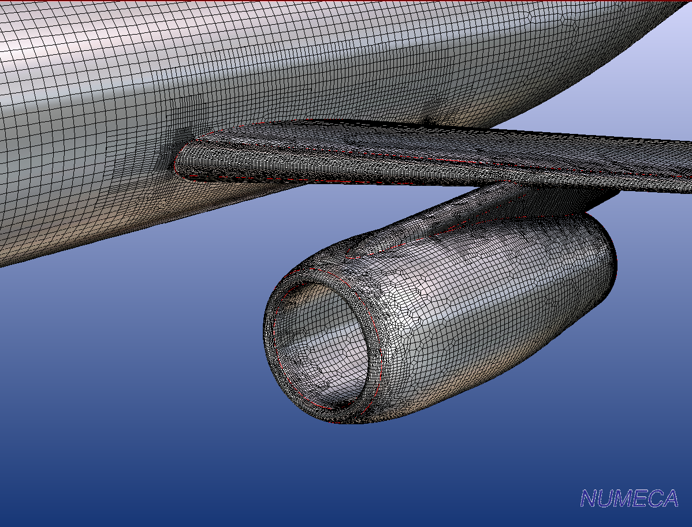{width="100%"}
:::
::::

## Unstructured grids: optimizations

:::: {.columns}
::: {.column width="50%"}
- problem space discretization and topology
  - which types of grid elements?
  - which types of connections?
  - cells, faces, vertices, edges, …
  - should be efficient to load/store, navigate, and compute
- decomposition, decomposition, decomposition
  - efficient ghost cell exchange required
  - efficient grid navigation e.g. to access neighbors
:::
::: {.column width="50%"}
{width="100%"}
:::
::::

## Monte Carlo methods

:::: {.columns}
::: {.column width="55%"}
- also known as map-reduce
  - process data independently and merge the results
- models statistical evaluation of repeated random trials
  - communication usually insignificant
  - embarrassingly parallel, multiple copies of sequential method
- e.g. numerical integration, quantum many-body problems, ray tracing
:::
::: {.column width="45%"}
{width="78%" fig-align="center"}
:::
::::

## Monte Carlo methods: characteristics

- parallelization almost a no-factor
  - similar to multiple sequential programs sharing some resources (e.g. L3 cache, random number generator, thermal envelope of CPU)
  - relatively inexpensive reduction
- depends heavily on sequential speed and shared bottlenecks

## Monte Carlo methods: optimizations

- not much to do beyond sequential optimization
  - ILP
  - prefetching
  - vectorization
  - reduce resource contention (read: fast random number generation)
- consider different hardware
  - GPUs
  - FPGAs
  - …
- try to decrease cost of evaluating a sample
  - increase number of samples if required

# Additional Dwarfs

## Additional dwarfs

:::: {.columns}
::: {.column width="45%"}
8. Combinational Logic
9. Graph Traversal
10. Dynamic Programming
11. Backtrack & Branch+Bound
12. Graphical Models
13. Finite State Machine
:::
::: {.column width="55%"}
- slightly different focus compared to first 7 dwarfs
  - more (but not exclusively) on integer-heavy applications, machine learning, theoretical problems
  - less on physical processes
:::
::::

## Combinational logic {.smaller}

:::: {.columns}
::: {.column width="46%"}
- generally involves performing simple operations on large amounts of integer data
  - e.g. computing cyclic redundancy codes (CRC)
- often parallelizable on multiple levels
  - bit-level parallelism (e.g. x86 `popcnt`)
  - block-level parallelism
:::
::: {.column width="54%"}
```c
uint8_t compute(uint8_t const msg[], int n) {
  uint8_t rem = 0;
  for (int byte = 0; byte < n; ++byte) {
    rem ^= (msg[byte] << (WIDTH - 8));
    for (uint8_t bit = 8; bit > 0; --bit) {
      if (rem & TOPBIT) {
        rem = (rem << 1) ^ POLYNOMIAL;
      } else {
        rem = (rem << 1);
      }
    }
  }
  return (rem);
}
```
:::
::::

## Graph traversal

:::: {.columns}
::: {.column width="50%"}
- traverse a number of objects in a graph and examine characteristics
  - e.g. searching, sorting, collision detection, decision trees, …
  - usually heavy on data reads and lookups, very little computation and output
- parallelizable over different paths in the graph
  - but indirect accesses are heavily latency-bound (c.f. unstructured grids)
:::
::: {.column width="50%"}
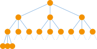{width="100%"}
:::
::::

## Dynamic programming

:::: {.columns}
::: {.column width="45%"}
- method of computing solutions by solving simpler, overlapping sub-problems
  - applicable to problems where optimal result is composed of optimal results of sub-problems
  - e.g. matrix-chain-multiplication
- usually based on memoization
  - solve each sub-problem exactly once
  - store and re-use the result
:::
::: {.column width="55%"}
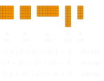{width="100%"}
:::
::::

## Backtrack & Branch+Bound

:::: {.columns}
::: {.column width="52%"}
- search and optimization problems for very large problem spaces
  - incrementally build solution but discard if determined unsuitable
  - e.g. n-queens problem
- use divide & conquer strategy:
  - break down complex problem into smaller sub-problems until they become solvable
  - solve sub-problems in parallel
:::
::: {.column width="48%"}
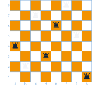{width="88%" fig-align="center"}
:::
::::

## Probabilistic graphical models {.smaller}

:::: {.columns}
::: {.column width="46%"}
- represent graphs consisting of random variables as nodes and dependencies as edges
  - e.g. Bayesian networks, Hidden Markov models
- ongoing research in math and computer science regarding parallelization and optimization
:::
::: {.column width="54%"}
::: {.small}
**weather**

| sun | rain |
| --- | --- |
| 0.40 | 0.60 |

**mensa food**

| good | bad |
| --- | --- |
| 0.90 | 0.10 |

**mood**

| | good | bad |
| --- | --- | --- |
| sun, good | 0.95 | 0.05 |
| sun, bad | 0.70 | 0.30 |
| rain, good | 0.75 | 0.25 |
| rain, bad | 0.10 | 0.90 |
:::
:::
::::

## Finite state machines

:::: {.columns}
::: {.column width="42%"}
- represent interconnected set of states to be moved among
  - e.g. parsers
- can sometimes be decomposed into multiple state machines that act in parallel
  - ongoing research
:::
::: {.column width="58%"}
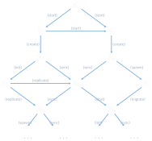{width="100%"}
:::
::::

## Literature material

- White Paper by Berkeley University: *"The Landscape of Parallel Computing Research: A View from Berkeley"* from 2006
  - <https://www2.eecs.berkeley.edu/Pubs/TechRpts/2006/EECS-2006-183.pdf>
- holds more detailed descriptions and related aspects

## Note the focus on scientific problems

- MPI can be (and is!) used to implement also
  - distributed-memory runtime systems
  - emulate shared memory runtime systems on distributed memory (e.g. PGAS)
  - provide the connecting parallelism layer for shared-memory or sequential systems
    - e.g. use multiple accelerators in separate compute nodes (Celerity project @ UIBK)
    - extend shared memory parallelism to distributed memory (MPI+X)
    - …
- still, the majority of codes is of scientific computing nature

# Summary

## Summary

- 13 Dwarfs of HPC
  - abstract application categories
  - facilitate cross-platform reasoning and cross-application component reuse
  - 7 older ones, most well-studied physics problems
  - 6 newer ones, partially of theoretical nature, subject to ongoing research
  - give a broad perspective on HPC potential and limitations

## Image sources

::: {.small}
- **Dwarfs:** <http://pngimg.com/download/47261>, <http://rpgmke.wikidot.com/moonshae-isles-campaign>
:::

# Appendix

## TOP500 November '23 update highlights

:::: {.columns}
::: {.column width="46%"}
- quite some changes in the top spots
  - Frontier still No. 1 & still the only Exascale system
  - new! Aurora No. 2 (but only partial availability)
    - full system expected to exceed 2 Exaflops
    - uses Intel CPUs and Intel GPUs
  - Fugaku moved to No. 4 (previously 2)
  - European systems moved down
    - LUMI 5 (prev. 3)
    - LEONARDO 6 (prev. 4)
- related but not online yet: JUPITER (Jülich, Germany)
  - expected to be EU's first Exaflop system
  - new Nvidia Grace Hopper chips (combined CPU+GPU with hardware-supported memory coherency!)
:::
::: {.column width="54%"}
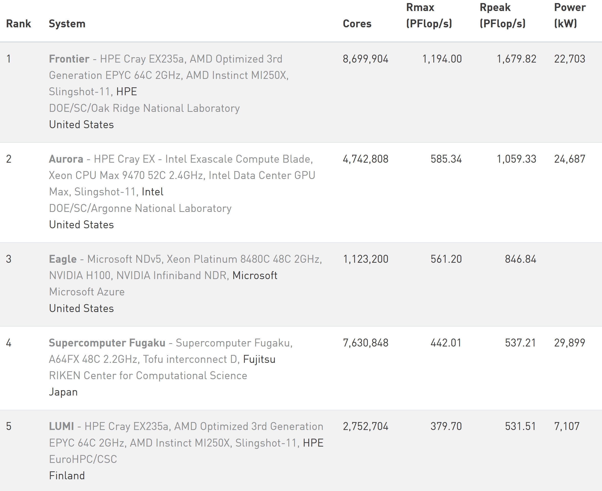{.fig-card width="100%"}
:::
::::

## Daniel's weird `int` problem

:::: {.columns}
::: {.column width="52%"}
- sequential 2D heat stencil
  - 100x100 problem size
  - `-O0` (but also with `-O2`) on LCC2
  - gcc 4.8.5 (but also 9.2 and MSVC 2019)
  - switching from `long long` loop iterators to `int` halves execution time
- What the heck is going on?
:::
::: {.column width="48%"}
```default
$ /usr/bin/time -f %E ./stencil_long 100 100
0:04.60

$ /usr/bin/time -f %E ./stencil_int 100 100
0:02.31
```
:::
::::

## Daniel's weird `int` problem cont'd {.smaller}

profiled with `gprof` to find "hot spots", left is `int`, right is `long long`

:::: {.columns}
::: {.column width="50%"}
```default
%   cumulative   self
time  seconds  seconds   name
32.92    0.76     0.76   int.c:93
20.06    1.22     0.46   int.c:78
14.83    1.56     0.34   int.c:79
10.47    1.80     0.24   int.c:87
 9.59    2.02     0.22   int.c:86
```
:::
::: {.column width="50%"}
```default
%   cumulative   self
time  seconds  seconds   name
36.84    1.69     1.69   long.c:79
31.61    3.15     1.45   long.c:78
16.35    3.90     0.75   long.c:93
 5.34    4.15     0.25   long.c:86
 3.27    4.30     0.15   long.c:87
```
:::
::::

## Daniel's weird `int` problem cont'd

```{.c code-line-numbers="|5-6"}
74   // get temperature at current position
75   value_t tc = A[i];
76
77   // get temperatures of adjacent cells
78   value_t txl = (i % Nx != 0)      ? A[i - 1] : tc;
79   value_t txr = (i % Nx != Nx - 1) ? A[i + 1] : tc;
     // ...... snip ......
90   if (Ny > 1)
91     B[i] = tc + 0.165 * (txl + txr + tyl + tyr + tzl + tzr + (-6 * tc));
92   else
93     B[i] = tc + 0.2 * (txl + txr + tzl + tzr + (-4 * tc));
```

## Daniel's weird `int` problem cont'd {.smaller}

far-fetched idea, but maybe branch (mis-)predictions? compared with `perf stat`:

:::: {.columns}
::: {.column width="50%"}
```default
  2328.650634 task-clock:u (msec) #  0.996 CPUs
            0 context-switches:u  #  0.000 K/sec
            0 cpu-migrations:u    #  0.000 K/sec
          186 page-faults:u       #  0.080 K/sec
5,739,935,525 cycles:u            #  2.465 GHz
10,671,532,880 instructions:u     #  1.86  IPC
1,196,623,336 branches:u          # 513.870 M/sec
    1,030,678 branch-misses:u     #  0.09%

  2.338387625 seconds time elapsed
```
:::
::: {.column width="50%"}
```default
  4639.728721 task-clock:u (msec) #  0.998 CPUs
            0 context-switches:u  #  0.000 K/sec
            0 cpu-migrations:u    #  0.000 K/sec
          186 page-faults:u       #  0.040 K/sec
11,444,184,736 cycles:u           #  2.467 GHz
10,972,976,005 instructions:u     #  0.96  IPC
1,196,977,569 branches:u          # 257.984 M/sec
    1,030,347 branch-misses:u     #  0.09%

  4.650327844 seconds time elapsed
```
:::
::::

::: {.aside}
The same investigation appears in lecture 05; it is repeated here because the dwarfs lecture arrives at it from the structured-grid side.
:::
