## Overview

- communicators and groups
  - more ways of limiting and controlling collective communication
- one-sided communication
  - decouples data access and synchronization
- error handling

## Motivation

- real-world applications are rarely a single component
  - often MPMD
  - usually combination of libraries (e.g. molecular dynamics and quantum mechanics)
- adds several new complexities compared to single-component software
  - collective communication via `MPI_COMM_WORLD`?
  - how to identify sub-programs and communicate between and within them?

## Motivation cont'd

:::: {.columns}
::: {.column width="46%"}
- unstructured grid with cell and face element types
  - assume both require global communication (e.g. reduction) among their types
- a communicator per element type would be useful
  - but how?
:::
::: {.column width="54%"}
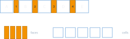{width="100%"}
:::
::::

## Motivation cont'd

:::: {.columns}
::: {.column width="46%"}
- What about NUMA?
  - virtual topologies do not reflect e.g. shared memory address spaces
- consider shared memory node with 4 CPUs and many cores per CPU
- local collective communication among cores of a node is cheap
  - how to limit?
  - construct a communicator per node?
  - do this in hardware- and compiler-independent way?
:::
::: {.column width="54%"}
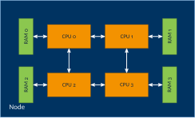{width="100%"}
:::
::::

## Communicators and groups

- communicators and groups hold sets of ranks
  - directly used for e.g. collective communication
  - also required for identifying single ranks
  - remember MPI basics lecture: everything in MPI is relative to a communicator or group
- Why not stick to `MPI_COMM_WORLD`?
  - isolate application sub-programs
    - individual processing steps running in parallel (task parallelism, MPMD)
    - domain decomposition (SPMD, c.f. slicing Cartesian topologies)
    - libraries (portability)
  - usability
    - add user-defined attributes such as topologies
  - performance
    - re-numbering of ranks (virtual topology vs. hardware topology)

## Communicators and groups cont'd

- `MPI_Group`
  - holds ordered set of ranks
  - ordering is given by mapping process identifier (e.g. PID) to rank number
  - construction of and operations on groups are always **local** operations
- `MPI_Comm`
  - holds an `MPI_Group`
    - transitively holds ordered set of ranks
  - can hold attributes (e.g. topology)
  - constructed from groups
  - construction of communicators are **non-local** operations (collectives)

## Operations on `MPI_Group`

:::: {.columns}
::: {.column width="50%"}
- **constructors**
  - `MPI_Comm_group(…)`
  - `MPI_Group_union(…)`
  - `MPI_Group_intersection(…)`
  - `MPI_Group_difference(…)`
  - `MPI_Group_incl(…)`
  - `MPI_Group_excl(…)`
  - `MPI_Group_range_incl(…)`
  - `MPI_Group_range_excl(…)`
:::
::: {.column width="50%"}
- **accessors**
  - `MPI_Group_size(…)`
  - `MPI_Group_rank(…)`
  - `MPI_Group_compare(…)`
    - result is `MPI_IDENT`, `MPI_SIMILAR` or `MPI_UNEQUAL`
- **destructor**
  - `MPI_Group_free(…)`
:::
::::

## Operations on `MPI_Comm`

- **constructors**
  - `MPI_Comm_dup(…)`
  - `MPI_Comm_create(…)`
  - `MPI_Comm_split(…)`
  - convenience constructors such as `MPI_Cart_sub(…)`
- **accessors**
  - `MPI_Comm_size(…)`
  - `MPI_Comm_rank(…)`
  - `MPI_Comm_compare(…)`
    - result is `MPI_IDENT`, `MPI_SIMILAR`, `MPI_CONGRUENT` or `MPI_UNEQUAL`
- **destructor**
  - `MPI_Comm_free(…)`

## Group and communicator workflow

:::: {.columns}
::: {.column width="55%"}
- start with `MPI_COMM_WORLD`
- construct group(s) of rank subsets and modify as required
  - `MPI_Group_union()`, `MPI_Group_range_incl()`, …
- create new communicator from group and use for communication
:::
::: {.column width="45%"}
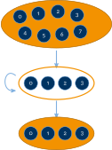{width="72%" fig-align="center"}
:::
::::

## Splitting communicators

```c
int MPI_Comm_split(MPI_Comm comm, int color, int key, MPI_Comm* newcomm)
```

- `comm`: current communicator
- `color`: control of subset assignment (same color: same new communicator)
- `key`: control of rank assignment (0: sorted as in `comm`; otherwise according to ascending key values)
- `newcomm`: new communicator
- `MPI_Comm_split_type(…)`
  - allows to split dependent on hardware properties

## `MPI_Comm_split` example

:::: {.columns}
::: {.column width="50%"}
```c
MPI_Comm newComm;
MPI_Comm_rank(MPI_COMM_WORLD, &myRank);

int myColor = myRank / 4;
MPI_Comm_split(MPI_COMM_WORLD, myColor,
               myRank, &newComm);

MPI_Comm_rank(newComm, &newRank);
```
:::
::: {.column width="50%"}
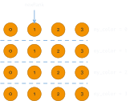{width="100%"}
:::
::::

## Solutions to motivation examples {.smaller}

:::: {.columns}
::: {.column width="50%"}
a communicator per element type:

```c
MPI_Comm newComm;
MPI_Comm_rank(MPI_COMM_WORLD, &rank);

int color = (elementType == TYPE_FACES);
MPI_Comm_split(MPI_COMM_WORLD,
               color, rank, &newComm);
```
:::
::: {.column width="50%"}
a communicator per shared-memory node:

```c
MPI_Comm newComm;
MPI_Comm_rank(MPI_COMM_WORLD, &rank);

MPI_Comm_split_type(MPI_COMM_WORLD,
    MPI_COMM_TYPE_SHARED, rank,
    MPI_INFO_NULL, &newComm);

// also: OMPI_COMM_TYPE_CORE,
// OMPI_COMM_TYPE_L1CACHE,
// OMPI_COMM_TYPE_L2CACHE,
// OMPI_COMM_TYPE_L3CACHE, ...
```
:::
::::

## Intra- and inter-communicators

:::: {.columns}
::: {.column width="50%"}
- **intra-communicator**
  - collection of ranks that can send messages to each other via point-to-point and collectives
  - e.g. `MPI_COMM_WORLD`
:::
::: {.column width="50%"}
- **inter-communicator**
  - collection of ranks from disjoint intra-communicators
  - allows sending messages between communicators
:::
::::

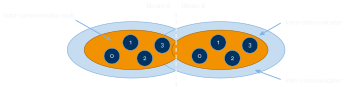{fig-align="center" height="250"}

# One-sided Communication

## Motivation

- **message-passing paradigm**
  - fits distributed memory systems well
  - data transfers among distinct address spaces require network communication
  - requires explicit communication
  - downside: little control over message & synchronization aggregation
- **shared memory paradigm**
  - no message passing required
  - data transfer aggregation possible – write multiple bytes, elements, … in one go
  - much more convenient from a user and performance perspective
    - does not necessarily require receiving side to participate
  - also, messages are needless overhead on shared-memory systems
    - send/recv function call, management, etc., just for a `memcpy` in the same address space?

## MPI's solution: one-sided communication

- classic point-to-point ("two-sided") communication implies synchronization
  - at every data transfer action
  - incurs a lot of overhead in the presence of many messages
- one-sided communication decouples data movement and synchronization
  - ranks expose a "window" of rank-local memory
  - can be accessed by other ranks using remote memory access (RMA)
  - data accesses do not necessarily require action on the rank exposing memory
  - both read and write are possible
    - ranks no longer identify as "sender" and "receiver" but as "origin" and "target" instead

## One-sided communication workflow

- allocate buffer and window
  - can ask MPI to allocate fast memory
- open window ("start epoch")
  - synchronization point
  - allows data access by remote ranks
- close window ("end epoch")
  - synchronization point
  - commits data accesses
- deallocate window and buffer

## MPI one-sided communication cont'd {.center-figs}

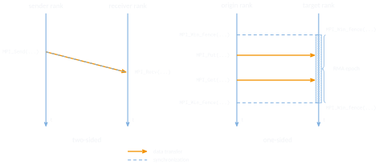{fig-align="center" height="440"}

## Means of synchronization

- **active target synchronization**
  - target participates in synchronization
  - similar to message-passing paradigm
  - uses either `MPI_Win_fence()` or "post-start-complete-wait"
  - often preferred for bulk-synchronous parallel programs
    - all ranks execute computation and communication steps more or less in sync
    - e.g. structured grid with ghost cell exchange
- **passive target synchronization**
  - target does not synchronize
  - similar to shared memory paradigm
  - uses `MPI_Win_lock()` and `MPI_Win_unlock()`
  - often preferred for dynamic, independent access patterns
    - e.g. irregular codes

## Active target synchronization: fence

:::: {.columns}
::: {.column width="42%"}
- collective synchronization
  - origin/target not specified
- all control the epoch
  - starts/ends all epochs on all participating ranks
- fence enforces synchronization
:::
::: {.column width="58%"}
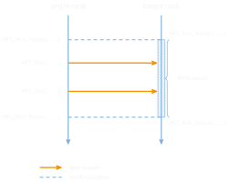{width="100%"}
:::
::::

## Active target synchronization: post/start/complete/wait

:::: {.columns}
::: {.column width="42%"}
- selective synchronization
  - origin and target specify a group they communicate with
- both control their epochs
  - origin: start/complete
  - target: post/wait
- synchronization calls may block to enforce ordering
:::
::: {.column width="58%"}
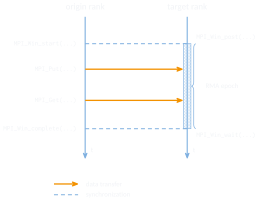{width="100%"}
:::
::::

## Passive target synchronization: lock/unlock

:::: {.columns}
::: {.column width="42%"}
- target neither involved in data transfer, nor in synchronization
- origin has full control over epoch
- resembles shared memory programming models (e.g. Pthreads, `std::mutex`, …)
  - but not the same
  - no critical section!
:::
::: {.column width="58%"}
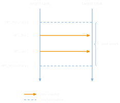{width="100%"}
:::
::::

## Implications of one-sided communication

- several benefits
  - allows dynamic access patterns (e.g. when target rank does not know number and ranks of origins; or have two ranks communicate data through a third rank who does not participate)
  - reduce synchronization overhead for multiple data transfers
  - reduce management overhead on receiver side (e.g. tag matching)
  - performance gain
  - reduce coding effort on receiver side
- drawbacks
  - no send/receive matching
  - operations are not explicitly visible on the receiver side
  - user responsible for correct order of reads/writes (race conditions)
  - only non-blocking communication

## Performance comparison

:::: {.columns}
::: {.column width="52%"}
- LCC2, openmpi/3.1.1, 2 ranks, one per node
- rank 0 sends $10^8$ `int` to rank 1
  - once using $10^8$ plain send/recv calls
  - once using $10^8$ `MPI_Put()` calls with `MPI_Win_fence()` synchronization
- execution time reduced by 2.26x
  - only between two ranks
  - but an edge case stress test
:::
::: {.column width="48%"}
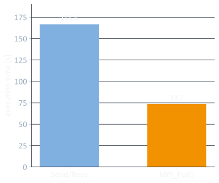{width="100%"}
:::
::::

## Optional window fence assertions

- `MPI_MODE_NOSTORE`
  - local window was not updated by local store, local get or receive calls since last fence
- `MPI_MODE_NOPUT`
  - local window will not be updated by put or accumulate until next fence
- `MPI_MODE_NOPRECEDE`
  - fence does not complete any sequence of locally issued RMA calls
- `MPI_MODE_NOSUCCEED`
  - fence does not start any sequence of locally issued RMA calls
- none of these are required, but they can improve performance

## Four window models

- `MPI_Win_create(…)`
  - private memory buffer already allocated, use as window
- `MPI_Win_allocate(…)`
  - allocate buffer and use as window
- `MPI_Win_create_dynamic(…)`
  - expose a buffer which is not available yet
  - use later with `MPI_Win_attach()`/`MPI_Win_detach()`
- `MPI_Win_allocate_shared(…)`
  - allocate and use buffer in shared memory segment of the OS
  - only works for `MPI_COMM_TYPE_SHARED`

## Transferring data: put & get

```c
int MPI_Put(const void* origin_addr, int origin_count,
            MPI_Datatype origin_datatype, int target_rank,
            MPI_Aint target_disp, int target_count,
            MPI_Datatype target_datatype, MPI_Win win)
```

- `origin_addr`: local address of data to put (aka "send buffer")
- `origin_count`: number of elements on origin side
- `origin_datatype`: type of elements on origin side
- `target_rank`: target rank
- `target_disp`: offset of target address to base address of target window
- `target_count`: number of elements on target side
- `target_datatype`: type of elements on target side
- `win`: window handle
- `MPI_Get(…)`: transfer data from target to origin

## Transferring data: accumulate

- `MPI_Accumulate(…)`
  - transfer data from origin and accumulate atomically at target
  - can only use predefined operations of `MPI_Reduce(…)` (e.g. `MPI_SUM`)
  - use `MPI_REPLACE` to get atomic put
- `MPI_Get_accumulate(…)`
  - same as `MPI_Accumulate(…)` but store target buffer data in result buffer before accumulating
  - use with `MPI_NO_OP` to implement atomic get or `MPI_REPLACE` for atomic swap

## Transferring data: single-element atomics

- `MPI_Compare_and_swap(…)`
  - atomic swap if data at target buffer matches comparison value
  - must be single element
  - must be predefined integer, logical or byte type
- `MPI_Fetch_and_op(…)`
  - variant of `MPI_Get_accumulate(…)`, available for hardware optimization
  - implements a subset of `MPI_Get_accumulate(…)`'s generic functionality
    - must be single-element
    - must be predefined data type

## MPI one-sided communication example {.smaller}

:::: {.columns}
::: {.column width="50%"}
```c
// rank 0 (origin)
MPI_Win window;
int buffer[SIZE] = ... ;

MPI_Win_create(&buffer, sizeof(int)*SIZE,
    sizeof(int), MPI_INFO_NULL,
    MPI_COMM_WORLD, &window);

MPI_Win_fence(MPI_MODE_NOSTORE |
    MPI_MODE_NOPUT | MPI_MODE_NOPRECEDE,
    window);

MPI_Put(&buffer, SIZE, MPI_INT, 1, 0,
        SIZE, MPI_INT, window);

MPI_Win_fence(MPI_MODE_NOSTORE |
    MPI_MODE_NOPUT | MPI_MODE_NOSUCCEED,
    window);

MPI_Win_free(&window);
```
:::
::: {.column width="50%"}
```c
// rank 1 (target)
MPI_Win window;
int buffer[SIZE] = { 0 };

MPI_Win_create(&buffer, sizeof(int)*SIZE,
    sizeof(int), MPI_INFO_NULL,
    MPI_COMM_WORLD, &window);

MPI_Win_fence(MPI_MODE_NOSTORE |
    MPI_MODE_NOPRECEDE |
    MPI_MODE_NOSUCCEED, window);

// window open, buffer can be written to

MPI_Win_fence(MPI_MODE_NOPUT |
    MPI_MODE_NOPRECEDE |
    MPI_MODE_NOSUCCEED, window);

// use buffer here
MPI_Win_free(&window);
```
:::
::::

## RMA semantics

- order of Get and Put/Accumulate is not guaranteed
  - race condition
  - same for multiple Put operations (use Accumulate instead)
- no local access to window during access epoch
  - use an RMA operation if absolutely required
- local vs. remote completion of operation
  - no send buffer re-use after Put until end of access epoch
- no concurrent passive synchronization epochs to same target
  - only relevant in multi-threading context
- lots of MPI fence optimizations
  - where to place, which assertions to use (start with 0 and add assertions as appropriate)

## Shared-memory one-sided communication

- one-sided communication also available in a truly shared memory fashion
  - origin of data transfer will get a pointer to access target memory
  - naturally only works for ranks in the same address space
  - c.f. POSIX shared memory segments
- allows to share memory between ranks
  - reduces memory footprint (e.g. no extra buffer for ghost cell exchange of a stencil)
  - even more efficient for intra-node communication than one-sided communication

## Ghost cell exchange (message passing in shared memory) {.center-figs}

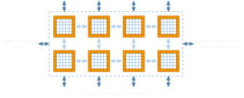{fig-align="center" height="430"}

## Ghost cell exchange (MPI shared memory access) {.center-figs}

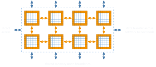{fig-align="center" height="430"}

## Example for shared memory one-sided communication

```c
MPI_Comm_split_type(MPI_COMM_WORLD, MPI_COMM_TYPE_SHARED,
                    0, MPI_INFO_NULL, &comm_sm);

MPI_Win_allocate_shared((MPI_Aint)(sizeof(int) * 10),
                        sizeof(int), MPI_INFO_NULL, comm_sm,
                        &rcv_buf_ptr, &win);

MPI_Win_fence(0, win);

*rcv_buf_ptr = ...;   // replaces the MPI_Put() call!

MPI_Win_fence(0, win);
MPI_Win_free(&win);
```

## MPI and multithreading

- one-sided shared memory communication can become quite complex
  - there are alternatives: MPI+(OpenMP or `std::thread` or Pthreads or TBB or …)
  - these are known as hybrid programming models
  - both paradigms have their ups and downs (number of programming models, compiler support, compiler optimizations, interactions, side-effects, …)
- MPI+threads needs to be supported by MPI, indicated by one of four safety levels
  - `MPI_THREAD_SINGLE`: only a single thread per rank
  - `MPI_THREAD_FUNNELED`: multithreaded ranks, but only the main thread calls MPI
  - `MPI_THREAD_SERIALIZED`: multithreaded, but only one per time calls MPI
  - `MPI_THREAD_MULTIPLE`: multithreaded, any thread can call MPI any time (with restrictions)
  - MPI implementations are not required to support more than `MPI_THREAD_SINGLE`
    - always check beforehand with `MPI_Query_thread(…)` and call `MPI_Init_thread()` instead of `MPI_Init()`

# Error Handling

## Error handling

- MPI introduces additional hassle
  - imagine everything that can go wrong with a sequential process
  - add the fact that multiple processes are interacting, across the network
- default behavior: communication errors cause abort of MPI operation
  - causes respective process to exit
  - causes all other MPI processes of the same application to exit
- this only relates to halting crashes
  - also consider deadlocks or hangs

## Error handling cont'd

- all MPI routines return error codes
  - `MPI_SUCCESS` if everything went well
- should always check and act accordingly
  - consider action to take when MPI calls fail
  - compare to a failing `malloc` in sequential program
  - make sure to free allocated resources (e.g. file handles)
  - inform the user!!

## Error handling cont'd

- error behavior can be altered with `MPI_Comm_set_errhandler(…)`
  - `MPI_ERRORS_ARE_FATAL`: abort if error detected (default)
  - `MPI_ERRORS_RETURN`: return error code to user program
- user-defined error handlers can be installed
  - `MPI_Comm_create_errhandler(…)`
  - `MPI_Comm_set_errhandler(…)`
  - `MPI_Comm_get_errhandler(…)`

## Additional topics

- File I/O
  - data file partitioning among processes, strided file access (derived data types!)
  - asynchronous data transfers
- process management
  - process spawning
  - socket-style communication
- Fortran-specific issues
  - slight differences in MPI function signatures
- profiling support
  - `MPI_...` vs. `PMPI_...`

# Summary

## Summary

- communicators and groups
  - offers high-level control over sets of ranks
- one-sided communication
  - can improve performance, but can be tricky to use
- error handling
  - graceful exits
