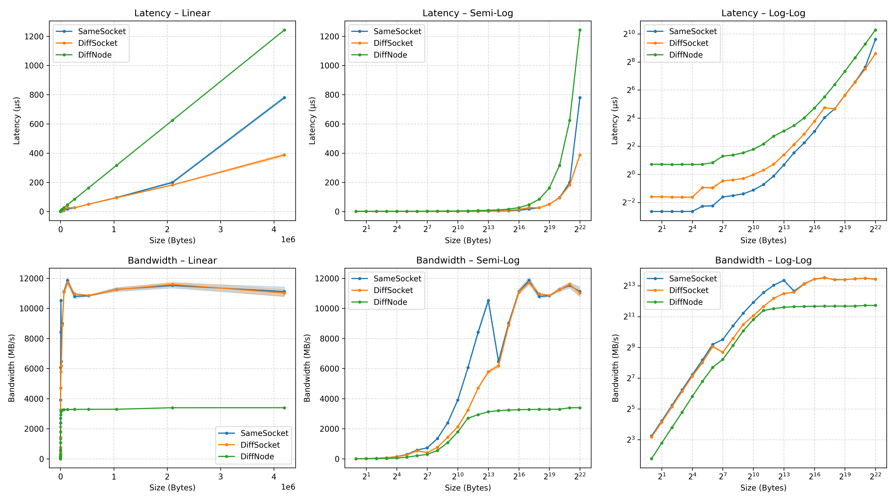

# Useful commands

sbatch [script]
squ (for your user)
squeue (for all users)
scancel [jobid]
sinfo
scontrol [show job [jobid]]
sacct (show accounting info)
module avail
module load
module list
module unload
module load gcc/12.2.0-gcc-8.5.0-p4pe45v
gprof & grpof --line
perf stat -e cycles,instructions,cache-misses ./executable

to run the program in parallel, you load `module load openmpi/3.1.6-gcc-12.2.0-d2gmn55` to get mpiexec added to the PATH (and openmpi libraries to the LD_LIBRARY_PATH)

`mpiexec -n [num_processes] /path/to/application` will start n processes of the executable.

`mpicc/mpic++` internally sets required flags for linking with MPI libs.


important parameters for SBATCH:
`--mem=8G` or `--mem-per-cpu=8G` 
// default is only 1GB per CPU allocated, which was not enought for some of my testing applications:
```
> scontrol show config
...
DefMemPerCPU            = 1000
...
```

`--time=00:01:00`
time limit so I don't need to manually check and cancel a job if it takes too long

`--ntasks` `--ntasks-per-node` and `--cpus-per-task`
To get the right number of processes and CPU cores per process. E.g. 2 processes with 4 threads each on 2 different nodes would be `--ntasks=2 --ntasks-per-node=1 --cpus-per-task=4`

`--partition=lva`
Important to get the right resources (e.g. IFIgpu2070 or IFIAMD I used for GPU computing)

`--exclusive`
to not share nodes with other jobs (in order to get good comparisons)

`--map-by [node, socket, numa, core, hwthread] `
spreads ranks/tasks evenly across available node/socket/package/core/hwthread 's
`--bind-to [core, socket, numa, none]`
specifies exactly what resource one rank/task gets. (further restricts the `--map-by` option)
`--host`
Says which nodes can be used and how many slots (processes) can be allocated with `:` E.g. 
`--host node1,node2`
Use only node1 and node2.
`--host node1:2,node2:4`
Allocate 2 slots on node1 and 4 slots on node2.

`--report-bindings` tells you where each rank/task is bound to (which core/socket/numa node) (for debugging)

Task 2:

rank = process ID (unique integer assigned to an MPI process)

```
wget http://mvapich.cse.ohio-state.edu/download/mvapich/osu-micro-benchmarks-5.8.tgz
tar -xzf osu-micro-benchmarks-5.8.tgz
cd osu-micro-benchmarks-5.8

./configure CC=mpicc CXX=mpic++
make -j % -j for parallel build
cd mpi/pt2pt
```



[latency benchmark csv file](latency.csv)

[bandwidth benchmark csv file](bandwidth.csv)

libibcm: couldn't read ABI version
>> MPI tries to load something from Infiniband; idk didn't look further into how to fix it.

at a MB and up, the latency of SameSocket seems to be even higher than DiffSocket.
My idea is that because in SameSocket the 2 processes use the same memory controller and L3 cache lines, there might be some throughput bottleneck which will be felt more than the physical distance&latency between the sockets.

The dip in 2^7 for DiffSocket and 2^14 of SameSocket is probably due to switching between messeging protocols (from eager to rendezvous) of MPI. There probably wouldn't be a drop if the switching threshold was higher.

Eager: sender pushes data immediately a buffer on the receiver without asking

Rendezvous: sender asks the receiver if it is ready to receive the data (Request-to-send, RTS) and the receiver responds with a Clear-to-send (CTS) message. The sender then sends the data.
This adds 1RTT of latency
