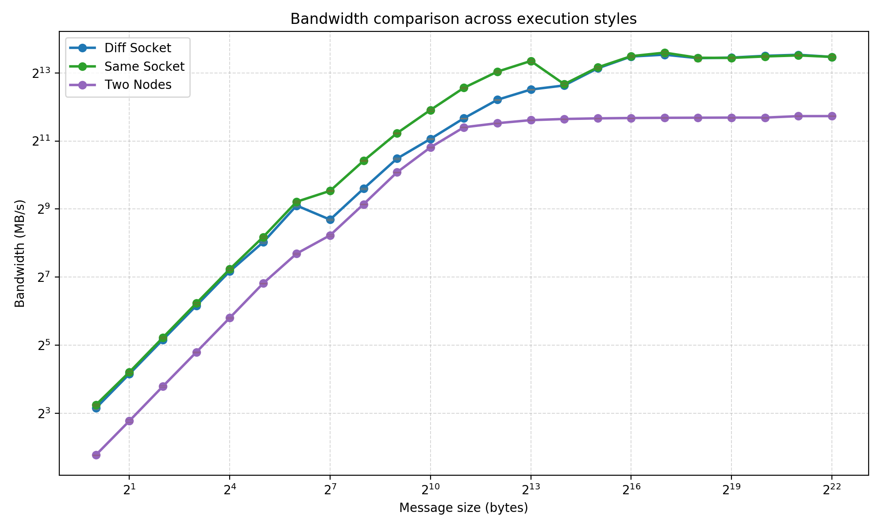
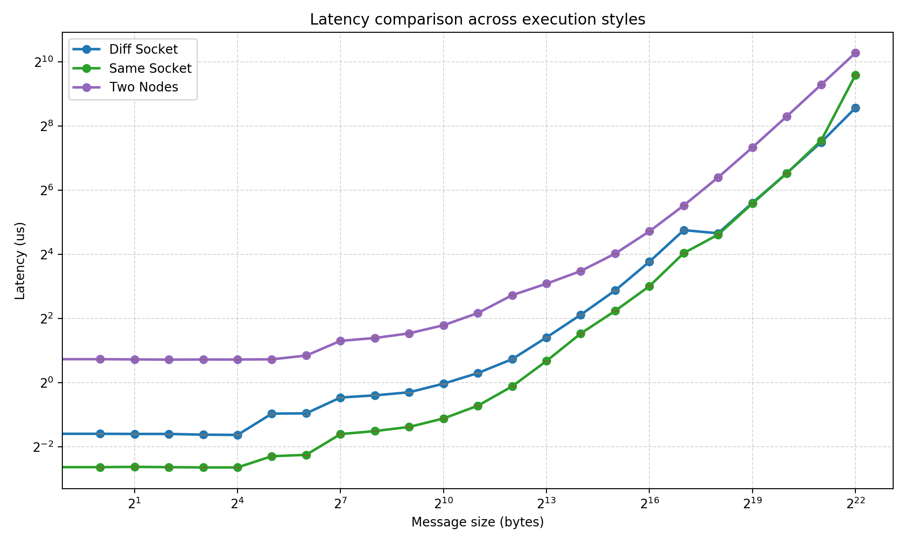

# Solutions 01

## Task 1

### How slurm works

- you can submit a slurm script with sbatch
- you can see all your running and queued jobs with squ
- you can cancel with scancel <id>

### Script

```bash
#!/bin/bash

# Execute job in the partition "lva" unless you have special requirements.
#SBATCH --partition=lva
# Name your job to be able to identify it later
#SBATCH --job-name task1
# Redirect output stream to this file
#SBATCH --output=output.log
# Maximum number of tasks (=processes) to start in total
#SBATCH --ntasks=1
# Maximum number of tasks (=processes) to start per node
#SBATCH --ntasks-per-node=1
# Enforce exclusive node allocation, do not share with other jobs
#SBATCH --exclusive

/bin/hostname
```

### Most Important Parameters

1. --ntasks (-n):	Total number of processes	
Effect: Sets how many instances of your program run.

2. --cpus-per-task (-c)	Cores per process	
Effect: Allocates multiple cores to a single task

3. --nodes (-N) nodes per job
Effect: Allocates multiple nodes for the script

4. --time (-t)	Wall-clock limit	
Effect: How long the job can run. It will get canceled if it takes longer
Lcc3 already has a default limit of 30 minutes, so no student does anything stupid.

5. --partition (-p)	
Effect: Selects which group of nodes to use (e.g., GPU nodes, high-memory nodes, lva in our case).

### How to run MPI programs

add `module load openmpi/3.1.6-gcc-12.2.0-d2gmn55` to the slurm script and execute the desired program with the mpi wrapper `mpiexec`.


## Task 2

### Info about the hardware

Number of CPUs and Cores
Physical Packages (Sockets): There are 2 Packages (Package L#0 and Package L#1). 
This means the node has two physical CPU chips installed.
Cores: The output shows "Core L#0" inside Package 0. Based on the "PU" (Processing Unit) numbering (P#1 and P#13), 
each core has 6 cores.
Total Count: While the visual tree is truncated in your text snippet, usually these systems are symmetric. 
If we assume the standard layout for this type of server,
you have 2 Packages, each with a set of cores, and 2 logical threads per core so 24 logical CPUs.

Memory (RAM) Hierarchy

Total RAM: 47GB (likely marketed as a 48GB node).

Distribution: This memory is split into two pools:
    NUMANode L#0: 23GB
    NUMANode L#1: 24GB

NUMA stands for Non-Uniform Memory Access,
used in multiprocessing, where the memory access time depends on the memory location relative to the processor. 
Under NUMA, a processor can access its own local memory faster than non-local memory. 
(https://en.wikipedia.org/wiki/Non-uniform_memory_access)
Each physical CPU (Package) has its own local memory controller. 
Package L#0 is directly connected to the 23GB in NUMANode 0, and Package L#1 is wired to NUMANode 1.
The Impact: A core in Package 0 can access memory in NUMANode 1, 
but it has to travel across a bridge, 
which is slower and has higher latency than accessing its own local 23GB.

Cache:

L1d and L1i (32KB): "d" is for data, "i" is for instructions.

L2 (256KB)

L3 (12MB)

### Results


#### Bandwidth

In general it can be observed, that same socket has the highest bandwidth (obviously), but 2 sockets is pretty close, except there is a rather big discrepancy from $2⁷$ to $2^15$. The dip in bandwidth at 2⁷ is across all configurations, this could have something to do with the messaging protocol.
The dip at $2^14$ only for single socket and is maybe due to the cache. This explains why it is not there for 2 sockets, since it is numa from the start and 2 nodes.

The results are pretty stable there is a relatively low stddev.



| Message size | diff_socket mean (MB/s) | diff_socket stdev (MB/s) | same_socket mean (MB/s) | same_socket stdev (MB/s) | two_nodes mean (MB/s) | two_nodes stdev (MB/s) |
| --- | --- | --- | --- | --- | --- | --- |
| 1 | 8.899 | 0.188 | 9.511 | 0.178 | 3.427 | 0.016 |
| 2 | 17.808 | 0.260 | 18.505 | 0.474 | 6.850 | 0.193 |
| 4 | 35.757 | 0.513 | 37.334 | 0.681 | 13.843 | 0.264 |
| 8 | 71.576 | 1.048 | 75.185 | 1.462 | 27.745 | 0.261 |
| 16 | 143.927 | 1.839 | 150.501 | 4.022 | 55.856 | 0.651 |
| 32 | 260.668 | 4.805 | 289.880 | 7.169 | 112.839 | 0.726 |
| 64 | 549.638 | 11.942 | 594.039 | 11.376 | 206.711 | 2.889 |
| 128 | 412.787 | 4.509 | 741.734 | 7.200 | 300.030 | 4.760 |
| 256 | 774.852 | 8.449 | 1366.964 | 11.975 | 564.658 | 2.022 |
| 512 | 1429.679 | 15.960 | 2399.917 | 27.887 | 1080.787 | 4.423 |
| 1024 | 2133.965 | 13.321 | 3848.447 | 84.023 | 1796.408 | 9.643 |
| 2048 | 3251.563 | 10.414 | 6042.271 | 79.776 | 2705.447 | 6.589 |
| 4096 | 4735.857 | 27.699 | 8394.433 | 178.389 | 2939.890 | 9.447 |
| 8192 | 5833.715 | 20.347 | 10433.054 | 278.325 | 3129.519 | 1.590 |
| 16384 | 6341.026 | 108.710 | 6506.610 | 177.997 | 3204.317 | 3.589 |
| 32768 | 8979.836 | 140.608 | 9161.367 | 224.413 | 3244.044 | 3.993 |
| 65536 | 11424.517 | 126.320 | 11512.278 | 175.249 | 3268.227 | 1.402 |
| 131072 | 11865.305 | 492.217 | 12365.137 | 303.368 | 3280.448 | 3.440 |
| 262144 | 11052.095 | 722.065 | 11142.365 | 194.203 | 3287.260 | 0.980 |
| 524288 | 11185.873 | 82.976 | 11111.986 | 157.240 | 3294.489 | 0.447 |
| 1048576 | 11586.890 | 92.828 | 11444.868 | 159.132 | 3295.703 | 0.677 |
| 2097152 | 11840.334 | 73.061 | 11689.375 | 124.715 | 3395.482 | 0.137 |
| 4194304 | 11345.686 | 464.980 | 11339.755 | 351.361 | 3396.320 | 0.045 |


#### Latency

Basically what discussed in bandwidth, but high is bad and low is good.



| Message size | diff_socket mean (us) | diff_socket stdev (us) | same_socket mean (us) | same_socket stdev (us) | two_nodes mean (us) | two_nodes stdev (us) |
| --- | --- | --- | --- | --- | --- | --- |
| 0 | 0.329 | 0.003 | 0.161 | 0.003 | 1.693 | 0.006 |
| 1 | 0.331 | 0.003 | 0.161 | 0.003 | 1.660 | 0.006 |
| 2 | 0.330 | 0.004 | 0.162 | 0.004 | 1.652 | 0.006 |
| 4 | 0.330 | 0.000 | 0.161 | 0.003 | 1.644 | 0.005 |
| 8 | 0.325 | 0.005 | 0.160 | 0.000 | 1.649 | 0.005 |
| 16 | 0.323 | 0.005 | 0.160 | 0.000 | 1.648 | 0.004 |
| 32 | 0.512 | 0.009 | 0.204 | 0.005 | 1.655 | 0.005 |
| 64 | 0.515 | 0.016 | 0.210 | 0.000 | 1.795 | 0.005 |
| 128 | 0.725 | 0.005 | 0.329 | 0.005 | 2.468 | 0.007 |
| 256 | 0.760 | 0.004 | 0.351 | 0.003 | 2.623 | 0.013 |
| 512 | 0.812 | 0.004 | 0.384 | 0.005 | 2.903 | 0.010 |
| 1024 | 0.978 | 0.006 | 0.461 | 0.007 | 3.458 | 0.010 |
| 2048 | 1.229 | 0.007 | 0.607 | 0.008 | 4.499 | 0.009 |
| 4096 | 1.661 | 0.033 | 0.923 | 0.006 | 6.617 | 0.013 |
| 8192 | 2.656 | 0.053 | 1.595 | 0.015 | 8.487 | 0.015 |
| 16384 | 4.338 | 0.081 | 2.895 | 0.024 | 11.163 | 0.027 |
| 32768 | 7.327 | 0.123 | 4.713 | 0.041 | 16.250 | 0.027 |
| 65536 | 13.653 | 0.270 | 8.047 | 0.063 | 26.329 | 0.032 |
| 131072 | 26.988 | 0.765 | 16.450 | 0.100 | 46.022 | 0.067 |
| 262144 | 25.233 | 1.304 | 24.492 | 0.325 | 84.399 | 0.350 |
| 524288 | 48.732 | 1.698 | 48.009 | 0.552 | 161.273 | 0.054 |
| 1048576 | 92.520 | 1.451 | 92.159 | 0.914 | 315.725 | 0.064 |
| 2097152 | 180.033 | 2.398 | 186.832 | 10.464 | 624.606 | 0.112 |
| 4194304 | 378.560 | 8.975 | 769.284 | 5.195 | 1243.242 | 0.231 |


#### How to get rank configuration without results

In order to get the configuration of the rank binds the flag `--report-bingings can be added`

Example output:

```
[n001.intern.lcc3.intra.uibk.ac.at:1319711] MCW rank 0 bound to socket 0[core 0[hwt 0-1]]: [BB/../../../../..][../../../../../..]
[n001.intern.lcc3.intra.uibk.ac.at:1319711] MCW rank 1 bound to socket 0[core 1[hwt 0-1]]: [../BB/../../../..][../../../../../..]

[n001.intern.lcc3.intra.uibk.ac.at:1319901] MCW rank 0 bound to socket 0[core 0[hwt 0-1]]: [BB/../../../../..][../../../../../..]
[n001.intern.lcc3.intra.uibk.ac.at:1319901] MCW rank 1 bound to socket 1[core 6[hwt 0-1]]: [../../../../../..][BB/../../../../..]


[n001.intern.lcc3.intra.uibk.ac.at:1319942] MCW rank 0 bound to socket 0[core 0[hwt 0-1]]: [BB/../../../../..][../../../../../..]
[n002.intern.lcc3.intra.uibk.ac.at:1792427] MCW rank 1 bound to socket 0[core 0[hwt 0-1]]: [BB/../../../../..][../../../../../..]
```


---

AI Notice:

Ai was used to help me find the flags to execute the scripts correctly and generate the parse_osu_results.py